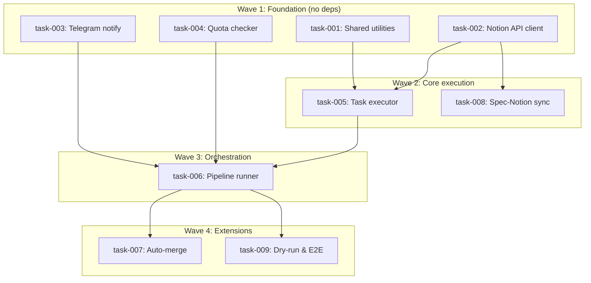

# Pipeline Orchestration — OpenClaw

> Technical Specification | Generated 2026-02-11 | 9 tasks | 14.5h estimated

---

## Overview

Semi-automated development pipeline that transforms a Notion backlog into GitHub Pull Requests without human intervention during execution. The orchestrator coordinates task execution (SPEC-02), reads from a Notion database (SPEC-03), and sends Telegram notifications (SPEC-04). Architecture: Bash + jq + curl, no Python, no framework, no local database.

## Scope

### In Scope

- `pipeline-runner.sh` — Main orchestration loop with guards and recovery
- `run-task.sh` — Single task execution with hybrid spec reading (Notion body / Git file)
- `quota-checker.sh` — Reactive quota management (throttle detection + cooldown)
- `notify.sh` — Telegram notifications + kill switch
- Notion API client (curl/jq) — Query, update, read blocks, create pages
- `projects.json` — Multi-project configuration
- Auto-merge PRs (3 levels: dependencies, GitHub auto-merge, pipeline-safe label)
- Spec-to-Notion sync — Automatic page creation from /spec output
- Dependency management — Inter-task blocking via Notion relations
- Dry-run mode and E2E test harness

### Out of Scope

- Skill implement-auto (already implemented — SPEC-01)
- Dashboard web
- Parallelism (V2)
- Telegram advanced commands (/status, /pause, /resume)
- Proactive quota tracking (M1) — deferred until calibration data available

---

## Tasks

| # | Task | Description | Effort | Dependencies |
|---|------|-------------|--------|--------------|
| 001 | [Create shared utilities and project configuration](task-001-shared-utilities.md) | Logging, .env loading, projects.json schema | 75 min | - |
| 002 | [Implement Notion API client library](task-002-notion-api.md) | Query, update, read blocks, create pages via curl/jq | 120 min | - |
| 003 | [Implement Telegram notification wrapper](task-003-telegram-notify.md) | sendMessage, kill switch check, heartbeat | 75 min | - |
| 004 | [Implement quota management](task-004-quota-checker.md) | Log scanning for throttle, 30min cooldown | 60 min | - |
| 005 | [Implement single task executor](task-005-run-task.md) | Hybrid spec reading, worktree, headless Claude, PR creation | 120 min | 001, 002 |
| 006 | [Implement pipeline orchestrator](task-006-pipeline-runner.md) | Lockfile, kill switch, health check, dependency filter, circuit breaker | 120 min | 003, 004, 005 |
| 007 | [Implement auto-merge system](task-007-auto-merge.md) | 3 levels: dependencies, gh auto-merge, pipeline-safe label | 90 min | 006 |
| 008 | [Implement spec-to-Notion sync](task-008-spec-notion-sync.md) | Create Notion pages from task specs, map dependencies | 120 min | 002 |
| 009 | [Implement dry-run mode and E2E testing](task-009-dry-run-e2e.md) | --dry-run flag, mock APIs, E2E scenarios | 90 min | 006 |

---

## Dependency Graph



---

## Execution Order

1. **task-001** — Create shared utilities and project configuration
2. **task-002** — Implement Notion API client library
3. **task-003** — Implement Telegram notification wrapper
4. **task-004** — Implement quota management
5. **task-005** — Implement single task executor (after: task-001, task-002)
6. **task-008** — Implement spec-to-Notion sync (after: task-002)
7. **task-006** — Implement pipeline orchestrator (after: task-003, task-004, task-005)
8. **task-007** — Implement auto-merge system (after: task-006)
9. **task-009** — Implement dry-run mode and E2E testing (after: task-006)

---

## Metrics

| Metric | Value |
|--------|-------|
| Total Tasks | 9 |
| Total Steps | 30 |
| Estimated Effort | 14.5h |
| Critical Path | task-002 -> task-005 -> task-006 -> task-007 |
| Optimized Duration | 7.5h |
| Complexity | STANDARD |

---

## Files

### Task Specifications

- [task-001-shared-utilities.md](task-001-shared-utilities.md) — Create shared utilities and project configuration
- [task-002-notion-api.md](task-002-notion-api.md) — Implement Notion API client library
- [task-003-telegram-notify.md](task-003-telegram-notify.md) — Implement Telegram notification wrapper
- [task-004-quota-checker.md](task-004-quota-checker.md) — Implement quota management
- [task-005-run-task.md](task-005-run-task.md) — Implement single task executor
- [task-006-pipeline-runner.md](task-006-pipeline-runner.md) — Implement pipeline orchestrator
- [task-007-auto-merge.md](task-007-auto-merge.md) — Implement auto-merge system
- [task-008-spec-notion-sync.md](task-008-spec-notion-sync.md) — Implement spec-to-Notion sync
- [task-009-dry-run-e2e.md](task-009-dry-run-e2e.md) — Implement dry-run mode and E2E testing

### Machine-Readable

- [openclaw.prd.json](openclaw.prd.json) — PRD v2.0 format

---

## Routing Recommendation

| Complexity | Recommended Skill | Command |
|------------|-------------------|---------|
| STANDARD | /implement | `/implement openclaw @docs/specs/openclaw/` |

### Execution Options

**Option A: Manual Implementation**
```bash
/implement openclaw @docs/specs/openclaw/
```

**Option B: Ralph Batch Execution**
```bash
./.ralph/openclaw/ralph.sh
```

---

## Source

- **Brief**: docs/briefs/clawdbot/brief-orchestrator-pipeline-20260211.md
- **Generated**: 2026-02-11
- **Generator**: /spec v1.0 — EPCI v6.0

---

*This specification is auto-generated. Edit task-XXX.md files to modify, then regenerate index and PRD.json.*
