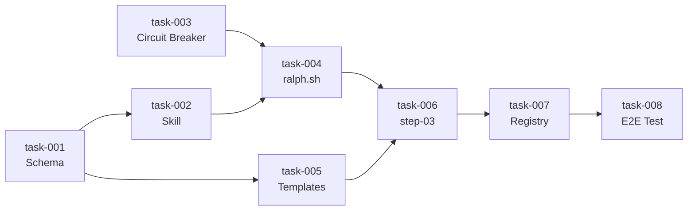

# Ralph Integration v6.1 — Specification Index

> **Generated**: 2026-02-02
> **Source**: docs/briefs/ralph-integration/brief-ralph-integration-20260202.md
> **Tasks**: 8
> **Total Effort**: 8.75h (7h optimized)
> **Complexity**: STANDARD

---

## Overview

Improve the `/spec` skill to generate a fully functional Ralph execution system, including:
- PRD.json with `userStories[]` format and execution tracking
- New `/ralph-exec` skill for story-by-story execution
- Autonomous `ralph.sh` script with inline circuit breaker
- Complete templates for all artifacts

## Scope

### In Scope

- Update prd-v2.json schema to userStories[] format
- Create /ralph-exec skill (SKILL.md + 3 steps)
- Define RALPH_STATUS block format
- Create ralph.sh template with circuit breaker
- Create generation templates (prd.json, prompt.md, memory.md, ralph.sh)
- Update /spec step-03-generate-ralph.md
- Create .ralph/index.json registry
- E2E test flow

### Out of Scope

- Migration of existing PRDs
- Web interface for progress visualization
- CI/CD integration
- Multi-branch worktree support
- Automatic rollback on failure

---

## Tasks

| # | Task | Deps | Effort | Steps | Status |
|---|------|------|--------|-------|--------|
| 001 | [Update PRD Schema v2](task-001-schema.md) | - | 60min | 4 | Pending |
| 002 | [Create Skill /ralph-exec](task-002-ralph-exec.md) | 001 | 120min | 5 | Pending |
| 003 | [Implement Circuit Breaker](task-003-circuit-breaker.md) | - | 60min | 3 | Pending |
| 004 | [Create ralph.sh Template](task-004-ralph-script.md) | 002, 003 | 90min | 4 | Pending |
| 005 | [Create Generation Templates](task-005-templates.md) | 001 | 45min | 3 | Pending |
| 006 | [Update /spec step-03](task-006-spec-update.md) | 004, 005 | 60min | 4 | Pending |
| 007 | [Create Registry index.json](task-007-registry.md) | 006 | 30min | 2 | Pending |
| 008 | [E2E Test Flow](task-008-e2e-test.md) | 007 | 60min | 3 | Pending |

---

## Dependency Graph



---

## Execution Order

**Sequential (8.75h)**:
1. task-001 — Update PRD Schema v2 (60min)
2. task-003 — Implement Circuit Breaker (60min) *can parallel with 001*
3. task-002 — Create Skill /ralph-exec (120min)
4. task-005 — Create Generation Templates (45min) *can parallel with 002*
5. task-004 — Create ralph.sh Template (90min)
6. task-006 — Update /spec step-03 (60min)
7. task-007 — Create Registry index.json (30min)
8. task-008 — E2E Test Flow (60min)

**Optimized (7h)**:
- Level 0: task-001 || task-003 (60min)
- Level 1: task-002 || task-005 (120min, limited by task-002)
- Level 2: task-004 (90min)
- Level 3: task-006 (60min)
- Level 4: task-007 (30min)
- Level 5: task-008 (60min)

**Critical Path**: task-001 → task-002 → task-004 → task-006 → task-007 → task-008

---

## Metrics Summary

| Metric | Value |
|--------|-------|
| Total Tasks | 8 |
| Total Steps | 28 |
| Estimated Hours | 8.75h |
| Optimized Hours | 7h |
| Parallel Savings | 1.75h (20%) |
| Complexity | STANDARD |

---

## Routing

**Recommended**: `/implement ralph-integration @docs/specs/ralph-integration/`

Rationale: STANDARD complexity with 8 interdependent tasks requiring full EPCI workflow.

---

## Usage

### Manual Execution
```bash
# Execute task by task
/implement ralph-integration @docs/specs/ralph-integration/
```

### Ralph Batch (after artifacts generated)
```bash
# Autonomous overnight execution
./.ralph/ralph-integration/ralph.sh
```

---

*Generated by /spec v1.0 — EPCI v6.0*
