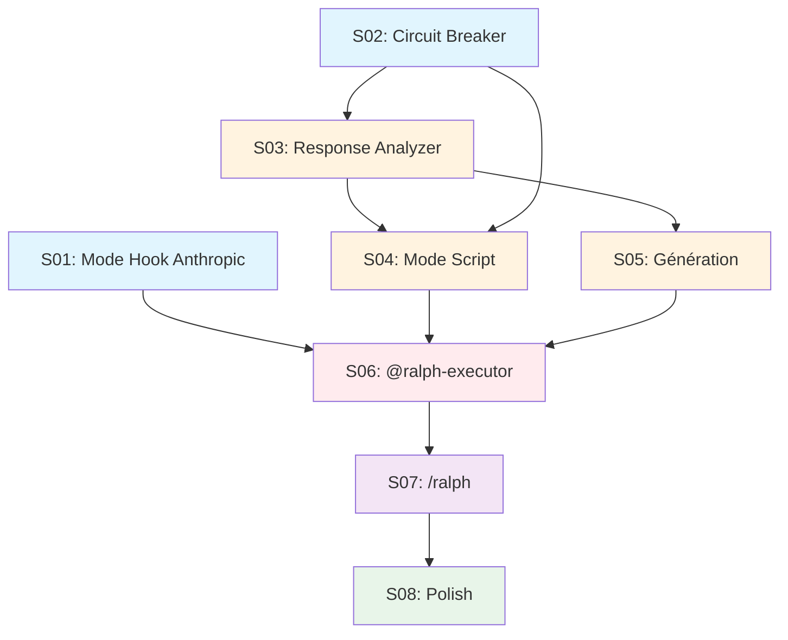
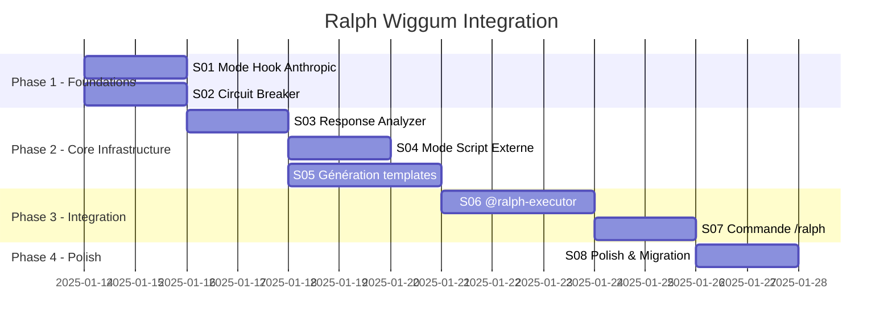

# Ralph Wiggum Integration — Index

> **Generated**: 2025-01-13
> **Source**: PRD-ralph-wiggum-integration-2025-01-13.md
> **Sub-specs**: 8
> **Total effort**: 18 jours (séquentiel) / 12 jours (parallélisé)

---

## Overview

| ID | Title | Effort | Priority | Dependencies | Status |
|----|-------|--------|----------|--------------|--------|
| S01 | Mode Hook Anthropic | 2j | 1 | — | Pending |
| S02 | Circuit Breaker | 2j | 1 | — | Pending |
| S03 | Response Analyzer + RALPH_STATUS | 2j | 1 | S02 | Pending |
| S04 | Mode Script Externe | 2j | 1 | S02, S03 | Pending |
| S05 | Génération prd.json et templates | 3j | 1 | S03 | Pending |
| S06 | Subagent @ralph-executor | 3j | 1 | S01, S04 | Pending |
| S07 | Commande /ralph unifiée | 2j | 1 | S06 | Pending |
| S08 | Polish & Migration | 2j | 2 | S07 | Pending |

---

## Dependency Graph



---

## Gantt Planning



---

## User Stories Mapping

| Sub-spec | User Stories | Priorité |
|----------|--------------|----------|
| S01 | US13 (Mode Stop Hook), US14 (/cancel-ralph) | Must-have |
| S02 | US9 (Circuit Breaker Pattern) | Must-have |
| S03 | US10 (Response Analyzer), US11 (RALPH_STATUS) | Must-have |
| S04 | US15 (Mode Script Externe) | Must-have |
| S05 | US1 (prd.json), US2 (ralph.sh), US3 (prompt.md) | Must-have |
| S06 | US4 (Subagent @ralph-executor) | Must-have |
| S07 | US5 (Commande /ralph), US6 (Mode hybride) | Must-have |
| S08 | US7 (Sécurité), US8 (Dépréciation), US12 (Rate Limiting), US16 (Sélection intelligente) | Should-have |

---

## Files to Create/Modify

| File | Action | Sub-spec |
|------|--------|----------|
| `src/hooks/ralph-stop-hook.sh` | Create | S01 |
| `src/templates/ralph/ralph-loop.local.md` | Create | S01 |
| `src/commands/cancel-ralph.md` | Create | S01 |
| `src/scripts/lib/circuit_breaker.sh` | Create | S02 |
| `src/scripts/lib/response_analyzer.sh` | Create | S03 |
| `src/templates/ralph/PROMPT.md` | Create | S03 |
| `src/scripts/ralph_loop.sh` | Create | S04 |
| `src/scripts/lib/date_utils.sh` | Create | S04 |
| `src/skills/core/ralph-converter/SKILL.md` | Create | S05 |
| `src/commands/decompose.md` | Modify | S05 |
| `src/agents/ralph-executor.md` | Create | S06 |
| `src/skills/core/ralph-analyzer/SKILL.md` | Create | S06 |
| `src/commands/ralph.md` | Create | S07 |
| `src/commands/orchestrate.md` | Modify (deprecate) | S08 |

---

## Usage

Launch a sub-spec:

```bash
/brief @docs/specs/ralph-wiggum-integration/S01-mode-hook.md
```

Execute with Ralph (after all specs complete):

```bash
/ralph docs/specs/ralph-wiggum-integration/
```

---

## Risk Summary

| Risk | Probability | Impact | Mitigation | Related Spec |
|------|-------------|--------|------------|--------------|
| Coûts overnight explosent | M | H | --max-iterations + rate limiting | S02, S08 |
| RALPH_STATUS non respecté | M | H | Validation prompt.md + fallback | S03 |
| Circuit Breaker trop sensible | M | M | Seuils configurables | S02 |
| Complexité scripts Bash | M | M | Tests BATS + documentation | S02, S03, S04 |

---

*Generated by /decompose — Project: ralph-wiggum-integration*
