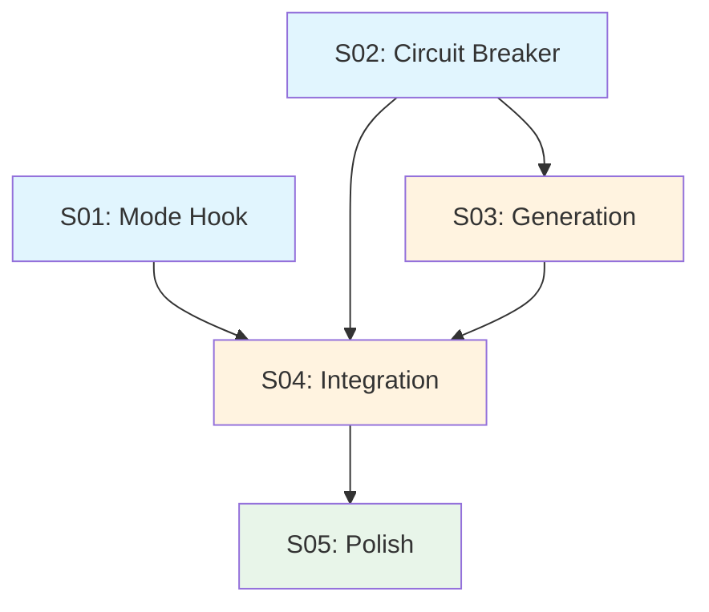
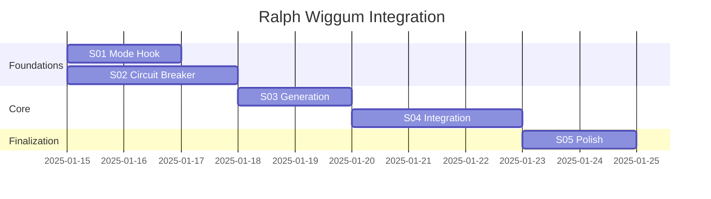

# Ralph Wiggum Integration — Index

> **Generated**: 2025-01-14
> **Source**: PRD-ralph-wiggum-integration-2025-01-13.md
> **Sub-specs**: 5
> **Total effort**: 12 days
> **User Stories**: 16 (11 Must-have, 5 Should-have)

---

## Overview

| ID | Title | Effort | Priority | Dependencies | Status |
|----|-------|--------|----------|--------------|--------|
| S01 | Mode Hook (Anthropic) | 2j | Must | - | Pending |
| S02 | Circuit Breaker & Analyzer | 3j | Must | - | Pending |
| S03 | Generation prd.json & Scripts | 2j | Must | S02 | Pending |
| S04 | Integration Commande Ralph | 3j | Must | S01, S02, S03 | Pending |
| S05 | Security & Polish | 2j | Should | S04 | Pending |

---

## User Stories Mapping

| Spec | User Stories | Complexity | Total |
|------|-------------|------------|-------|
| S01 | US13 (M), US14 (S) | M+S | 2 |
| S02 | US9 (M), US10 (M), US11 (S) | M+M+S | 3 |
| S03 | US1 (M), US2 (M), US3 (S), US15 (M) | M+M+S+M | 4 |
| S04 | US4 (L), US5 (M), US6 (M) | L+M+M | 3 |
| S05 | US7 (S), US8 (S), US12 (S), US16 (S) | S+S+S+S | 4 |

---

## Dependency Graph



---

## Gantt Planning



---

## Parallelization

**Parallelizable specs**: S01 and S02 can run in parallel (independent foundations)

**Critical path**: S02 → S03 → S04 → S05 (8 days)

**Optimized duration**: ~9 days (vs 12 days sequential)

---

## Files Overview

### Commands (2 new, 1 modified)
- `src/commands/ralph.md` — New unified command
- `src/commands/cancel-ralph.md` — New cancellation command
- `src/commands/decompose.md` — Modified (prd.json generation)

### Scripts (4 new)
- `src/scripts/ralph_loop.sh` — Main loop script
- `src/scripts/lib/circuit_breaker.sh` — Circuit Breaker pattern
- `src/scripts/lib/response_analyzer.sh` — Response parsing
- `src/scripts/lib/date_utils.sh` — Date utilities

### Hooks (1 new)
- `src/hooks/ralph-stop-hook.sh` — Stop hook for mode hook

### Skills (2 new)
- `src/skills/core/ralph-converter/SKILL.md` — prd.json conversion
- `src/skills/core/ralph-analyzer/SKILL.md` — Response analysis

### Agents (1 new)
- `src/agents/ralph-executor.md` — Story execution agent

### Templates (2 new)
- `src/templates/ralph/PROMPT.md` — System prompt template
- `src/templates/ralph/ralph-loop.local.md` — State file template

---

## Usage

### Manual Execution (spec by spec)

```bash
# Analyze and execute a single spec
/epci:brief @docs/specs/ralph-wiggum-integration/S01-mode-hook-anthropic.md
# → Routes to /epci:quick (TINY/SMALL) or /epci:epci (STANDARD/LARGE)
```

### Autonomous Execution (overnight)

```bash
# Execute all specs autonomously
/epci:ralph docs/specs/ralph-wiggum-integration/
# → Uses prd.json, executes via @ralph-executor
# → Each story routes through /epci:brief → /epci:quick or /epci:epci
```

### EPCI Command Reference

| Command | Usage |
|---------|-------|
| `/epci:brief` | Analyze spec/story, assess complexity |
| `/epci:quick` | Fast workflow for TINY/SMALL (<200 LOC) |
| `/epci:epci` | Full workflow for STANDARD/LARGE (>200 LOC) |
| `/epci:ralph` | Autonomous overnight execution |
| `/epci:commit` | Git commit with EPCI context |

---

_Generated by /decompose — Project: ralph-wiggum-integration_
