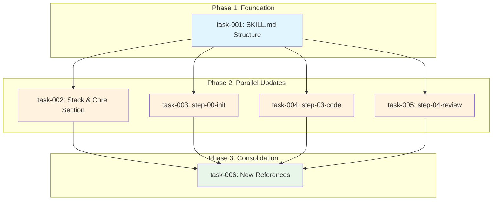

# Skill /implement v6 Refonte

> Technical Specification | Generated 2026-01-26 | 6 tasks | 8.5h estimated

---

## Overview

Refonte du skill `/implement` pour EPCI v6.0 avec integration obligatoire des stack skills (auto-inject rules), utilisation systematique des 6 core skills, section dediee "Stack & Core Skills Integration", architecture multi-agents avec parallel fan-out et critic synthesis, et TDD strict avec pre-code check.

## Scope

### In Scope

- Update SKILL.md with new sections and mandatory rules
- Add "Stack & Core Skills Integration" section with Mermaid diagram
- Update step-00-init.md for stack detection and clarification
- Update step-03-code.md for pre-code TDD check
- Update step-04-review.md for parallel fan-out reviews
- Create 3 new reference files (stack-integration, multi-agent-review, turbo-mode)
- Ensure coherence with /spec and /quick skills

### Out of Scope

- Changes to step-01-explore.md (no modifications needed)
- Changes to step-02-plan.md (no modifications needed)
- Changes to /quick or /spec skills
- Python validation scripts modifications
- Schema modifications (state-v2 schema not in scope)

---

## Tasks

| # | Task | Description | Effort | Dependencies |
|---|------|-------------|--------|--------------|
| 1 | [Update SKILL.md Structure](task-001-skill-md-structure.md) | Update frontmatter, mandatory rules, workflow overview | 90 min | - |
| 2 | [Add Stack & Core Skills Section](task-002-stack-core-section.md) | Create new section with tables and Mermaid diagram | 90 min | task-001 |
| 3 | [Update step-00-init.md](task-003-step-00-init.md) | Add stack detection and clarification protocols | 75 min | task-001 |
| 4 | [Update step-03-code.md](task-004-step-03-code.md) | Add pre-code TDD check and stack conventions | 75 min | task-001 |
| 5 | [Update step-04-review.md](task-005-step-04-review.md) | Implement parallel fan-out and critic synthesis | 90 min | task-001 |
| 6 | [Create New References](task-006-new-references.md) | Create 3 reference files for detailed documentation | 90 min | task-002, task-003, task-004, task-005 |

---

## Dependency Graph



---

## Execution Order

1. **task-001** — Update SKILL.md Structure
2. **task-002** — Add Stack & Core Skills Section (after: task-001)
3. **task-003** — Update step-00-init.md (after: task-001)
4. **task-004** — Update step-03-code.md (after: task-001)
5. **task-005** — Update step-04-review.md (after: task-001)
6. **task-006** — Create New References (after: task-002, task-003, task-004, task-005)

**Parallel execution**: Tasks 2-5 can run in parallel after task-001 completes.

---

## Metrics

| Metric | Value |
|--------|-------|
| Total Tasks | 6 |
| Total Steps | 22 |
| Estimated Effort | 8.5h |
| Critical Path | task-001 → task-002 → task-006 |
| Optimized Duration | 4.5h |
| Complexity | STANDARD |

---

## Files

### Task Specifications

- [task-001-skill-md-structure.md](task-001-skill-md-structure.md) — Update SKILL.md Structure
- [task-002-stack-core-section.md](task-002-stack-core-section.md) — Add Stack & Core Skills Section
- [task-003-step-00-init.md](task-003-step-00-init.md) — Update step-00-init.md
- [task-004-step-03-code.md](task-004-step-03-code.md) — Update step-03-code.md
- [task-005-step-04-review.md](task-005-step-04-review.md) — Update step-04-review.md
- [task-006-new-references.md](task-006-new-references.md) — Create New References

### Machine-Readable

- [skill-implement.prd.json](skill-implement.prd.json) — PRD v2.0 format

---

## Routing Recommendation

| Complexity | Recommended Skill | Command |
|------------|-------------------|---------|
| STANDARD | /implement | `/implement skill-implement @docs/specs/skill-implement/index.md` |

### Execution Options

**Option A: Manual Implementation**
```bash
/implement skill-implement @docs/specs/skill-implement/index.md
```

**Option B: Ralph Batch Execution**
```bash
./.ralph/skill-implement/ralph.sh
```

---

## Source

- **Brief**: docs/briefs/skill-implement/brief-skill-implement-20260126.md
- **Generated**: 2026-01-26
- **Generator**: /spec v1.0 — EPCI v6.0

---

*This specification is auto-generated. Edit task-XXX.md files to modify, then regenerate index and PRD.json.*
