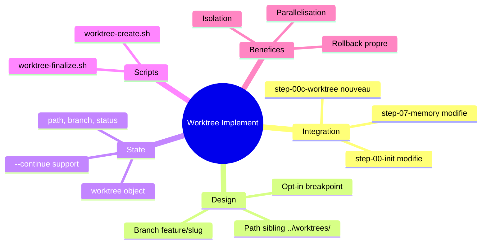

# Integration Git Worktree dans /implement

> Generated on 2026-01-29 - 2 iterations - Template: feature - Final EMS: 78/100

---

## 1. Contexte et Objectif Initial

Le skill `/implement` travaille actuellement directement dans le repo principal, rendant impossible l'execution simultanee de plusieurs features. Cette limitation bloque la parallelisation du developpement et rend les sessions interdependantes.

**Question initiale**:
Comment integrer git worktree dans le workflow /implement pour permettre plusieurs features en parallele?

**Scope**:
- In scope: Creation automatique de worktree par session /implement, nettoyage apres merge/abandon, gestion etat dans state-manager
- Out of scope: Synchronisation bidirectionnelle entre worktrees, integration dans /quick (reste leger)

**Criteres de succes**:
1. Pouvoir lancer 2+ /implement simultanement sans conflits
2. Pas d'intervention manuelle sur les worktrees
3. Rollback propre en cas d'echec
4. Compatible avec --continue (reprise de session)

---

## 2. Synthese Executive

L'integration des git worktrees dans /implement permettra d'isoler chaque feature dans son propre espace de travail, autorisant le developpement parallele de plusieurs fonctionnalites. L'approche retenue est opt-in via breakpoint: lors de l'initialisation d'une feature STANDARD+, un nouveau step propose la creation d'un worktree dedie.

**Insight cle**: Le worktree n'est pas juste une isolation technique mais un enabler de parallelisation qui transforme le workflow de developpement sequentiel en workflow concurrent.

**Decisions principales**:
- Worktree path: `../worktrees/{feature-slug}/` (sibling du repo, evite pollution .gitignore)
- Approche opt-in via breakpoint (pas auto-creation)
- Nouveau step `step-00c-worktree` pour la creation
- Persistence de l'etat worktree dans state.json

---

## 3. Analyse et Conclusions Cles

### 3.1 Architecture d'integration

L'integration se fait a trois niveaux du workflow /implement:

**Points cles**:
- Insertion apres le routing de complexite (step-00-init, etape 5)
- Nouveau step conditionnel `step-00c-worktree`
- Modification de `step-07-memory` pour proposer cleanup

**Implications**:
Le workflow reste compatible avec les sessions sans worktree. Les features TINY/SMALL routees vers /quick ne sont pas affectees.

### 3.2 Gestion du cycle de vie

Le cycle de vie du worktree est automatique mais initie par l'utilisateur:

**Points cles**:
- Creation: Via scripts shell (`worktree-create.sh`)
- Travail: Steps 01-06 s'executent dans le worktree
- Cleanup: `step-07-memory` propose `worktree-finalize.sh` ou abandon

**Implications**:
L'utilisateur garde le controle mais n'a pas a gerer manuellement les commandes git worktree.

### 3.3 Persistence d'etat

Le state-manager recoit une extension pour tracker les worktrees:

**Points cles**:
- Nouveau champ `worktree` dans `state.json`
- Contient: path, branch, status (active/merged/abandoned)
- Le flag `--continue` respecte `worktree.path`

**Implications**:
Les sessions interrompues peuvent reprendre dans le bon worktree automatiquement.

### 3.4 Patterns de la recherche Perplexity

La recherche externe a confirme les best practices:

**Points cles**:
- Pattern valide: 1 worktree = 1 feature = 1 branche
- Nommage: `feature/{slug}` aligne avec conventions existantes
- Tooling: Scripts shell simples suffisent (pas besoin d'outil externe)
- Reference: Workflow incident.io (tmux + worktree + Claude) valide l'approche

**Implications**:
L'implementation peut s'appuyer sur des patterns eprouves, reduisant le risque technique.

---

## 4. Decisions et Orientations

| Decision | Rationale | Impact | Confiance |
|----------|-----------|--------|-----------|
| Worktree path sibling (`../worktrees/`) | Evite pollution du repo, pas de .gitignore | Structure projet | High |
| Branch naming `feature/{slug}` | Aligne avec global-git-workflow.md | Coherence conventions | High |
| Approche opt-in via breakpoint | Respecte preferences utilisateur, pas intrusif | UX | High |
| Nouveau step-00c-worktree | Separation claire des responsabilites | Architecture | High |
| State persistence worktree | Permet --continue dans le bon contexte | Robustesse | High |
| /quick non impacte | Garde /quick leger et rapide | Performance | Medium |

### Decisions differees
- Integration CI/CD (merge automatique post-PR): A explorer dans phase ulterieure

---

## 5. Plan d'Action

| # | Action | Priorite | Effort | Dependencies |
|---|--------|----------|--------|--------------|
| 1 | Creer `step-00c-worktree.md` | High | Medium | Aucune |
| 2 | Modifier `step-00-init.md` (ajout check worktree) | High | Low | #1 |
| 3 | Modifier `step-07-memory.md` (ajout cleanup) | High | Low | #1 |
| 4 | Creer scripts shell (worktree-create, worktree-finalize) | High | Medium | Aucune |
| 5 | Etendre schema state.json (champ worktree) | Medium | Low | Aucune |
| 6 | Tests: parallelisation 2 features | Medium | Medium | #1-4 |
| 7 | Documentation: mise a jour SKILL.md implement | Low | Low | #1-4 |

### Quick Wins (Impact eleve, Effort faible)
1. Modifier step-00-init pour check worktree existant - Condition prealable minimale
2. Etendre state.json - Schema simple, impact transversal

### Investissements strategiques (Impact eleve, Effort eleve)
1. Scripts shell robustes avec gestion d'erreurs - Fiabilite long terme

---

## 6. Risques et Points d'Attention

| Risque | Probabilite | Impact | Mitigation |
|--------|-------------|--------|------------|
| Worktrees orphelins (oubli cleanup) | Medium | Low | Script prune periodique, reminder dans step-07 |
| Conflits de ports dev servers | Low | Medium | Convention ports par index worktree |
| Confusion utilisateur (quel repertoire?) | Low | Medium | Affichage clair du path actif |

### Hypotheses faites
- git worktree disponible (version >= 2.5): Si faux, degradation gracieuse possible
- Espace disque suffisant pour worktrees: Si faux, warning a l'utilisateur

---

## 7. Pistes Non Explorees

| Topic | Pourquoi non explore | Valeur potentielle | Action suggeree |
|-------|---------------------|-------------------|-----------------|
| Synchronisation bidirectionnelle | Complexite elevee, cas rare | Low | Pas prioritaire |
| Integration /quick | /quick doit rester leger | Medium | Evaluer apres v1 |
| Orchestration multi-agent | Hors scope brainstorm | High | Futur brainstorm |

---

## 8. Mindmap de Synthese



---

## 9. Verification des Criteres de Succes

| Critere | Statut | Evidence |
|---------|--------|----------|
| 2+ /implement simultanes | Achievable | Architecture worktree permet isolation complete |
| Pas d'intervention manuelle | Achievable | Scripts + breakpoint automatisent le cycle |
| Rollback propre | Achievable | `git worktree remove` nettoie sans residus |
| Compatible --continue | Achievable | state.json persiste worktree.path |

**Evaluation globale**: L'exploration a valide la faisabilite technique et defini une architecture d'integration claire. Tous les criteres sont adressables avec l'approche retenue.

---

## 10. Score EMS Final

```
EMS Final: 78/100 GOOD

EMS Score
100 |
 90 | . . . . . . . . . . . . . . . . . . .
 80 |                              ●━━━━━━━●
 70 |                    ●━━━━━━━━━┘
 60 | . . . . . . . . . . . . . . . . . . .
 50 |
 40 |          ●━━━━━━━━━┘
 30 | . . . . . . . . . . . . . . . . . . .
 20 | ●
  0 +--------+--------+--------+--------+---
    Init   Framing  Iter.1   Iter.2   End

Progression: 20 → 38 → 70 → 78

Final axes:
   Clarte       [████████░░] 82/100
   Profondeur   [███████░░░] 78/100
   Couverture   [███████░░░] 74/100
   Decisions    [████████░░] 80/100
   Actionab.    [███████░░░] 75/100
```

---

## 11. Sources et References

### Documents analyses
- `/implement/steps/step-00-init.md`: Structure actuelle du workflow d'initialisation
- `/implement/SKILL.md`: Vue d'ensemble du skill implement
- `state-manager/references/examples.md`: Format state.json existant
- `docs/specs/worktree-integration/`: Specs S01-S03 existantes (non implementees)

### Recherche web (Perplexity)
- Git worktree parallel development patterns 2025-2026: Patterns de nommage, best practices
- Git worktree automation scripts: Templates de scripts shell
- Git worktree session management: Pattern incident.io (tmux + worktree + Claude)

### Codebase analysis (@Explore)
- 7 steps dans /implement (00-init a 07-memory)
- state-manager disponible pour persistence
- TDD workflow independant du worktree

---

## 12. Prochaines Etapes

**Workflow recommande**:

| Etape | Skill | Action |
|-------|-------|--------|
| 1 | `/spec` | Transformer ce brief en specification technique |
| 2 | `/implement` | Implementer step-00c-worktree + modifications |

**Routing complexite**: STANDARD
**Skill suggere**: `/implement` (modifications multi-fichiers, nouvelle logique)

---

*Document genere par Brainstorm v6.0 - EPCI*
