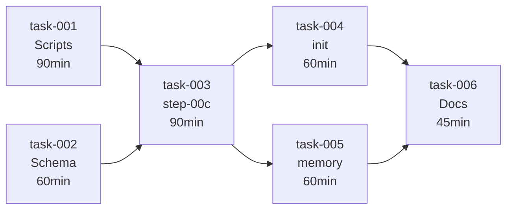

# Worktree Integration in /implement

> Generated: 2026-01-29 | Tasks: 6 | Estimated: 6.75h (4.75h optimized)

## Overview

Integration des git worktrees dans le skill `/implement` pour permettre le developpement parallele de plusieurs features.

### Scope

**In Scope:**
- Creation automatique de worktree par session /implement
- Nettoyage apres merge/abandon
- Gestion etat dans state-manager
- Compatible --continue

**Out of Scope:**
- Synchronisation bidirectionnelle entre worktrees
- Integration dans /quick

## Tasks

| # | Task | Duration | Dependencies | Steps |
|---|------|----------|--------------|-------|
| 001 | [Create worktree shell scripts](task-001-worktree-scripts.md) | 90 min | - | 4 |
| 002 | [Extend state.json schema](task-002-state-schema.md) | 60 min | - | 3 |
| 003 | [Create step-00c-worktree.md](task-003-step-00c.md) | 90 min | 001, 002 | 4 |
| 004 | [Modify step-00-init.md](task-004-modify-init.md) | 60 min | 003 | 3 |
| 005 | [Modify step-07-memory.md](task-005-modify-memory.md) | 60 min | 003 | 3 |
| 006 | [Update documentation](task-006-documentation.md) | 45 min | 003, 004, 005 | 2 |

**Total:** 6 tasks, 19 steps, 405 minutes

## Dependency Graph

## Execution Phases

### Phase 1: Foundation (Parallel)
- **task-001**: Create worktree shell scripts (90 min)
- **task-002**: Extend state.json schema (60 min)

### Phase 2: Core Implementation
- **task-003**: Create step-00c-worktree.md (90 min)

### Phase 3: Integration (Parallel)
- **task-004**: Modify step-00-init.md (60 min)
- **task-005**: Modify step-07-memory.md (60 min)

### Phase 4: Finalization
- **task-006**: Update documentation (45 min)

## Execution Summary

| Metric | Value |
|--------|-------|
| Total effort | 6.75h |
| Critical path | T001 → T003 → T004 → T006 |
| Parallel opportunities | 2 (Phase 1, Phase 3) |
| Optimized duration | 4.75h |
| Complexity | STANDARD |

## Routing

**Recommended:** `/implement worktree-implement @docs/specs/worktree-implement/`

---

## Source

- Brief: [brief-worktree-implement-2026-01-29.md](../../briefs/worktree-implement/brief-worktree-implement-2026-01-29.md)
- PRD: [worktree-implement.prd.json](worktree-implement.prd.json)
