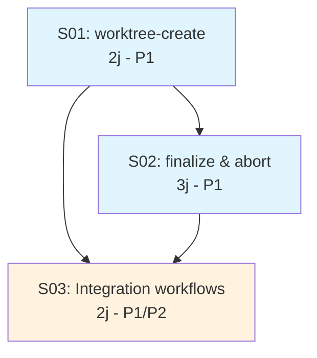
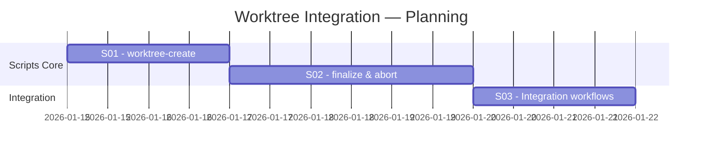

# INDEX — Worktree Integration EPCI

| Metadata | Value |
|----------|-------|
| **PRD Source** | `docs/briefs/worktree-integration/brief-worktree-integration-2026-01-14.md` |
| **Generated** | 2026-01-14 |
| **Total Specs** | 3 |
| **Total Effort** | 7 jours |
| **Parallelization** | 0 (sequentiel) |

---

## Summary Table

| ID | Title | Effort | Priority | Dependencies | Status |
|----|-------|--------|----------|--------------|--------|
| S01 | Script worktree-create | 2j | P1 | - | Pending |
| S02 | Scripts finalize & abort | 3j | P1 | S01 | Pending |
| S03 | Integration workflows | 2j | P1/P2 | S01, S02 | Pending |

---

## Dependency Graph



---

## Gantt Planning



**Duree totale**: 7 jours (sequentiel)

---

## Specs Detail

### S01 — Script worktree-create.sh

**Fichier**: [S01-worktree-create.md](./S01-worktree-create.md)

| Aspect | Value |
|--------|-------|
| Effort | 2 jours |
| Priority | P1 (Must-have) |
| Dependencies | - |
| User Story | US1 |

**Deliverables**:
- `src/scripts/worktree-create.sh`

---

### S02 — Scripts finalize & abort

**Fichier**: [S02-worktree-finalize-abort.md](./S02-worktree-finalize-abort.md)

| Aspect | Value |
|--------|-------|
| Effort | 3 jours |
| Priority | P1 (Must-have) |
| Dependencies | S01 |
| User Stories | US2, US3 |

**Deliverables**:
- `src/scripts/worktree-finalize.sh`
- `src/scripts/worktree-abort.sh`

---

### S03 — Integration workflows EPCI

**Fichier**: [S03-integration-workflows.md](./S03-integration-workflows.md)

| Aspect | Value |
|--------|-------|
| Effort | 2 jours |
| Priority | P1 (integration) / P2 (suggestion) |
| Dependencies | S01, S02 |
| User Stories | US2 (integration), US4 |

**Deliverables**:
- Modification `src/commands/epci.md`
- Modification `src/commands/quick.md`
- Modification `src/commands/brief.md`

---

## Execution Options

### Option A: Manual execution

```bash
# Execute each spec with /brief
/brief @docs/specs/worktree-integration/S01-worktree-create.md
/brief @docs/specs/worktree-integration/S02-worktree-finalize-abort.md
/brief @docs/specs/worktree-integration/S03-integration-workflows.md
```

### Option B: Autonomous execution (Ralph)

```bash
cd docs/specs/worktree-integration
./ralph.sh
```

---

## Files Overview

```
docs/specs/worktree-integration/
├── INDEX.md              # This file
├── backlog.md            # Backlog table view
├── prd.json              # Ralph stories format
├── ralph.sh              # Executable loop script
├── progress.txt          # Iteration logging
├── S01-worktree-create.md
├── S02-worktree-finalize-abort.md
└── S03-integration-workflows.md
```
