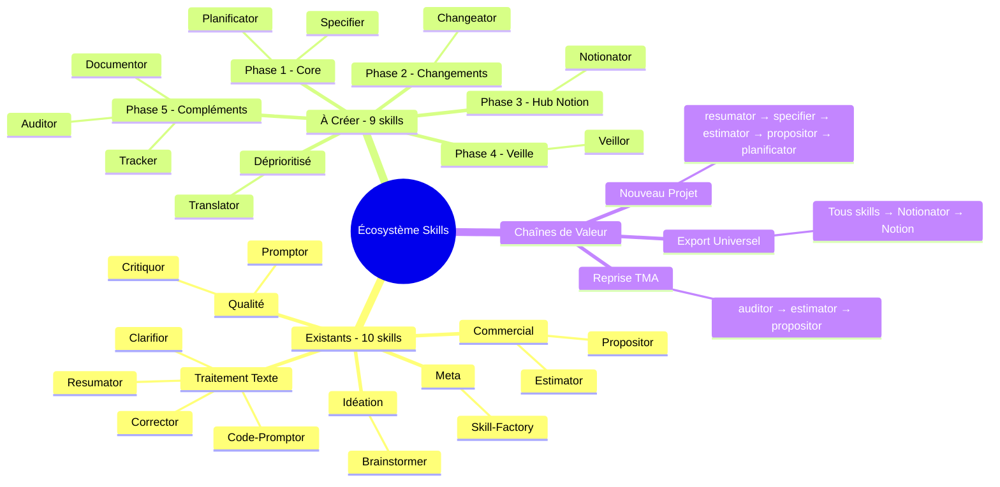

# Extension de l'Écosystème Skills Claude

> Généré le 16 décembre 2025 — 5 itérations — Template: project — EMS Final: 85/100 🌳

---

## 1. Contexte et Objectif Initial

Ce brainstorming visait à identifier et prioriser les skills complémentaires à ajouter à l'écosystème existant de 10 skills Claude, afin de créer un système de productivité IA complet couvrant l'ensemble du cycle de vie d'un projet web.

**Question initiale** :
Quels skills manquent à l'écosystème pour avoir un système performant et complet, du brief client jusqu'à la livraison ?

**Périmètre** :
- ✅ Dans le scope : Skills Claude.ai / Claude Code, workflows développeur/chef de projet, chaînes de valeur complètes
- ❌ Hors scope : Intégrations MCP tierces, skills pour autres métiers, implémentation technique détaillée

**Critères de succès définis** :
1. Liste priorisée des skills à développer (existants planifiés + nouveaux)
2. Identification des chaînes de valeur complètes
3. Gaps fonctionnels clairement identifiés
4. Roadmap actionnable avec ordre de développement

---

## 2. Synthèse Exécutive

L'écosystème actuel de 10 skills couvre bien les phases d'idéation, de traitement de texte et de cycle commercial initial. Cependant, des gaps significatifs existent dans la **gestion de projet opérationnelle**, la **formalisation des specs**, et l'**intégration avec Notion** qui est le hub central de productivité.

Sur les 8 skills initialement planifiés (brainstorming précédent), 6 restent pertinents. L'analyse a fait émerger **4 nouveaux skills** non identifiés précédemment, dont un hub centralisé pour Notion et un clarificateur de specs floues — deux douleurs majeures identifiées.

**Insight clé** : Le skill **Notionator** (hub d'export centralisé vers Notion) représente un multiplicateur de valeur pour tous les autres skills, mais sa complexité (multi-espaces, bases homonymes) justifie de le développer en Phase 3, après avoir stabilisé les skills qu'il servira.

---

## 3. Analyse et Conclusions Clés

### 3.1 État de l'écosystème actuel

L'écosystème de 10 skills existants couvre :

| Catégorie | Skills | Couverture |
|-----------|--------|------------|
| Idéation & Réflexion | Brainstormer | ✅ Complète |
| Cycle Commercial | Estimator, Propositor | ✅ Complète |
| Traitement de Texte | Code-Promptor, Corrector, Clarifior, Resumator | ✅ Complète |
| Qualité & Amélioration | Critiquor, Promptor | ✅ Complète |
| Méta / Infrastructure | Skill-Factory | ✅ Complète |

**Gap majeur identifié** : La phase post-signature (gestion de projet, specs, planning, suivi) n'est pas couverte.

### 3.2 Douleurs principales à adresser

Deux douleurs récurrentes ont été identifiées :

1. **Specs floues** — Les clients envoient des briefs vagues par email ou en réunion, nécessitant un travail de clarification et formalisation chronophage.

2. **Gestion des changements** — Les demandes de modification en cours de projet sont difficiles à évaluer (impact délai/budget) et à tracer.

**Implication** : Les skills Specifier et Changeator adressent directement ces douleurs et doivent être prioritaires.

### 3.3 Centralité de Notion

Notion est le "second cerveau" : gestion de projet, base de connaissances, CRM, facturation. Tous les outputs de skills gagneraient à être pushés automatiquement dans les bonnes bases Notion.

**Complexité identifiée** : Structure Notion établie avec multi-espaces d'équipe et bases homonymes — le skill Notionator devra gérer cette complexité avec un système de mapping configurable.

### 3.4 Nouveaux besoins émergents

| Besoin | Skill proposé | Justification |
|--------|---------------|---------------|
| Veille technologique | Veillor | Rester à jour sur Claude, Symfony, React, Python sans y passer des heures |
| Clarification specs | Specifier | Transformer specs floues en user stories Agile |
| Gestion changements | Changeator | Formaliser et évaluer les avenants projet |
| Export Notion | Notionator | Centraliser tous les exports vers Notion |

---

## 4. Décisions et Orientations

| Décision | Justification | Impact | Confiance |
|----------|---------------|--------|-----------|
| Prioriser Planificator et Specifier en Phase 1 | Plus haut score (85 et 83), résolvent douleurs majeures | Chaîne complète du brief au planning | Haute |
| Créer Notionator comme hub centralisé | Évite duplication code, format unifié | Tous les skills en bénéficient | Haute |
| Déprioritiser Negociator et Translator | Profil dev/chef de projet, pas commercial. Usage ponctuel. | Focus sur core business | Haute |
| Retirer Contractor | Couvert par Planificator + template Notion | Pas de skill supplémentaire | Haute |
| Veillor en mode manuel d'abord | V1 simple, automatisation Make/n8n en V2 | Livraison rapide | Moyenne |

### Décisions reportées

- **Intégration Make/n8n pour Veillor** — Reportée à V2 du skill. À revisiter après validation du flux manuel.

---

## 5. Plan d'Action

| # | Action | Priorité | Effort | Timeline | Owner | Dépendances |
|---|--------|----------|--------|----------|-------|-------------|
| 1 | Développer Planificator | 🔴 Haute | 4-5 JH | Phase 1 | Edouard | Estimator (existant) |
| 2 | Développer Specifier | 🔴 Haute | 4-5 JH | Phase 1 | Edouard | Resumator (existant) |
| 3 | Développer Changeator | 🟡 Moyenne | 3-4 JH | Phase 2 | Edouard | - |
| 4 | Développer Notionator | 🟡 Moyenne | 5-7 JH | Phase 3 | Edouard | Connecteur Notion MCP |
| 5 | Développer Veillor V1 (manuel) | 🟡 Moyenne | 2-3 JH | Phase 4 | Edouard | - |
| 6 | Automatiser Veillor V2 (Make/n8n) | 🟢 Basse | 1-2 JH | Post-Phase 4 | Edouard | Veillor V1 |
| 7 | Développer Documentor | 🟢 Basse | 3-4 JH | Phase 5 | Edouard | - |
| 8 | Développer Auditor | 🟢 Basse | 3-4 JH | Phase 5 | Edouard | - |
| 9 | Développer Tracker | 🟢 Basse | 3-4 JH | Phase 5 | Edouard | Planificator |

### Quick Wins (Impact élevé, Effort faible)

1. **Specifier** — Résout immédiatement la douleur #1 (specs floues), rentabilise le cadrage projet
2. **Veillor V1** — Standalone, pas de dépendances, valeur personnelle immédiate

### Investissements Stratégiques (Impact élevé, Effort élevé)

1. **Notionator** — Complexité justifiée par l'effet multiplicateur sur tous les autres skills

---

## 6. Risques et Points d'Attention

| Risque | Probabilité | Impact | Mitigation |
|--------|-------------|--------|------------|
| Complexité Notionator sous-estimée | Moyenne | Haute | Prévoir buffer +50%, itérer par phases |
| Bases Notion homonymes créent conflits | Haute | Moyenne | Mapping explicite par espace + confirmation user |
| Veillor génère trop de bruit | Moyenne | Faible | Sources fiables uniquement, fréquence ajustable |
| Surcharge cognitive avec trop de skills | Faible | Moyenne | Triggers bien différenciés, descriptions claires |

### Hypothèses posées

- **Connecteur Notion MCP reste stable** — Si changement majeur : adapter Notionator
- **Workflow Agile (user stories)** — Si autre méthodologie requise : adapter Specifier

---

## 7. Pistes Non Explorées

| Sujet | Pourquoi non exploré | Valeur potentielle | Prochaine étape suggérée |
|-------|----------------------|---------------------|--------------------------|
| Intégration calendrier | Hors périmètre initial | Moyenne | Brainstorm dédié si besoin |
| Skills collaboratifs (multi-user) | Complexité technique | Haute | À explorer quand écosystème stabilisé |
| Skill de facturation | Déjà géré dans Notion | Faible | Pas de suite |
| Skill de reporting client | Peut être couvert par Documentor | Moyenne | Évaluer après Documentor |

---

## 8. Mindmap de Synthèse



---

## 9. Vérification des Critères de Succès

| Critère | Statut | Preuve |
|---------|--------|--------|
| Liste priorisée des skills | ✅ Atteint | 9 skills priorisés avec scoring objectif |
| Chaînes de valeur complètes | ✅ Atteint | 3 chaînes documentées (nouveau projet, TMA, export) |
| Gaps fonctionnels identifiés | ✅ Atteint | 4 nouveaux skills créés pour combler les gaps |
| Roadmap actionnable | ✅ Atteint | 5 phases avec effort estimé (27-37 JH total) |

**Évaluation globale** : Le brainstorming a pleinement atteint ses objectifs. La roadmap est claire, priorisée et directement actionnable.

---

## 10. Score EMS Final

```
📊 EMS Final : 85/100 🌳 Mature

Score EMS
100 ┤                                    ●
 90 ┤ · · · · · · · · · · · · · · ·●· · · · ·
 80 ┤                           ●
 70 ┤                      ●
 60 ┤ · · · · · · · · ·●· · · · · · · · · · ·
 50 ┤               ●
 40 ┤          ●
 30 ┤ · · ·●· · · · · · · · · · · · · · · · ·
 20 ┤
  0 ┼────┴─────┴─────┴─────┴─────┴─────┴
    Init  It.1  It.2  It.3  It.4  It.5

Axes finaux :
   Clarté       ██████████████████░░ 92/100
   Profondeur   █████████████████░░░ 85/100
   Couverture   █████████████████░░░ 88/100
   Décisions    █████████████████░░░ 82/100
   Actionnab.   ██████████████░░░░░░ 72/100
```

---

## 11. Sources et Références

### Conversations passées consultées

- **Brainstorming précédent (Skill Cloud)** : CDC initial des 8 skills complémentaires, matrice de synergies, roadmap V1
- **Développement Propositor** : Contexte de scission Brief Analyzer en Estimator + Propositor

### Documents de référence

- Écosystème skills existant (10 SKILL.md analysés)
- Structure Notion existante (mentionnée, non analysée en détail)

---

*Document généré par Brainstormer v2.0 — Auto-portant et utilisable indépendamment*
