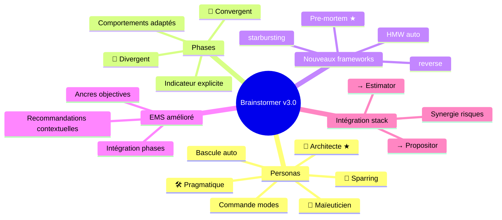

# Amélioration du Skill Brainstormer — Roadmap v3.0

> Généré le 2025-01-22 — 7 itérations — Template: audit — EMS Final: 95/100 🎯

---

## 1. Contexte et Objectif Initial

Ce méta-brainstorming visait à auditer le skill Brainstormer v2.0 existant (~155K de documentation) pour identifier les points faibles, incohérences et fonctionnalités manquantes, puis définir une roadmap d'amélioration vers une v3.0 plus robuste et différenciante.

**Question initiale** : Comment améliorer Brainstormer pour qu'il apporte une vraie valeur ajoutée dans le contexte de la stack existante (Estimator, Propositor, Skill-Factory, EPCI) et des besoins clients B2B (GMS, municipalités, industriels) ?

**Périmètre** :
- Inclus : SKILL.md, toutes les références (EMS, frameworks, categories, biases, templates, output-formats), exemples
- Exclus : Autres skills, comparaison approfondie avec outils externes payants

**Critères de succès définis** :
1. Liste claire des problèmes identifiés avec sévérité
2. Propositions d'amélioration concrètes et priorisées
3. Roadmap v3.0 avec specs actionnables

---

## 2. Synthèse Exécutive

L'audit a révélé un skill déjà solide (système EMS bien pensé, frameworks riches, templates différenciés) mais avec des lacunes structurelles : absence de personnalité définie, scoring EMS subjectif, manque de guidance sur le processus créatif (divergent/convergent).

Le benchmark des outils de brainstorming IA du marché (Miro AI, Taskade, XMind Copilot) a permis d'identifier 8 fonctionnalités innovantes potentielles, dont 4 ont été retenues après scoring contextuel basé sur la valeur métier, la synergie avec la stack existante, et la non-intrusivité.

**Insight clé** : La vraie différenciation de Brainstormer v3.0 réside dans son système de personas adaptatifs et sa structure explicite divergent/convergent — des fonctionnalités que les outils concurrents ne proposent pas de manière intégrée.

**Décisions principales** :
- Système de 4 personas avec bascule automatique (défaut: Architecte Méthodique)
- Indicateur de phase Divergent/Convergent explicite
- Génération automatique de questions HMW en phase init
- Pre-mortem comme nouveau framework à haute valeur B2B
- Ancres objectives pour le scoring EMS

---

## 3. Analyse et Conclusions Clés

### 3.1 Audit de l'existant — Problèmes identifiés

**Incohérences structurelles** :

| Problème | Sévérité | Résolution v3.0 |
|----------|----------|-----------------|
| Langue mixte (EN/FR) dans les docs | 🟠 Haute | Harmoniser en FR ou EN selon fichier |
| Version datée du même jour (suspicieux) | 🟡 Moyenne | Versionning réaliste |
| Duplication checkpoint/journal | 🟡 Moyenne | Consolider dans output-formats.md |
| Un seul exemple (feature) | 🟠 Haute | Ajouter exemples decision, problem |

**Lacunes fonctionnelles** :

| Lacune | Impact | Résolution v3.0 |
|--------|--------|-----------------|
| Pas de personnalité définie | Haute | Système de 4 personas |
| EMS scoring subjectif | Critique | Ancres objectives par axe |
| Pas de distinction divergent/convergent | Haute | Indicateur + comportements adaptés |
| Pas de HMW structurés | Moyenne | Génération auto en init |
| Coaching mode vague | Moyenne | Clarification par persona |

**Points forts conservés** :
- Structure EMS à 5 axes pertinente
- Catalogue de 8 frameworks bien documentés
- Système de biais avec seuils et cooldowns
- Templates différenciés (feature, audit, project, research)

### 3.2 Benchmark marché — Enseignements

L'analyse des outils concurrents a révélé que la plupart se concentrent sur la génération d'idées (divergent) mais négligent la phase de convergence et de décision.

**Fonctionnalités identifiées et évaluées** :

| Fonctionnalité | Score | Décision |
|----------------|-------|----------|
| Pre-mortem | 4.8/5 | ✅ Ajouter |
| HMW auto-générés | 4.4/5 | ✅ Ajouter |
| Indicateur Divergent/Convergent | 4.2/5 | ✅ Ajouter |
| Commande modes (personas) | 4.0/5 | ✅ Ajouter |
| Techniques reverse/starbursting | 3.2/5 | 🟡 Optionnel |
| Timeboxing | 3.0/5 | 🟡 Améliorer Quick mode |
| Clustering automatique | 2.6/5 | ❌ Redondant |
| Innovation score | 2.2/5 | ❌ Redondant |
| Mindmap live | 1.8/5 | ❌ Trop intrusif |

### 3.3 Système de Personas — Architecture retenue

Quatre personas avec bascule automatique intelligente :

| Persona | Icône | Philosophie | Contexte d'activation |
|---------|-------|-------------|----------------------|
| **Maïeuticien** | 🧒 | Socrate bienveillant | Exploration libre, début de session |
| **Sparring Partner** | 🥊 | Coach exigeant | Certitudes à challenger, devil's advocate |
| **Architecte** | 📐 | Structurant (DÉFAUT) | Sujets complexes, synthèse |
| **Pragmatique** | 🛠️ | Orienté action | Stagnation, décisions à prendre |

La commande `modes` permet de visualiser et switcher manuellement entre les personas.

### 3.4 Intégration avec la stack existante

```
Brainstormer v3.0
├── HMW → Cadrage du besoin client
├── Divergent → Exploration libre
├── Pre-mortem → Identification risques
├── Convergent → Décisions
└── Rapport final
         │
         ▼
    Estimator ← Risques alimentent le chiffrage
         │
         ▼
    Propositor ← Section risques pré-remplie
```

Le pre-mortem devient un argument commercial : "On anticipe vos risques avant qu'ils ne surviennent."

---

## 4. Décisions et Orientations

| Décision | Rationale | Impact | Confiance |
|----------|-----------|--------|-----------|
| Personas hybride avec 4 modes | Flexibilité + personnalité | UX majeure | 🟢 Haute |
| Défaut = Architecte Méthodique | Correspond au profil clients B2B | Cohérence | 🟢 Haute |
| Bascule automatique par défaut | Moins de charge cognitive | UX | 🟢 Haute |
| Ancres EMS objectives | Réduit la subjectivité du scoring | Fiabilité | 🟢 Haute |
| HMW en phase init | Cadrage rapide des problèmes flous | Efficacité | 🟢 Haute |
| Pre-mortem comme framework | Haute valeur B2B, synergie Propositor | Différenciation | 🟢 Haute |
| Indicateur Divergent/Convergent | Structure le processus créatif | Clarté | 🟢 Haute |
| Skip mindmap live | Trop intrusif, mindmap finale suffit | Simplicité | 🟢 Haute |
| Skip innovation score | Redondant avec scoring existant | Éviter bloat | 🟢 Haute |

### Décisions reportées

- **Template PRD** : Reporté pour version Claude Code (pas prioritaire pour web)
- **Techniques crazy8, SCAMPER, lotus** : Trop "atelier créatif", pas le contexte B2B actuel

---

## 5. Plan d'Action

| # | Action | Priorité | Effort | Fichier impacté |
|---|--------|----------|--------|-----------------|
| 1 | Créer `references/personas.md` | 🔴 Haute | 2h | Nouveau fichier |
| 2 | Ajouter pre-mortem à `frameworks.md` | 🔴 Haute | 30min | frameworks.md |
| 3 | Ajouter HMW en phase init | 🔴 Haute | 1h | SKILL.md + templates.md |
| 4 | Implémenter indicateur Divergent/Convergent | 🔴 Haute | 1h | SKILL.md + ems-system.md |
| 5 | Ajouter commandes `modes`, `mode [x]`, `diverge`, `converge` | 🔴 Haute | 30min | SKILL.md |
| 6 | Mettre à jour ancres EMS objectives | 🟡 Moyenne | 1h | ems-system.md |
| 7 | Harmoniser langue des fichiers | 🟡 Moyenne | 1h | Tous les fichiers |
| 8 | Ajouter exemples dialogue personas | 🟢 Basse | 1h | examples/dialogue-personas.md |
| 9 | Ajouter techniques `reverse` et `starbursting` | 🟢 Basse | 30min | frameworks.md |

**Effort total estimé** : ~8-10 heures

### Quick Wins

1. **Pre-mortem** — Framework simple à documenter, haute valeur immédiate
2. **Commande `modes`** — UX simple, différenciation forte

### Investissements stratégiques

1. **Système personas complet** — Transformation de l'expérience utilisateur
2. **Indicateur Divergent/Convergent** — Structure le processus créatif de manière unique

---

## 6. Risques et Considérations

| Risque | Probabilité | Impact | Mitigation |
|--------|-------------|--------|------------|
| Bascule auto de persona confuse | 🟡 Moyenne | 🟡 Modéré | Indicateur clair + override manuel facile |
| Surcharge cognitive avec trop de commandes | 🟢 Faible | 🟡 Modéré | Commandes optionnelles, défauts intelligents |
| Ancres EMS trop rigides | 🟡 Moyenne | 🟢 Faible | Garder "OU" dans les critères, flexibilité |
| HMW générés non pertinents | 🟢 Faible | 🟢 Faible | Option de reformulation, flag `--no-hmw` |

### Hypothèses

- Les utilisateurs veulent de la structure (validé par profil clients B2B)
- La bascule automatique de persona sera perçue positivement
- Les ancres EMS objectives amélioreront la cohérence inter-sessions

---

## 7. Pistes Non Explorées

| Piste | Pourquoi non exploré | Valeur potentielle | Pour plus tard |
|-------|---------------------|-------------------|----------------|
| Template PRD complet | Orienté Claude Code | 🟡 Moyenne | v3.1 Claude Code |
| Crazy 8s, SCAMPER, Lotus | Trop "atelier créatif" | 🟢 Faible | Si demande client |
| Intégration Notion native | Complexité technique | 🟡 Moyenne | Quand connecteur stable |
| Multi-utilisateurs sync | Hors scope actuel | 🟡 Moyenne | Si besoin atelier |
| Historique cross-sessions | Complexité | 🟠 Haute | v4.0 |

---

## 8. Mindmap de Synthèse



---

## 9. Vérification des Critères de Succès

| Critère | Statut | Évidence |
|---------|--------|----------|
| Liste claire des problèmes avec sévérité | ✅ Atteint | Section 3.1 — 10+ problèmes identifiés et classés |
| Propositions d'amélioration priorisées | ✅ Atteint | Section 3.2 — Scoring 1-5 de 8 fonctionnalités |
| Roadmap v3.0 avec specs actionnables | ✅ Atteint | Section 5 + Itération 7 (specs détaillées) |

**Évaluation globale** : Tous les critères de succès sont atteints. L'exploration a produit une roadmap complète avec des specs prêtes à implémenter.

---

## 10. Score EMS Final

```
📊 EMS Final : 95/100 🎯

Score EMS
100 ┤                                             ●─── 95 (Fin)
 90 ┤ · · · · · · · · · · · · · · · · · · · · ·╭──╯· · 
 85 ┤                                    ╭────╯
 78 ┤                              ╭────╯
 68 ┤                        ╭────╯
 60 ┤ · · · · · · · · · · · ·│· · · · · · · · · · · · 
 52 ┤                  ╭────╯
 40 ┤            ╭────╯
 32 ┤      ╭────╯
 30 ┤ · · ·│· · · · · · · · · · · · · · · · · · · · · 
 20 ┤     │
  0 ┼─────┴─────┴─────┴─────┴─────┴─────┴─────┴─────
    Init  It.1  It.2  It.3  It.4  It.5  It.6  It.7

Axes finaux :
   Clarté       ███████████████████░ 95/100
   Profondeur   ███████████████████░ 94/100
   Couverture   ████████████████████ 96/100
   Décisions    ███████████████████░ 94/100
   Actionnab.   ██████████████████░░ 92/100
```

---

## 11. Sources et Références

### Recherches web effectuées

- Benchmark outils IA brainstorming 2024-2025 (Miro AI, Taskade, XMind, HyperWrite)
- Techniques de brainstorming et facilitation (IDEO, Design Council, IxDF)
- Recherche académique sur divergent/convergent thinking et CSTs

### Fichiers analysés

- `/mnt/skills/user/brainstormer/SKILL.md` (16K)
- `/mnt/skills/user/brainstormer/references/*.md` (87K total)
- `/mnt/skills/user/brainstormer/examples/*.md` (23K)

### Insights clés du benchmark

- La plupart des CSTs négligent la phase convergente
- Les outils IA de brainstorming manquent de personnalité/style défini
- Le pre-mortem est sous-utilisé malgré sa haute valeur
- La distinction divergent/convergent est rarement explicite dans les outils

---

## 12. Annexe — Structure de fichiers v3.0

```
/brainstormer/
├── SKILL.md                          # Mis à jour
├── brainstorm-ems-journal.md
├── brainstorm-ems-report.md
│
├── references/
│   ├── personas.md                   # NOUVEAU
│   ├── ems-system.md                 # Mis à jour (ancres + phases)
│   ├── frameworks.md                 # Mis à jour (+ pre-mortem)
│   ├── templates.md                  # Mis à jour (+ HMW)
│   ├── biases.md
│   ├── categories.md
│   └── output-formats.md
│
└── examples/
    ├── rapport-feature.md
    ├── journal-example.md
    └── dialogue-personas.md          # NOUVEAU
```

---

*Document généré par Brainstormer v2.0 — Autoportant et indépendamment utilisable*
