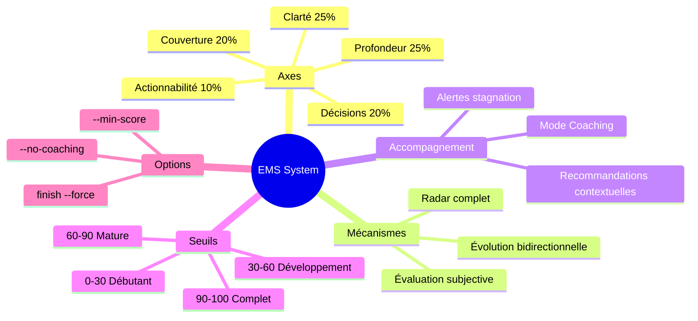

# Système EMS (Exploration Maturity Score) pour Brainstormer

> Généré le 2025-01-12 — 5 itérations — Template: feature

---

## 1. Contexte et Objectif Initial

Ce brainstorming avait pour objectif de concevoir un **système de notation pondérée évolutive** pour le skill Brainstormer. L'idée était de créer un score qui se construit et s'affine à chaque itération, permettant de mesurer objectivement la maturité et la qualité d'une exploration.

**Problème initial** : Le skill Brainstormer v1.1 ne disposait d'aucune mesure objective de la "qualité" ou "maturité" d'une exploration en cours. L'utilisateur n'avait pas de repère pour savoir s'il avait suffisamment creusé un sujet ou s'il pouvait passer à la synthèse.

**Scope** :
- In scope : Système de scoring, affichage, recommandations, alertes, intégration au workflow
- Out of scope : Comparaison inter-sessions, IA prédictive

**Critères de succès définis** :
1. Mesurabilité : Le score reflète objectivement l'avancement
2. Évolutivité : Le score change de manière cohérente à chaque itération
3. Actionnabilité : Le score guide les prochaines actions
4. Non-intrusivité : Ne ralentit pas le flow naturel

---

## 2. Synthèse Exécutive

Le système **EMS (Exploration Maturity Score)** est un score composite sur 100 points, calculé à partir de 5 axes pondérés évalués à chaque itération. Le score évolue de manière bidirectionnelle (peut monter ou baisser) et déclenche des recommandations contextuelles basées sur les axes faibles.

**Key insight** : L'EMS transforme le brainstorming d'un processus subjectif en une démarche mesurable et guidée, sans sacrifier la créativité.

**Composants clés** :
- 5 axes : Clarté (25%), Profondeur (25%), Couverture (20%), Décisions (20%), Actionnabilité (10%)
- 4 seuils déclencheurs : 0-30 (débutant), 30-60 (développement), 60-90 (mature), 90-100 (complet)
- Recommandations contextuelles automatiques sur axes faibles
- Alertes de stagnation si progression < 5 pts sur 2 itérations
- Mode Coaching par défaut (niveau modéré)

---

## 3. Analyse et Conclusions Clés

### 3.1 Architecture du système EMS

Le score EMS repose sur une **évaluation subjective par Claude** à chaque fin d'itération, basée sur des critères explicites par axe.

**Formule** :
```
EMS = (Clarté × 0.25) + (Profondeur × 0.25) + (Couverture × 0.20) 
    + (Décisions × 0.20) + (Actionnabilité × 0.10)
```

**Justification des poids** :
- Clarté et Profondeur (25% chacun) : Fondamentaux d'une bonne exploration
- Couverture et Décisions (20% chacun) : Équilibre entre exhaustivité et progression
- Actionnabilité (10%) : Important mais souvent concentré en fin d'exploration

### 3.2 Les 5 axes détaillés

Chaque axe dispose d'une grille de 5 niveaux avec critères explicites :

| Axe | Question clé | Ce qui fait monter | Ce qui fait baisser |
|-----|--------------|-------------------|---------------------|
| **Clarté** | Le sujet est-il bien défini ? | Reformulations, contraintes explicitées | Pivot mal cadré, ambiguïtés |
| **Profondeur** | A-t-on creusé suffisamment ? | Deep dives, frameworks, 5 Whys | Rester en surface |
| **Couverture** | Tous les angles explorés ? | Alternatives, risques, Six Hats | Vision tunnel |
| **Décisions** | A-t-on tranché ? | Valider des orientations | Rouvrir des sujets clos |
| **Actionnabilité** | Peut-on agir concrètement ? | Actions avec responsables | Rester théorique |

### 3.3 Mécanismes d'accompagnement

**Recommandations contextuelles** : Lorsqu'un axe est < 40 (critique) ou < 60 (à améliorer), des suggestions ciblées sont proposées. Maximum 2 recommandations par itération pour ne pas surcharger.

**Alertes de stagnation** : Si le score global progresse de moins de 5 points pendant 2 itérations consécutives, une alerte douce propose des pistes : changer d'angle, deep dive, pivot, ou finish.

**Mode Coaching** (par défaut ON, niveau modéré) :
- 2-3 challenges par itération
- Push vers les frameworks pertinents
- Focus sur les axes faibles
- Désactivable avec `--no-coaching`

### 3.4 Intégration au workflow existant

Le système EMS s'intègre sans modifier le workflow existant :
- **Phase 1 (Init)** : EMS initialisé après validation du brief
- **Phase 2 (Itérations)** : EMS calculé et affiché à chaque fin d'itération
- **Phase 3 (Finish)** : EMS final inclus dans rapport et journal

---

## 4. Décisions et Orientations

| Décision | Rationale | Impact | Confiance |
|----------|-----------|--------|-----------|
| 5 axes avec poids 25/25/20/20/10 | Équilibre entre fondamentaux et progression | Structure du scoring | Haute |
| Évaluation subjective par Claude | Flexibilité, pas de checklist rigide | Cohérence variable mais naturelle | Haute |
| Pas de delta maximum | Permettre les vrais sauts qualitatifs | Évolution libre | Haute |
| Seuils 30/60/90 | Plages égales, sémantique claire | Déclencheurs cohérents | Haute |
| Coaching par défaut ON | Maximiser la valeur ajoutée | Expérience plus riche | Haute |
| Niveau coaching modéré | Équilibre challenge/confort | 2-3 challenges/itération | Moyenne |
| Radar complet systématique | Visibilité maximale pour l'utilisateur | Affichage détaillé | Haute |

**Décisions reportées** : Aucune

---

## 5. Plan d'Action

| # | Action | Priorité | Effort | Livrable |
|---|--------|----------|--------|----------|
| 1 | Créer `ems-system.md` | 🔴 Haute | Moyen | Nouveau fichier référence |
| 2 | Mettre à jour `SKILL.md` | 🔴 Haute | Élevé | Section EMS, flags, coaching |
| 3 | Mettre à jour `output-formats.md` | 🔴 Haute | Moyen | Format fin itération, journal |
| 4 | Mettre à jour exemples | 🟡 Moyenne | Faible | Rapport et journal avec EMS |
| 5 | Tester sur cas concrets | 🟡 Moyenne | Variable | Validation terrain |

### Quick Wins
1. Structure de données EMS simple (YAML) — Facile à implémenter
2. Affichage radar ASCII — Pas de dépendance externe

### Investissement stratégique
1. Calibrage des évaluations — Nécessitera ajustements itératifs après tests

---

## 6. Risques et Considérations

| Risque | Probabilité | Impact | Mitigation |
|--------|-------------|--------|------------|
| Incohérence d'évaluation entre sessions | Moyenne | Moyen | Critères explicites détaillés |
| Score perçu comme "jeu" plutôt qu'outil | Faible | Moyen | Recommandations actionnables |
| Surcharge cognitive (trop d'infos) | Faible | Moyen | Limiter à 2 recommandations |
| Mode coaching trop intrusif | Faible | Faible | Option `--no-coaching` |

**Hypothèses** :
- L'utilisateur valorise la mesure objective de progression
- Le mode coaching modéré est le bon équilibre

---

## 7. Pistes Non Explorées

| Piste | Pourquoi non explorée | Valeur potentielle | Next step suggéré |
|-------|----------------------|-------------------|-------------------|
| Comparaison inter-sessions | Complexité, peu de valeur perçue | Faible | Abandonné |
| Score minimum par axe | Temps limité | Moyenne | V2.1 si besoin |
| Personnalisation des poids | Complexité UX | Moyenne | V2.1 si demandé |
| Export EMS vers outils externes | Hors scope | Moyenne | Intégration future |

---

## 8. Synthèse Mindmap



---

## 9. Vérification des Critères de Succès

| Critère | Statut | Évidence |
|---------|--------|----------|
| Mesurabilité | ✅ Atteint | Score 0-100 avec 5 axes quantifiés |
| Évolutivité | ✅ Atteint | Delta calculé à chaque itération, bidirectionnel |
| Actionnabilité | ✅ Atteint | Recommandations ciblées, seuils déclencheurs |
| Non-intrusivité | ✅ Atteint | Intégré naturellement en fin d'itération |

**Évaluation globale** : Tous les critères de succès sont atteints. Le système EMS est prêt pour implémentation.

---

## 10. Score EMS Final de cette session

```
📊 EMS Final : 91/100

Score EMS
100 ┤                                        ┌──● 91
 90 ┤ · · · · · · · · · · · · · · · · · · · ·│· · seuil "finish recommandé"
 82 ┤                              ╭────────╯
 73 ┤                    ╭────────╯
 63 ┤          ╭────────╯
 60 ┤ · · · · ·│· · · · · · · · · · · · · · · · · seuil "finish possible"
 42 ┤    ╭────╯
 30 ┤ · ·│· · · · · · · · · · · · · · · · · · · · seuil "exploration jeune"
 18 ┤───╯
  0 ┼────┴─────┴─────┴─────┴─────┴
    Init  It.1  It.2  It.3  It.4  It.5

Axes finaux :
   Clarté       ██████████████████░░ 92/100
   Profondeur   █████████████████░░░ 88/100
   Couverture   █████████████████░░░ 90/100
   Décisions    ██████████████████░░ 94/100
   Actionnab.   █████████████████░░░ 88/100
```

---

## 11. Sources et Références

### Documents analysés
- Skill Brainstormer v1.1 complet (SKILL.md + 5 références + 2 exemples)

### Inspirations
- TRL (Technology Readiness Level) — NASA
- Scoring composite type NPS
- Frameworks d'évaluation de maturité

---

*Document généré par Brainstormer v1.1 — Prêt pour implémentation v2.0*
