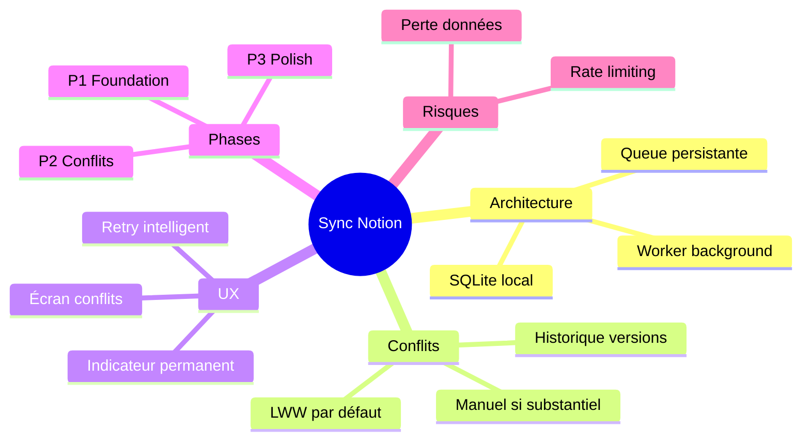

# Synchronisation Notion pour Application Mobile

> Généré le 2025-01-15 — 6 itérations — Template: feature — EMS Final: 82/100 🌳

---

## 1. Contexte et Objectif Initial

Ce brainstorming visait à définir la stratégie de synchronisation entre une application mobile React Native et l'API Notion pour permettre aux utilisateurs de gérer leurs tâches en mode offline puis de synchroniser lorsqu'une connexion est disponible.

**Question initiale** : Comment implémenter une synchronisation robuste et performante entre notre app mobile et Notion, en gérant les conflits et le mode offline ?

**Périmètre** :
- Inclus : Sync bidirectionnelle, gestion offline, résolution de conflits, UX de sync
- Exclus : Authentification (déjà implémentée), autres intégrations que Notion

**Critères de succès définis** :
1. Architecture de sync définie avec diagrammes
2. Stratégie de résolution de conflits choisie
3. Plan d'implémentation phasé

---

## 2. Synthèse Exécutive

L'exploration a abouti à une architecture de synchronisation basée sur le pattern **CRDT simplifié** avec stockage local SQLite et queue de synchronisation. La stratégie "Last Write Wins" avec option de résolution manuelle pour les conflits critiques a été retenue comme compromis entre simplicité et robustesse.

**Insight clé** : La complexité de la sync Notion réside moins dans l'API elle-même que dans la gestion des états intermédiaires et la communication claire à l'utilisateur du statut de synchronisation.

**Décisions principales** :
- Architecture : SQLite local + Queue de sync + Worker dédié
- Conflits : LWW par défaut, résolution manuelle pour modifications substantielles
- UX : Indicateur de sync persistant, mode "conflit" explicite
- Phasage : 3 phases sur 6 semaines

---

## 3. Analyse et Conclusions Clés

### 3.1 Architecture de synchronisation

L'architecture retenue sépare clairement les responsabilités :

```
┌─────────────┐     ┌─────────────┐     ┌─────────────┐
│   UI Layer  │────▶│  Sync Queue │────▶│  Notion API │
└─────────────┘     └─────────────┘     └─────────────┘
       │                   │
       ▼                   ▼
┌─────────────┐     ┌─────────────┐
│ Local Store │◀────│ Sync Worker │
│  (SQLite)   │     │  (Background)│
└─────────────┘     └─────────────┘
```

**Points clés** :
- Toute modification passe d'abord par le store local
- La queue de sync persiste les opérations en attente
- Le worker gère les retry et la priorisation

**Implications** : Cette architecture permet un mode offline complet mais nécessite une gestion rigoureuse des versions.

### 3.2 Stratégie de résolution de conflits

Trois stratégies ont été évaluées :

| Stratégie | Complexité | UX | Robustesse |
|-----------|------------|-----|------------|
| Last Write Wins | Faible | Simple | Risque perte |
| Merge automatique | Élevée | Invisible | Complexe |
| Résolution manuelle | Moyenne | Explicite | Sûre |

**Décision** : Approche hybride — LWW pour les modifications mineures (< 30 sec d'écart), résolution manuelle pour les conflits substantiels.

### 3.3 Expérience utilisateur de synchronisation

L'UX de sync est critique pour la confiance utilisateur :

- **Indicateur persistant** : Icône dans la toolbar (✓ synced, ↻ syncing, ⚠️ conflict, ✕ offline)
- **Mode conflit** : Écran dédié listant les conflits avec diff visuel
- **Retry intelligent** : Backoff exponentiel avec notification après 3 échecs

---

## 4. Décisions et Orientations

| Décision | Rationale | Impact | Confiance |
|----------|-----------|--------|-----------|
| SQLite pour stockage local | Performance, requêtes complexes possibles | Architecture | Haute |
| Queue persistante | Survit aux crashes, retry fiable | Robustesse | Haute |
| LWW + manuel hybride | Équilibre simplicité/sécurité | UX & Data | Haute |
| Worker en background | Sync non-bloquante | Performance | Haute |
| Indicateur permanent | Transparence pour l'utilisateur | UX | Moyenne |

### Décisions reportées
- Sync partielle (par workspace) — À évaluer en phase 2 selon usage réel

---

## 5. Plan d'Action

| # | Action | Priorité | Effort | Timeline | Owner | Dépendances |
|---|--------|----------|--------|----------|-------|-------------|
| 1 | Setup SQLite + schéma | 🔴 High | 2j | S1 | Dev | - |
| 2 | Implémenter queue de sync | 🔴 High | 3j | S1-S2 | Dev | #1 |
| 3 | Worker de synchronisation | 🔴 High | 4j | S2-S3 | Dev | #2 |
| 4 | Gestion des conflits LWW | 🟡 Medium | 2j | S3 | Dev | #3 |
| 5 | UI indicateur de sync | 🟡 Medium | 1j | S3 | Dev | #3 |
| 6 | Écran résolution conflits | 🟡 Medium | 3j | S4 | Dev | #4 |
| 7 | Tests E2E sync | 🟡 Medium | 2j | S5 | QA | #6 |
| 8 | Documentation | 🟢 Low | 1j | S6 | Dev | #7 |

### Quick Wins
1. Indicateur de sync dans toolbar — Visible immédiatement, rassure l'utilisateur
2. Mode offline read-only d'abord — Moins risqué, valeur immédiate

### Investissements stratégiques
1. Écran de résolution de conflits — UX différenciante, confiance utilisateur

---

## 6. Risques et Considérations

| Risque | Probabilité | Impact | Mitigation |
|--------|-------------|--------|------------|
| Rate limiting Notion API | Moyenne | Élevé | Queue avec throttling, cache agressif |
| Perte de données en conflit | Faible | Élevé | Historique local des versions |
| Complexité du merge | Moyenne | Moyen | Commencer par LWW simple |
| Performance sur gros datasets | Faible | Moyen | Pagination, sync incrémentale |

### Hypothèses
- L'API Notion reste stable — Si changement majeur : refactoring nécessaire
- Usage majoritairement online — Si offline fréquent : revoir priorité cache

---

## 7. Pistes Non Explorées

| Piste | Pourquoi | Valeur | Next Step |
|-------|----------|--------|-----------|
| Sync temps réel (WebSocket) | Complexité, pas dans l'API Notion | Moyenne | Veille technologique |
| Compression des données sync | Optimisation prématurée | Faible | Si problème de perf |
| Multi-compte | Hors scope initial | Moyenne | Phase 2 si demandé |

---

## 8. Mindmap de Synthèse



---

## 9. Vérification des Critères de Succès

| Critère | Statut | Évidence |
|---------|--------|----------|
| Architecture définie avec diagrammes | ✅ Atteint | Diagramme dans section 3.1 |
| Stratégie de conflits choisie | ✅ Atteint | Hybride LWW + manuel |
| Plan d'implémentation phasé | ✅ Atteint | 8 actions sur 6 semaines |

**Évaluation globale** : Tous les critères de succès sont atteints. L'exploration a produit une architecture actionnable.

---

## 10. Score EMS Final

```
📊 EMS Final : 82/100 🌳

Score EMS
100 ┤
 90 ┤ · · · · · · · · · · · · · · · · · · · ·
 82 ┤                              ╭────────● 82 (Fin)
 75 ┤                    ╭────────╯
 68 ┤          ╭────────╯
 60 ┤ · · · · ·│· · · · · · · · · · · · · · ·
 52 ┤    ╭────╯
 40 ┤───╯
 30 ┤ · · · · · · · · · · · · · · · · · · · ·
 20 ┤
  0 ┼────┴─────┴─────┴─────┴─────┴─────┴─────
    Init  It.1  It.2  It.3  It.4  It.5  It.6

Axes finaux :
   Clarté       █████████████████░░░ 88/100
   Profondeur   ████████████████░░░░ 82/100
   Couverture   ████████████████░░░░ 80/100
   Décisions    █████████████████░░░ 85/100
   Actionnab.   ██████████████░░░░░░ 72/100
```

---

## 11. Sources et Références

### Recherches web effectuées
- Documentation API Notion : Limites de rate, endpoints de sync
- Patterns de synchronisation offline-first : CRDT, Event Sourcing

### Connaissances mobilisées
- Expérience React Native + SQLite
- Patterns de sync mobile (Realm, Firebase)

---

*Document généré par Brainstormer v2.0 — Autoportant et indépendamment utilisable*
