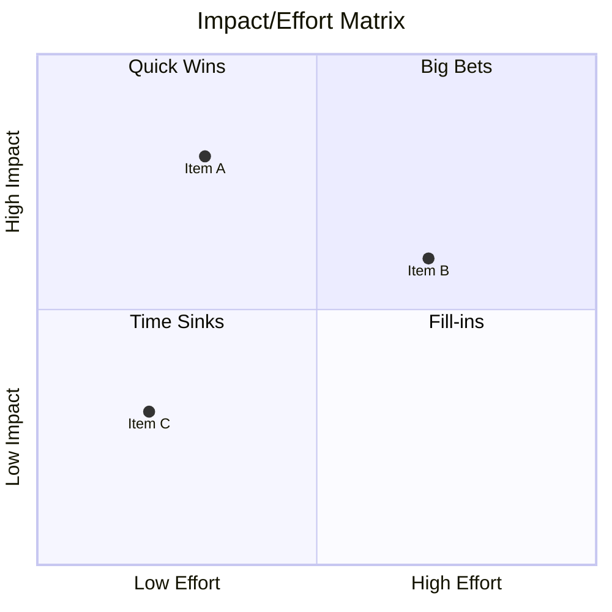

# Frameworks Catalog

> Complete reference for thinking frameworks and idea scoring in Brainstormer

---

## Framework Overview

| Framework | Category | Best For | Complexity | Time |
|-----------|----------|----------|------------|------|
| SWOT | Analysis | Evaluating options, strategic planning | Low | 10-15 min |
| 5 Whys | Clarification | Root cause analysis | Low | 5-10 min |
| MoSCoW | Prioritization | Feature prioritization | Low | 10-15 min |
| Six Thinking Hats | Perspective | Creative exploration, decision-making | Medium | 15-25 min |
| Impact/Effort Matrix | Prioritization | Action planning | Low | 10 min |
| Weighted Criteria Grid | Analysis | Multi-criteria comparison | Medium | 15-20 min |
| Comparative Matrix | Research | Benchmarking, vendor selection | Medium | 15-20 min |
| Business Model Canvas | Strategy | Business model design | High | 25-40 min |

---

## Idea Scoring System

### When to Use Scoring

Propose scoring when:
- Multiple competing ideas have emerged
- Prioritization is needed for action planning
- User seems undecided between options
- Before generating final report with action plan

### Scoring Formula

For each idea, score on 4 criteria:

| Criterion | Weight | Scale | Description |
|-----------|--------|-------|-------------|
| **Impact** | 40% | 1-5 | Business value, user benefit, strategic alignment |
| **Effort** | 30% | 1-5 | Time, cost, complexity (inverted: 5 = low effort) |
| **Risk** | 20% | 1-5 | Probability × severity of failure (inverted: 5 = low risk) |
| **Alignment** | 10% | 1-5 | Fit with constraints, existing systems, team capabilities |

**Formula**:
```
Final Score = (Impact × 0.40) + (Effort × 0.30) + (Risk × 0.20) + (Alignment × 0.10)
```

**Score interpretation**:
| Score | Level | Recommendation |
|-------|-------|----------------|
| 4.5 - 5.0 | Excellent | Prioritize immediately |
| 3.5 - 4.4 | Good | Strong candidate |
| 2.5 - 3.4 | Moderate | Consider with caveats |
| 1.5 - 2.4 | Weak | Likely deprioritize |
| 1.0 - 1.4 | Poor | Recommend against |

### Scoring Output Format

```markdown
## 📊 Idea Scoring

| Idea | Impact | Effort | Risk | Alignment | **Score** |
|------|--------|--------|------|-----------|-----------|
| [Idea A] | 4 | 5 | 4 | 4 | **4.3** |
| [Idea B] | 5 | 2 | 3 | 5 | **3.8** |
| [Idea C] | 3 | 4 | 5 | 3 | **3.8** |

**Ranking**:
1. 🥇 Idea A (4.3) — Best balance of impact and feasibility
2. 🥈 Idea B (3.8) — Highest impact but significant effort
3. 🥉 Idea C (3.8) — Low risk but moderate impact

**Recommendation**: [Synthesis based on scores and context]
```

### Custom Scoring Criteria

User can request custom criteria:
- "Add 'time to market' as a criterion"
- "Weight impact higher, I care less about risk"

When customizing:
1. Acknowledge the customization
2. Redistribute weights to total 100%
3. Apply new formula
4. Note customization in report

---

## Framework Details

### SWOT Analysis

**Purpose**: Evaluate internal and external factors affecting a decision or strategy.

**Structure**:
```
┌─────────────────┬─────────────────┐
│   STRENGTHS     │   WEAKNESSES    │
│   (Internal +)  │   (Internal -)  │
├─────────────────┼─────────────────┤
│  OPPORTUNITIES  │     THREATS     │
│   (External +)  │   (External -)  │
└─────────────────┴─────────────────┘
```

**Guiding questions**:
- Strengths: What advantages do we have? What do we do well?
- Weaknesses: What could be improved? What are we lacking?
- Opportunities: What trends can we leverage? What gaps exist?
- Threats: What obstacles do we face? What is the competition doing?

**Output format**:
```markdown
## SWOT Analysis: [Subject]

### Strengths
- [Strength 1]
- [Strength 2]

### Weaknesses
- [Weakness 1]
- [Weakness 2]

### Opportunities
- [Opportunity 1]
- [Opportunity 2]

### Threats
- [Threat 1]
- [Threat 2]

### Strategic Implications
[Summary: leverage strengths + opportunities, mitigate weaknesses + threats]
```

**Best for**: Audit template, Business type, strategic decisions

---

### 5 Whys

**Purpose**: Dig to root cause by asking "why" iteratively.

**Process**:
1. State the problem clearly
2. Ask "Why does this happen?"
3. For each answer, ask "Why?" again
4. Repeat until root cause is reached (typically 5 iterations)
5. Verify: addressing root cause would prevent original problem

**Example**:
```
Problem: Users abandon the checkout process

Why 1: The page loads slowly
Why 2: Too many external scripts
Why 3: Marketing added tracking pixels without review
Why 4: No approval process for third-party scripts
Why 5: No performance budget policy
→ Root cause: Missing governance for frontend performance
```

**Output format**:
```markdown
## 5 Whys Analysis: [Problem]

**Problem Statement**: [Clear description]

| Level | Question | Answer |
|-------|----------|--------|
| 1 | Why? | [First answer] |
| 2 | Why? | [Second answer] |
| 3 | Why? | [Third answer] |
| 4 | Why? | [Fourth answer] |
| 5 | Why? | [Fifth answer] |

**Root Cause**: [Identified root cause]

**Verification**: If we address [root cause], would [problem] be prevented? [Yes/No + explanation]

**Recommended Action**: [Solution addressing root cause]
```

**Best for**: Project template, debugging issues, process problems

---

### MoSCoW Prioritization

**Purpose**: Categorize requirements by priority.

**Categories**:
| Category | Meaning | Guidance | Typical % |
|----------|---------|----------|-----------|
| **Must** | Critical, non-negotiable | Failure without these | 60% |
| **Should** | Important but not vital | Workarounds possible | 20% |
| **Could** | Desirable enhancements | Nice to have | 15% |
| **Won't** | Out of scope (for now) | Explicitly excluded | 5% |

**Output format**:
```markdown
## MoSCoW Prioritization: [Subject]

### Must Have (non-negotiable)
- [ ] [Requirement 1] — [Justification]
- [ ] [Requirement 2] — [Justification]

### Should Have (important)
- [ ] [Requirement 1] — [Justification]

### Could Have (nice to have)
- [ ] [Requirement 1] — [Justification]

### Won't Have (this iteration)
- [ ] [Requirement 1] — [Reason for exclusion]

**Distribution check**: Must (~60%), Should (~20%), Could (~15%), Won't (~5%)
```

**Best for**: Feature template, scope definition, release planning

---

### Six Thinking Hats

**Purpose**: Explore a topic from six distinct perspectives.

**The Hats**:
| Hat | Color | Focus | Key Question |
|-----|-------|-------|--------------|
| 🤍 White | Information | Facts and data | "What do we know? What do we need to know?" |
| ❤️ Red | Emotion | Feelings and intuition | "What does my gut say? How do I feel?" |
| 🖤 Black | Caution | Risks and problems | "What could go wrong? What are the dangers?" |
| 💛 Yellow | Optimism | Benefits and value | "What are the advantages? Why will this work?" |
| 💚 Green | Creativity | Alternatives and ideas | "What else is possible? What's a creative solution?" |
| 💙 Blue | Process | Meta-thinking | "What's our next step? How should we think about this?" |

**Process**:
1. 💙 Blue: Define the topic and goal
2. 🤍 White: Gather facts and data
3. 💚 Green: Generate ideas and alternatives
4. 💛 Yellow: Explore benefits of each
5. 🖤 Black: Identify risks and problems
6. ❤️ Red: Check gut feelings
7. 💙 Blue: Summarize and decide next steps

**Output format**:
```markdown
## Six Hats Analysis: [Subject]

### 💙 Blue Hat — Process
**Goal**: [What we're trying to decide/explore]

### 🤍 White Hat — Facts
[Objective information and data only — no opinions]

### 💚 Green Hat — Creativity
[New ideas, alternatives, possibilities — no judgment]

### 💛 Yellow Hat — Optimism
[Benefits, advantages, opportunities — best case thinking]

### 🖤 Black Hat — Caution
[Risks, dangers, problems — critical thinking]

### ❤️ Red Hat — Emotions
[Gut feelings — no justification needed]

### 💙 Blue Hat — Summary
[Synthesis and recommended next steps]
```

**Best for**: Creative type, complex decisions, team alignment

---

### Impact/Effort Matrix

**Purpose**: Prioritize actions based on value vs. cost.

**Quadrants**:
```
High Impact │  BIG BETS      │  QUICK WINS
            │  (Plan carefully) │  (Do first!)
────────────┼──────────────────┼──────────────
Low Impact  │  TIME SINKS    │  FILL-INS
            │  (Avoid)       │  (Do if time)
            └──────────────────┴──────────────
              High Effort       Low Effort
```

**Scoring guidance**:
- Impact (1-5): Business value, user benefit, strategic alignment
- Effort (1-5): Time, cost, complexity, risk

**Output format (Mermaid)**:


**Best for**: Feature template, action planning, resource allocation

---

### Weighted Criteria Grid

**Purpose**: Objective multi-criteria comparison with weighted scoring.

**Process**:
1. Define options to compare (2-5 options ideal)
2. Define criteria (5-8 criteria ideal)
3. Assign weights to criteria (must total 100%)
4. Score each option per criterion (0-10)
5. Calculate weighted scores
6. Rank options and recommend

**Output format**:
```markdown
## Weighted Evaluation: [Subject]

### Criteria Weights
| Criterion | Weight | Justification |
|-----------|--------|---------------|
| [Criterion 1] | 30% | [Why this weight] |
| [Criterion 2] | 25% | [Why this weight] |
| ... | ... | ... |
| **Total** | **100%** | |

### Scoring Matrix
| Criterion | Weight | Option A | Option B | Option C |
|-----------|--------|----------|----------|----------|
| [Criterion 1] | 30% | 8 (2.4) | 6 (1.8) | 7 (2.1) |
| [Criterion 2] | 25% | 7 (1.75) | 8 (2.0) | 6 (1.5) |
| ... | ... | ... | ... | ... |
| **TOTAL** | 100% | **X.XX** | **X.XX** | **X.XX** |

**Ranking**: 1. [Winner], 2. [Second], 3. [Third]

**Recommendation**: [Option X] based on [key differentiator]
```

**Best for**: Audit template, vendor selection, technical decisions

---

### Comparative Matrix

**Purpose**: Side-by-side feature/capability comparison.

**Output format**:
```markdown
## Comparative Matrix: [Subject]

| Feature/Aspect | Option A | Option B | Option C | Winner |
|----------------|----------|----------|----------|--------|
| [Feature 1] | ✅ Full | ⚠️ Partial | ❌ No | A |
| [Feature 2] | ⚠️ Limited | ✅ Full | ✅ Full | B/C |
| [Feature 3] | ✅ Yes | ✅ Yes | ❌ No | A/B |
| Price | $100/mo | $150/mo | $80/mo | C |
| Support | 24/7 | Business hours | Community | A |

**Legend**: ✅ Full support | ⚠️ Partial/Limited | ❌ Not available

**Summary**: [Key differentiators and recommendation]
```

**Best for**: Research template, tool selection, competitive analysis

---

### Business Model Canvas

**Purpose**: Visualize complete business model on one page.

**9 Building Blocks**:
```
┌────────────┬────────────┬────────────┬────────────┬────────────┐
│    Key     │    Key     │   Value    │  Customer  │  Customer  │
│  Partners  │ Activities │Propositions│Relationships│  Segments  │
│            ├────────────┤            ├────────────┤            │
│            │    Key     │            │  Channels  │            │
│            │ Resources  │            │            │            │
├────────────┴────────────┴────────────┴────────────┴────────────┤
│        Cost Structure        │        Revenue Streams          │
└──────────────────────────────┴─────────────────────────────────┘
```

**Guiding questions per block**:
| Block | Key Question |
|-------|--------------|
| Customer Segments | Who are we creating value for? |
| Value Propositions | What value do we deliver? What problem do we solve? |
| Channels | How do we reach our customers? |
| Customer Relationships | What type of relationship does each segment expect? |
| Revenue Streams | What are customers willing to pay for? |
| Key Resources | What assets are required? |
| Key Activities | What must we do to deliver our value proposition? |
| Key Partners | Who helps us? What do we outsource? |
| Cost Structure | What are the major costs? |

**Best for**: Business type, startup ideas, business model innovation

---

## Framework Selection Logic

```
AUTOMATIC SUGGESTION BASED ON TYPE + TEMPLATE:

IF type == Technical:
    Primary: Comparative Matrix, Weighted Criteria
    Secondary: Impact/Effort

IF type == Business:
    Primary: SWOT, Business Model Canvas
    Secondary: MoSCoW

IF type == Creative:
    Primary: Six Thinking Hats
    Secondary: Impact/Effort

IF type == Analytical:
    Primary: Weighted Criteria Grid, SWOT
    Secondary: 5 Whys

───────────────────────────────────────

IF template == feature:
    Mandatory: MoSCoW (before finish)
    Suggested: Impact/Effort

IF template == audit:
    Mandatory: SWOT or Weighted Criteria
    Suggested: Comparative Matrix

IF template == project:
    Mandatory: 5 Whys (for problem clarity)
    Suggested: Six Hats, MoSCoW

IF template == research:
    Mandatory: Comparative Matrix
    Suggested: Weighted Criteria

───────────────────────────────────────

IF quick mode:
    Limit to 2 frameworks maximum
    Prefer: Impact/Effort + one type-specific
```

---

## User Framework Requests

User can request specific frameworks anytime:
- `framework swot` → Apply SWOT analysis
- `framework moscow` → Apply MoSCoW prioritization
- `framework hats` → Apply Six Thinking Hats
- `framework 5whys` → Apply 5 Whys
- `framework matrix` → Apply Comparative Matrix
- `framework weighted` → Apply Weighted Criteria Grid
- `scoring` → Apply Idea Scoring

Combinations allowed:
- "Do a SWOT then prioritize with MoSCoW"
- "Score the ideas, then put them in an impact/effort matrix"
