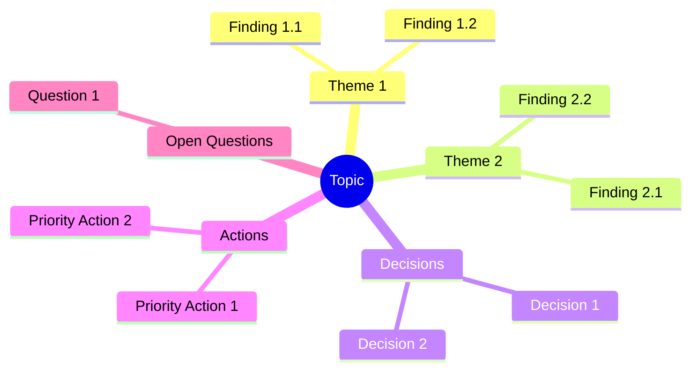

# Output Formats

> Complete structures for all Brainstormer deliverables — Updated for v3.0 with Phases & Personas

---

## Overview

Brainstormer produces up to 3 artifacts:

| Artifact | Purpose | When Generated | Quick Mode |
|----------|---------|----------------|------------|
| **Synthesis Report** | Self-contained final document | On `finish` command | ✅ Yes |
| **Exploration Journal** | Complete iteration history + EMS graph | On `finish` command | ❌ No |
| **Checkpoint** | Session state for resumption | On `checkpoint` command | ✅ Yes |

---

## End of Iteration Display (v3.0)

### Full Format (Standard Mode)

```markdown
───────────────────────────────────────────────────────────────
🔀 Phase : DIVERGENT | 📐 Persona : Architecte
───────────────────────────────────────────────────────────────

📍 **Fin d'Itération [N]**

📊 **EMS : [SCORE]/100 ([+/-DELTA])** [████████████░░░░░░░░]

   Clarté       [████████████████░░░░] [SCORE]/100 ([DELTA]) [⚠️ if < 40]
   Profondeur   [██████████░░░░░░░░░░] [SCORE]/100 ([DELTA]) [⚠️ if < 40]
   Couverture   [████████████░░░░░░░░] [SCORE]/100 ([DELTA]) [⚠️ if < 40]
   Décisions    [██████░░░░░░░░░░░░░░] [SCORE]/100 ([DELTA]) [⚠️ if < 40]
   Actionnab.   [████░░░░░░░░░░░░░░░░] [SCORE]/100 ([DELTA]) [⚠️ if < 40]

[🌱/🌿/🌳/🎯 STATUS MESSAGE based on threshold]

💡 **Recommandations** : [if weak axes exist, max 2 — phase-aware]
   → [Recommendation 1 for weakest axis]
   → [Recommendation 2 if another axis needs attention]

[⚠️ STAGNATION ALERT if delta < 5 for 2 consecutive iterations]

**Exploré** : [summary of what was covered]
**Décisions** : [decisions made this iteration]
**Ouvert** : [open threads remaining]

**Options** :
→ `continue` — Prochaine itération
→ `dive [sujet]` — Approfondir un point
→ `pivot` — Réorienter l'exploration
→ `diverge` / `converge` — Changer de phase
→ `modes` — Voir/changer le persona
→ `checkpoint` — Sauvegarder l'état
→ `finish` — Générer les rapports [+ indication based on EMS]

───────────────────────────────────────────────────────────────
```

### Simplified Format (Quick Mode)

```markdown
───────────────────────────────────────────────────────────────

📍 **Fin d'Itération [N]**

📊 **EMS : [SCORE]/100 ([+/-DELTA])** [████████████░░░░░░░░] [🌱/🌿/🌳/🎯]

💡 **Focus** : [Weakest 1-2 axes if any < 60]

**Exploré** : [brief summary]
**Options** : `continue` | `finish`

───────────────────────────────────────────────────────────────
```

---

## Synthesis Report Structure

**Filename**: `brainstorm-[topic-slug]-report.md`

**Audience**: Anyone who needs to understand conclusions without attending the session.

**Principle**: Fully self-contained and autoportant — a reader with no context should understand everything.

**Estimated length**: 800-2000 words depending on complexity.

```markdown
# [Brainstorming Title]

> Generated on [date] — [N] iterations — Template: [name] — Final EMS: [score]/100 [emoji]

---

## 1. Context and Initial Objective

[Clear reformulation of the starting point — 2-4 sentences]

**Initial question/problem**:
[What we set out to explore — 1-2 sentences]

**Scope**:
- In scope: [what was covered]
- Out of scope: [what was explicitly excluded]

**Success criteria defined**:
1. [Criterion 1]
2. [Criterion 2]

---

## 2. Executive Summary

[5-10 lines capturing the essential conclusions. A decision-maker should be able to read only this section and understand the key outcomes.]

**Key insight**: [Single most important takeaway — 1 sentence, bolded]

**Main decisions**:
- [Decision 1]
- [Decision 2]
- [Decision 3]

---

## 3. Analysis and Key Findings

### 3.1 [Major Theme 1]

[Structured development of findings — 1-3 paragraphs]

**Key points**:
- [Point 1]
- [Point 2]

**Implications**:
[What this means for the decision/project — 1-2 sentences]

### 3.2 [Major Theme 2]

[Same structure...]

### 3.3 [Major Theme N]

[Same structure...]

---

## 4. Decisions and Orientations

| Decision | Rationale | Impact | Confidence |
|----------|-----------|--------|------------|
| [Decision 1] | [Why this choice] | [Consequences] | 🟢 High/🟡 Medium/🔴 Low |
| [Decision 2] | [Why this choice] | [Consequences] | 🟢 High/🟡 Medium/🔴 Low |

### Decisions Deferred
- [Decision X] — Deferred because: [reason]. To revisit: [when/condition]

---

## 5. Action Plan

| # | Action | Priority | Effort | Timeline | Owner | Dependencies |
|---|--------|----------|--------|----------|-------|--------------|
| 1 | [Action] | 🔴 High | Low | [Date] | [Who] | [If any] |
| 2 | [Action] | 🟡 Medium | Medium | [Date] | [Who] | [If any] |
| 3 | [Action] | 🟢 Low | High | [Date] | [Who] | [If any] |

### Quick Wins (High Impact, Low Effort)
1. [Action] — [Why it's a quick win]
2. [Action] — [Why it's a quick win]

### Strategic Investments (High Impact, High Effort)
1. [Action] — [Why it's worth the investment]

---

## 6. Risks and Considerations

| Risk | Probability | Impact | Mitigation |
|------|-------------|--------|------------|
| [Risk 1] | 🔴/🟡/🟢 | 🔴/🟡/🟢 | [Mitigation strategy] |
| [Risk 2] | 🔴/🟡/🟢 | 🔴/🟡/🟢 | [Mitigation strategy] |

### Assumptions Made
- [Assumption 1] — If wrong: [consequence]
- [Assumption 2] — If wrong: [consequence]

---

## 7. Unexplored Avenues

[What remains open for future exploration]

| Topic | Why Not Explored | Potential Value | Suggested Next Step |
|-------|------------------|-----------------|---------------------|
| [Topic 1] | [Reason] | 🔴/🟡/🟢 | [Action] |
| [Topic 2] | [Reason] | 🔴/🟡/🟢 | [Action] |

---

## 8. Synthesis Mindmap



---

## 9. Success Criteria Verification

| Criterion | Status | Evidence |
|-----------|--------|----------|
| [Criterion 1] | ✅ Achieved / ⚠️ Partial / ❌ Not achieved | [Explanation] |
| [Criterion 2] | ✅ Achieved / ⚠️ Partial / ❌ Not achieved | [Explanation] |

**Overall assessment**: [Summary of whether brainstorm achieved its goals — 1-2 sentences]

---

## 10. Final EMS Score

```
📊 EMS Final : [SCORE]/100 [STATUS EMOJI]

Score EMS
100 ┤                                        [graph]
 90 ┤ · · · · · · · · · · · · · · · · · · · · · · · ·
 80 ┤
 70 ┤
 60 ┤ · · · · · · · · · · · · · · · · · · · · · · · ·
 50 ┤
 40 ┤
 30 ┤ · · · · · · · · · · · · · · · · · · · · · · · ·
 20 ┤
  0 ┼────┴─────┴─────┴─────┴─────┴─────┴
    Init  It.1  It.2  It.3  ...  Fin

Final axes:
   Clarté       [BAR] [SCORE]/100
   Profondeur   [BAR] [SCORE]/100
   Couverture   [BAR] [SCORE]/100
   Décisions    [BAR] [SCORE]/100
   Actionnab.   [BAR] [SCORE]/100
```

---

## 11. Sources and References

### Documents Analyzed
- [Document 1]: [What was extracted/learned]

### Web Research
- [URL 1]: [Key information obtained]

### Past Conversations Referenced
- [Topic/Date]: [Relevant connection]

---

*Document generated by Brainstormer v3.0 — Self-contained and independently usable*
```

---

## Exploration Journal Structure

**Filename**: `brainstorm-[topic-slug]-journal.md`

**Audience**: The brainstorm participant for personal reference and traceability.

**Principle**: Complete history of the thinking process — nothing omitted.

**Note**: Not generated in Quick Mode.

```markdown
# Exploration Journal — [Topic]

> Generated on [date] — [N] iterations

---

## Session Metadata

| Attribute | Value |
|-----------|-------|
| **Initial topic** | [Original formulation] |
| **Detected type** | [Technical/Business/Creative/Analytical] |
| **Template used** | [feature/audit/project/research/decision/problem/strategy] |
| **Frameworks applied** | [List] |
| **Devil's Advocate** | Active/Inactive |
| **Coaching Mode** | Active/Inactive |
| **Quick Mode** | Yes/No |
| **Total iterations** | [N] |
| **Deep dives** | [Count] |
| **Pivots** | [Count] |
| **Bias alerts** | [Count] |
| **Final EMS** | [Score]/100 |
| **Dominant Persona** | [🧒/🥊/📐/🛠️ Name] |
| **Phase shifts** | [Divergent→Convergent at iteration X] |

---

## Initialization Phase

### HMW Questions Generated (v3.0)

| # | Question | Selected |
|---|----------|----------|
| 1 | [HMW question 1] | ✅/❌ |
| 2 | [HMW question 2] | ✅/❌ |
| 3 | [HMW question 3] | ✅/❌ |

### Startup Brief (Validated)
[Complete validated brief from Phase 1]

### Sources Analyzed
| Source | Type | Key Insights |
|--------|------|--------------|
| [Source 1] | URL/Document | [Summary] |
| [Source 2] | URL/Document | [Summary] |

### History Search Results
| Result | Relevance | Used |
|--------|-----------|------|
| [Past topic] | [X]% | Yes/No |

---

## Iteration History

### Iteration 1

**Phase**: 🔀 Divergent
**Persona**: 📐 Architecte

- **Theme**: [Main theme]
- **Explored**: [Key points]
- **Decided**: [Conclusions if any]
- **Opened**: [New threads]
- **EMS**: [Score] ([Delta])

### Iteration 2

**Phase**: 🔀 Divergent
**Persona**: 🧒 Maïeuticien

[Same structure...]

### Iteration [N] (Last)

**Phase**: 🎯 Convergent
**Persona**: 🛠️ Pragmatique

- **Theme**: [Main theme]
- **Explored**: [Key points]
- **Decided**: [Conclusions]
- **Opened**: [New threads]
- **Pending questions**: [Any unanswered questions]
- **EMS**: [Score] ([Delta])
- **Last recommendations**: [If any]

---

## Phase History (v3.0)

| Iteration | Phase | Trigger |
|-----------|-------|---------|
| 1-3 | 🔀 Divergent | Session start |
| 4 | 🎯 Convergent | User command `converge` |
| 5 | 🎯 Convergent | Continued |

---

## Persona History (v3.0)

| Iteration | Persona | Trigger |
|-----------|---------|---------|
| 1 | 📐 Architecte | Default |
| 2 | 🧒 Maïeuticien | User uncertainty detected |
| 3 | 🥊 Sparring | Overconfidence detected |
| 4 | 🛠️ Pragmatique | Stagnation detected |

---

## EMS Progression

| Iteration | Clarity | Depth | Coverage | Decisions | Action. | Total | Delta |
|-----------|---------|-------|----------|-----------|---------|-------|-------|
| Init | [X] | [X] | [X] | [X] | [X] | [X] | - |
| It.1 | [X] | [X] | [X] | [X] | [X] | [X] | [+/-Y] |
| ... | ... | ... | ... | ... | ... | ... | ... |

---

## Key Decisions Made

| Decision | Iteration | Confidence | Rationale |
|----------|-----------|------------|-----------|
| [Decision 1] | [N] | 🟢/🟡/🔴 | [Brief why] |
| [Decision 2] | [N] | 🟢/🟡/🔴 | [Brief why] |

---

## Open Threads

| Thread | Opened at | Priority | Notes |
|--------|-----------|----------|-------|
| [Thread 1] | Iteration [N] | 🔴/🟡/🟢 | [Context] |
| [Thread 2] | Iteration [N] | 🔴/🟡/🟢 | [Context] |

---

## Frameworks Applied

| Framework | Iteration | Summary |
|-----------|-----------|---------|
| [Framework 1] | [N] | [Brief outcome] |
| [Framework 2] | [N] | [Brief outcome] |

---

## Bias Alerts History

| Bias Type | Iteration | User Response |
|-----------|-----------|---------------|
| [Bias 1] | [N] | [Acknowledged/Dismissed/Explained] |

---

*Journal generated by Brainstormer v3.0*
```

---

## Checkpoint Structure (v3.0)

**Filename**: `brainstorm-[topic-slug]-checkpoint.md`

**Purpose**: Resume a brainstorming session exactly where it left off.

```markdown
# Checkpoint — [Topic]

> Saved on [datetime] — Iteration [N] — EMS: [score]/100

---

## ⚠️ Resume Instructions

To resume this brainstorming session:
1. Start a new conversation with Claude
2. Upload this file
3. Say: "resume brainstorming" or "continue from checkpoint"

Claude will restore context and continue from Iteration [N+1].

---

## Session State

### Core Configuration
```yaml
version: "3.0"
topic: "[Original topic]"
topic_slug: "[slug-for-filenames]"
type_primary: "[Technical/Business/Creative/Analytical]"
type_secondary: "[Type or null]"
template: "[feature/audit/project/research/decision/problem/strategy]"
current_iteration: [N]
current_phase: "[divergent/convergent]"
current_persona: "[maieuticien/sparring/architecte/pragmatique]"
persona_mode: "[auto/manual]"
devil_advocate_mode: [true/false]
coaching_mode: [true/false]
quick_mode: [true/false]
min_score_finish: [null or integer]
created_at: "[ISO datetime]"
saved_at: "[ISO datetime]"
```

### Success Criteria
1. [Criterion 1]
2. [Criterion 2]

### Startup Brief (Validated)
```
[Complete validated brief - copy exactly as validated]
```

### HMW Questions Selected (v3.0)
- [HMW 1]
- [HMW 2]

---

## EMS State

### Current Scores
| Axis | Score | Status |
|------|-------|--------|
| Clarity | [X]/100 | [OK/Warning/Critical] |
| Depth | [X]/100 | [OK/Warning/Critical] |
| Coverage | [X]/100 | [OK/Warning/Critical] |
| Decisions | [X]/100 | [OK/Warning/Critical] |
| Actionability | [X]/100 | [OK/Warning/Critical] |
| **Total EMS** | **[X]/100** | [🌱/🌿/🌳/🎯] |

### EMS History
| Iteration | Clarity | Depth | Coverage | Decisions | Action. | Total | Delta |
|-----------|---------|-------|----------|-----------|---------|-------|-------|
| Init | [X] | [X] | [X] | [X] | [X] | [X] | - |
| It.1 | [X] | [X] | [X] | [X] | [X] | [X] | [+/-Y] |
| ... | ... | ... | ... | ... | ... | ... | ... |

### Stagnation Counter
```yaml
stagnation_count: [0/1]
last_delta: [+/-X]
```

---

## Phase & Persona State (v3.0)

```yaml
phase_history:
  - iteration: 1
    phase: divergent
    trigger: session_start
  - iteration: 4
    phase: convergent
    trigger: user_command

persona_history:
  - iteration: 1
    persona: architecte
    trigger: default
  - iteration: 3
    persona: sparring
    trigger: overconfidence_detected
```

---

## Accumulated Context

### Key Decisions Made
| Decision | Iteration | Confidence | Rationale |
|----------|-----------|------------|-----------|
| [Decision 1] | [N] | [High/Med/Low] | [Brief why] |

### Open Threads (Active)
| Thread | Opened at | Priority | Notes |
|--------|-----------|----------|-------|
| [Thread 1] | Iteration [N] | High/Med/Low | [Context] |

### Abandoned Threads
| Thread | Reason | Potential Value |
|--------|--------|-----------------|
| [Thread 1] | [Why abandoned] | [Low/Med/High] |

---

## Iteration Summaries

### Iteration 1
- **Phase**: 🔀 Divergent | **Persona**: 📐 Architecte
- **Theme**: [Main theme]
- **Explored**: [Key points]
- **Decided**: [Conclusions]
- **Opened**: [New threads]
- **EMS**: [Score] ([Delta])

### Iteration [N] (Last)
- **Phase**: [Phase] | **Persona**: [Persona]
- **Theme**: [Main theme]
- **Explored**: [Key points]
- **Decided**: [Conclusions]
- **Opened**: [New threads]
- **Pending questions**: [Any unanswered questions]
- **EMS**: [Score] ([Delta])
- **Last recommendations**: [If any]

---

## Resume Context

When resuming, Brainstormer should:

1. **Acknowledge restoration**: "Welcome back! Resuming brainstorm on '[Topic]'."

2. **Show state**:
   ```
   📊 EMS restored: [X]/100 [STATUS]
   🔀/🎯 Phase: [Phase]
   [Persona emoji] Persona: [Persona]
   ```

3. **Summarize state**:
   - Current iteration: [N]
   - Key decisions so far: [List]
   - Open threads: [List]
   - Weak axes: [If any]

4. **Present options**:
   ```
   Ready to continue. Options:
   → continue — Proceed to Iteration [N+1]
   → status — Review full context before continuing
   → finish — Generate reports with current state
   → dive [topic] — Explore an open thread
   → modes — View/change persona
   ```

5. **Maintain continuity**: Reference past decisions naturally, don't re-ask resolved questions.

6. **Restore phase & persona**: Continue with saved phase and persona mode.

---

## Validation Checksum

```
checkpoint_hash: [MD5 of core configuration section]
iteration_count: [N]
decision_count: [X]
thread_count: [Y]
ems_score: [Z]
phase: [divergent/convergent]
persona: [persona_name]
```

*Use checksum to detect corruption. If validation fails, inform user and offer to start fresh with readable content summary.*

---

*Checkpoint file v3.0 — Upload to new conversation to resume*
```

---

## Language Adaptation

All output formats adapt to user's input language:

| User Language | Output Language | Notes |
|---------------|-----------------|-------|
| French | French | Section headers translated |
| English | English | Default |
| Spanish | Spanish | Section headers translated |
| Mixed | Dominant language | Detect majority language |

### Translated Section Headers (French)

| English | French |
|---------|--------|
| Context and Initial Objective | Contexte et Objectif Initial |
| Executive Summary | Synthèse Exécutive |
| Analysis and Key Findings | Analyse et Conclusions Clés |
| Decisions and Orientations | Décisions et Orientations |
| Action Plan | Plan d'Action |
| Risks and Considerations | Risques et Points d'Attention |
| Unexplored Avenues | Pistes Non Explorées |
| Success Criteria Verification | Vérification des Critères de Succès |
| Final EMS Score | Score EMS Final |
| Sources and References | Sources et Références |

### Translated Phase/Persona Terms (French)

| English | French |
|---------|--------|
| Phase: Divergent | Phase : Divergent |
| Phase: Convergent | Phase : Convergent |
| Persona: Maieuticien | Persona : Maïeuticien |
| Persona: Sparring | Persona : Sparring Partner |
| Persona: Architect | Persona : Architecte |
| Persona: Pragmatic | Persona : Pragmatique |

---

*Output Formats v3.0 — Updated with Phase & Persona integration*
