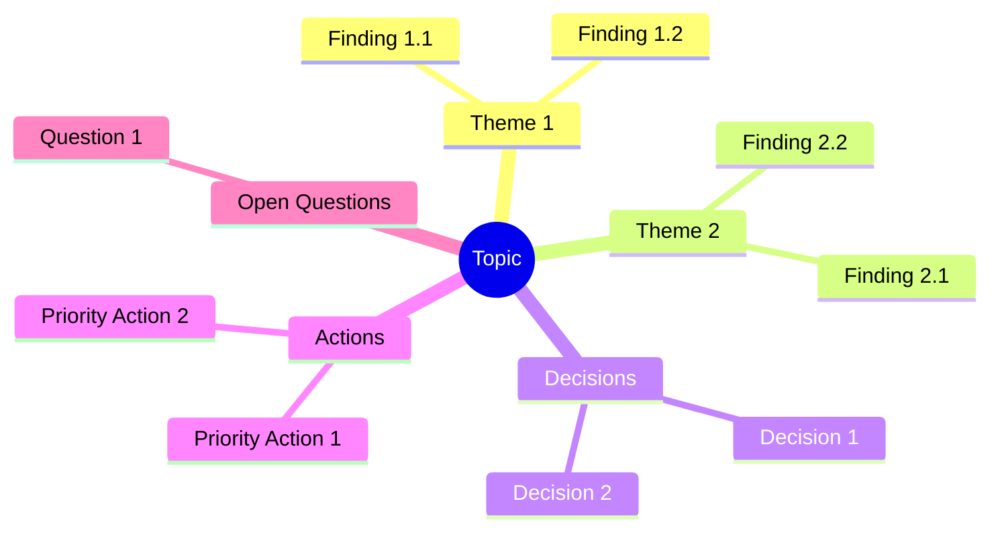

# Output Formats

> Complete structures for all Brainstormer deliverables — Updated for v2.0 with EMS

---

## Overview

Brainstormer produces up to 3 artifacts:

| Artifact | Purpose | When Generated | Quick Mode |
|----------|---------|----------------|------------|
| **Synthesis Report** | Self-contained final document | On `finish` command | ✅ Yes |
| **Exploration Journal** | Complete iteration history + EMS graph | On `finish` command | ❌ No |
| **Checkpoint** | Session state for resumption | On `checkpoint` command | ✅ Yes |

---

## End of Iteration Display (v2.0)

### Full Format (Standard Mode)

```markdown
---

📍 **Fin d'Itération [N]**

📊 **EMS : [SCORE]/100 ([+/-DELTA])** [████████████░░░░░░░░]

   Clarté       [████████████████░░░░] [SCORE]/100 ([DELTA]) [⚠️ if < 40]
   Profondeur   [██████████░░░░░░░░░░] [SCORE]/100 ([DELTA]) [⚠️ if < 40]
   Couverture   [████████████░░░░░░░░] [SCORE]/100 ([DELTA]) [⚠️ if < 40]
   Décisions    [██████░░░░░░░░░░░░░░] [SCORE]/100 ([DELTA]) [⚠️ if < 40]
   Actionnab.   [████░░░░░░░░░░░░░░░░] [SCORE]/100 ([DELTA]) [⚠️ if < 40]

[🌱/🌿/🌳/🎯 STATUS MESSAGE based on threshold]

💡 **Recommandations** : [if weak axes exist, max 2]
   → [Recommendation 1 for weakest axis]
   → [Recommendation 2 if another axis needs attention]

[⚠️ STAGNATION ALERT if delta < 5 for 2 consecutive iterations]

**Exploré** : [summary of what was covered]
**Décisions** : [decisions made this iteration]
**Ouvert** : [open threads remaining]

**Options** :
→ `continue` — Prochaine itération
→ `dive [sujet]` — Approfondir un point
→ `pivot` — Réorienter l'exploration
→ `checkpoint` — Sauvegarder l'état
→ `finish` — Générer les rapports [+ indication based on EMS]

---
```

### Simplified Format (Quick Mode)

```markdown
---

📍 **Fin d'Itération [N]**

📊 **EMS : [SCORE]/100 ([+/-DELTA])** [████████████░░░░░░░░] [🌱/🌿/🌳/🎯]

💡 **Focus** : [Weakest 1-2 axes if any < 60]

**Exploré** : [brief summary]
**Options** : `continue` | `finish`

---
```

---

## Synthesis Report Structure

**Filename**: `brainstorm-[topic-slug]-report.md`

**Audience**: Anyone who needs to understand conclusions without attending the session.

**Principle**: Fully self-contained and autoportant — a reader with no context should understand everything.

**Estimated length**: 800-2000 words depending on complexity.

```markdown
# [Brainstorming Title]

> Generated on [date] — [N] iterations — Template: [name] — Final EMS: [score]/100

---

## 1. Context and Initial Objective

[Clear reformulation of the starting point — 2-4 sentences]

**Initial question/problem**:
[What we set out to explore — 1-2 sentences]

**Scope**:
- In scope: [what was covered]
- Out of scope: [what was explicitly excluded]

**Success criteria defined**:
1. [Criterion 1]
2. [Criterion 2]

---

## 2. Executive Summary

[5-10 lines capturing the essential conclusions. A decision-maker should be able to read only this section and understand the key outcomes.]

**Key insight**: [Single most important takeaway — 1 sentence, bolded]

---

## 3. Analysis and Key Findings

### 3.1 [Major Theme 1]

[Structured development of findings — 1-3 paragraphs]

**Key points**:
- [Point 1]
- [Point 2]

**Implications**:
[What this means for the decision/project — 1-2 sentences]

### 3.2 [Major Theme 2]

[Same structure...]

### 3.3 [Major Theme N]

[Same structure...]

---

## 4. Decisions and Orientations

| Decision | Rationale | Impact | Confidence |
|----------|-----------|--------|------------|
| [Decision 1] | [Why this choice] | [Consequences] | High/Medium/Low |
| [Decision 2] | [Why this choice] | [Consequences] | High/Medium/Low |

### Decisions Deferred
- [Decision X] — Deferred because: [reason]. To revisit: [when/condition]

---

## 5. Action Plan

| # | Action | Priority | Effort | Timeline | Owner | Dependencies |
|---|--------|----------|--------|----------|-------|--------------|
| 1 | [Action] | 🔴 High | Low | [Date] | [Who] | [If any] |
| 2 | [Action] | 🟡 Medium | Medium | [Date] | [Who] | [If any] |
| 3 | [Action] | 🟢 Low | High | [Date] | [Who] | [If any] |

### Quick Wins (High Impact, Low Effort)
1. [Action] — [Why it's a quick win]
2. [Action] — [Why it's a quick win]

### Strategic Investments (High Impact, High Effort)
1. [Action] — [Why it's worth the investment]

---

## 6. Risks and Considerations

| Risk | Probability | Impact | Mitigation |
|------|-------------|--------|------------|
| [Risk 1] | High/Med/Low | High/Med/Low | [Mitigation strategy] |
| [Risk 2] | High/Med/Low | High/Med/Low | [Mitigation strategy] |

### Assumptions Made
- [Assumption 1] — If wrong: [consequence]
- [Assumption 2] — If wrong: [consequence]

---

## 7. Unexplored Avenues

[What remains open for future exploration]

| Topic | Why Not Explored | Potential Value | Suggested Next Step |
|-------|------------------|-----------------|---------------------|
| [Topic 1] | [Reason] | High/Med/Low | [Action] |
| [Topic 2] | [Reason] | High/Med/Low | [Action] |

---

## 8. Synthesis Mindmap



---

## 9. Success Criteria Verification

| Criterion | Status | Evidence |
|-----------|--------|----------|
| [Criterion 1] | ✅ Achieved / ⚠️ Partial / ❌ Not achieved | [Explanation] |
| [Criterion 2] | ✅ Achieved / ⚠️ Partial / ❌ Not achieved | [Explanation] |

**Overall assessment**: [Summary of whether brainstorm achieved its goals — 1-2 sentences]

---

## 10. Final EMS Score

```
📊 EMS Final : [SCORE]/100 [STATUS EMOJI]

Score EMS
100 ┤                                        [graph]
 90 ┤ · · · · · · · · · · · · · · · · · · · · · · · ·
 80 ┤
 70 ┤
 60 ┤ · · · · · · · · · · · · · · · · · · · · · · · ·
 50 ┤
 40 ┤
 30 ┤ · · · · · · · · · · · · · · · · · · · · · · · ·
 20 ┤
  0 ┼────┴─────┴─────┴─────┴─────┴─────┴
    Init  It.1  It.2  It.3  ...  Fin

Final axes:
   Clarté       [BAR] [SCORE]/100
   Profondeur   [BAR] [SCORE]/100
   Couverture   [BAR] [SCORE]/100
   Décisions    [BAR] [SCORE]/100
   Actionnab.   [BAR] [SCORE]/100
```

---

## 11. Sources and References

### Documents Analyzed
- [Document 1]: [What was extracted/learned]

### Web Research
- [URL 1]: [Key information obtained]

### Past Conversations Referenced
- [Topic/Date]: [Relevant connection]

---

*Document generated by Brainstormer v2.0 — Self-contained and independently usable*
```

---

## Exploration Journal Structure

**Filename**: `brainstorm-[topic-slug]-journal.md`

**Audience**: The brainstorm participant for personal reference and traceability.

**Principle**: Complete history of the thinking process — nothing omitted.

**Note**: Not generated in Quick Mode.

```markdown
# Exploration Journal — [Topic]

> Generated on [date] — [N] iterations

---

## Session Metadata

| Attribute | Value |
|-----------|-------|
| **Initial topic** | [Original formulation] |
| **Detected type** | [Technical/Business/Creative/Analytical] |
| **Template used** | [feature/audit/project/research/none] |
| **Frameworks applied** | [List] |
| **Devil's Advocate** | Active/Inactive |
| **Coaching Mode** | Active/Inactive |
| **Quick Mode** | Yes/No |
| **Total iterations** | [N] |
| **Deep dives** | [Count] |
| **Pivots** | [Count] |
| **Bias alerts** | [Count] |
| **Final EMS** | [Score]/100 |

---

## Initialization Phase

### Startup Brief (Validated)
[Complete validated brief from Phase 1]

### Sources Analyzed
| Source | Type | Key Insights |
|--------|------|--------------|
| [Source 1] | URL/Document | [Summary] |
| [Source 2] | URL/Document | [Summary] |

### History Search Results
[What was found in past conversations, or "No relevant history found"]

### Success Criteria Defined
1. [Criterion 1]
2. [Criterion 2]

### Initial EMS
| Axis | Score |
|------|-------|
| Clarity | [X]/100 |
| Depth | [X]/100 |
| Coverage | [X]/100 |
| Decisions | [X]/100 |
| Actionability | [X]/100 |
| **Total** | **[X]/100** |

---

## Iteration History

### Iteration 1 — [Main Theme]

**Questions asked**:
- 🔍 [Clarification question]
- 🔬 [Deepening question]
- 🔀 [Alternative question]

**User responses** (summarized):
[Summary of what user provided]

**Coaching interventions** (if active):
- Challenge: [What was challenged]
- Framework suggested: [If any]

**Enrichment**:
- [Web search conducted]: [Results summary]
- [Knowledge shared]: [Content summary]

**Synthesis**:
- **Explored**: [Points covered]
- **Decided**: [Conclusions reached]
- **Opened**: [New threads identified]

**EMS at end**:
| Axis | Score | Delta |
|------|-------|-------|
| Clarity | [X] | [+/-Y] |
| Depth | [X] | [+/-Y] |
| Coverage | [X] | [+/-Y] |
| Decisions | [X] | [+/-Y] |
| Actionability | [X] | [+/-Y] |
| **Total** | **[X]** | **[+/-Y]** |

**Recommendations given**: [If any]

**Bias alerts**: [None / Description if any]

---

### Iteration 2 — [Main Theme]

[Same structure...]

---

### Deep Dive: [Sub-topic] (branched from Iteration N)

**Trigger**: [User command or suggestion]
**Context**: [Why this deep dive was initiated]

**Exploration**:
[Content of focused exploration]

**Findings**:
[What emerged from the deep dive]

**EMS impact**: [How it affected scores]

**Return to main thread**: Iteration [N+1]

---

### Iteration N — [Main Theme]

[Same structure...]

---

## EMS Progression

### Summary Table

| Iteration | Clarity | Depth | Coverage | Decisions | Action. | **EMS** | Δ |
|-----------|---------|-------|----------|-----------|---------|---------|---|
| Init | [X] | [X] | [X] | [X] | [X] | **[X]** | - |
| It.1 | [X] | [X] | [X] | [X] | [X] | **[X]** | [+/-Y] |
| It.2 | [X] | [X] | [X] | [X] | [X] | **[X]** | [+/-Y] |
| ... | ... | ... | ... | ... | ... | ... | ... |
| Final | [X] | [X] | [X] | [X] | [X] | **[X]** | [+/-Y] |

### Evolution Graph

```
Score EMS
100 ┤                                        ┌──● [Final]
 90 ┤ · · · · · · · · · · · · · · · · · · · ·│· · · · · ·
 80 ┤                              ╭────────╯
 70 ┤                    ╭────────╯
 60 ┤ · · · · · · · · · ·│· · · · · · · · · · · · · · · ·
 50 ┤          ╭────────╯
 40 ┤    ╭────╯
 30 ┤ · ·│· · · · · · · · · · · · · · · · · · · · · · · ·
 20 ┤───╯
  0 ┼────┴─────┴─────┴─────┴─────┴─────┴
    Init  It.1  It.2  It.3  ...  Fin
```

### Progression Analysis

**Most improved axis**: [Axis] (+[X] points from Init to Final)
**Most stable axis**: [Axis]
**Stagnation alerts triggered**: [Count]
**Recommendations given**: [Count]

---

## Pivots Log

| Iteration | From | To | Trigger | Outcome |
|-----------|------|-----|---------|---------|
| [N] | [Original topic] | [New topic] | [What prompted pivot] | [Result] |

*Or: "No pivots during this session"*

---

## Bias Detection Log

| Iteration | Bias Type | Patterns Detected | Alert Sent | User Response |
|-----------|-----------|-------------------|------------|---------------|
| [N] | [Bias name] | [Pattern description] | Yes/No | [How user responded] |

*Or: "No bias alerts triggered during this session"*

---

## Framework Applications

### [Framework Name] — Applied in Iteration [N]

[Complete framework output as generated during session]

---

## Abandoned Threads

| Thread | Abandoned at | Reason | Potential Value |
|--------|--------------|--------|-----------------|
| [Topic] | Iteration [N] | [Why stopped] | [Future interest level] |

---

## Session Statistics

| Metric | Value |
|--------|-------|
| Total questions asked | [Count] |
| Web searches conducted | [Count] |
| Sources analyzed | [Count] |
| Frameworks applied | [Count] |
| Bias alerts triggered | [Count] |
| Deep dives | [Count] |
| Pivots | [Count] |
| Coaching challenges | [Count] |
| Recommendations given | [Count] |
| Session duration (estimated) | [Time] |
| Final EMS | [Score]/100 |
| EMS progression | [Init] → [Final] (+[Delta]) |

---

*Complete exploration journal — For personal reference and traceability*
```

---

## Checkpoint Structure

**Filename**: `brainstorm-[topic-slug]-checkpoint.md`

**Audience**: Brainstormer skill for session resumption.

**Principle**: Contains ALL state needed to resume seamlessly in a new conversation, including full EMS state.

```markdown
# Checkpoint — [Topic]

> Saved on [datetime] — Iteration [N]
> Version: 2.0

---

## ⚠️ Resume Instructions

To resume this brainstorming session:
1. Start a new conversation with Claude
2. Upload this file
3. Say: "resume brainstorming" or "continue from checkpoint"

Claude will restore context and continue from Iteration [N+1].

---

## Session State

### Core Configuration
```yaml
version: "2.0"
topic: "[Original topic]"
topic_slug: "[slug-for-filenames]"
type_primary: "[Technical/Business/Creative/Analytical]"
type_secondary: "[Type or null]"
template: "[feature/audit/project/research/none]"
current_iteration: [N]
devil_advocate_mode: [true/false]
coaching_mode: [true/false]
quick_mode: [true/false]
min_score_finish: [null or integer]
created_at: "[ISO datetime]"
saved_at: "[ISO datetime]"
```

### Success Criteria
1. [Criterion 1]
2. [Criterion 2]

### Startup Brief (Validated)
```
[Complete validated brief - copy exactly as validated]
```

---

## EMS State

### Current Scores
| Axis | Score | Status |
|------|-------|--------|
| Clarity | [X]/100 | [OK/Warning/Critical] |
| Depth | [X]/100 | [OK/Warning/Critical] |
| Coverage | [X]/100 | [OK/Warning/Critical] |
| Decisions | [X]/100 | [OK/Warning/Critical] |
| Actionability | [X]/100 | [OK/Warning/Critical] |
| **Total EMS** | **[X]/100** | [🌱/🌿/🌳/🎯] |

### EMS History
| Iteration | Clarity | Depth | Coverage | Decisions | Action. | Total | Delta |
|-----------|---------|-------|----------|-----------|---------|-------|-------|
| Init | [X] | [X] | [X] | [X] | [X] | [X] | - |
| It.1 | [X] | [X] | [X] | [X] | [X] | [X] | [+/-Y] |
| ... | ... | ... | ... | ... | ... | ... | ... |

### Stagnation Counter
```yaml
stagnation_count: [0/1]
last_delta: [+/-X]
```

---

## Accumulated Context

### Key Decisions Made
| Decision | Iteration | Confidence | Rationale |
|----------|-----------|------------|-----------|
| [Decision 1] | [N] | [High/Med/Low] | [Brief why] |
| [Decision 2] | [N] | [High/Med/Low] | [Brief why] |

### Open Threads (Active)
| Thread | Opened at | Priority | Notes |
|--------|-----------|----------|-------|
| [Thread 1] | Iteration [N] | High/Med/Low | [Context] |
| [Thread 2] | Iteration [N] | High/Med/Low | [Context] |

### Abandoned Threads
| Thread | Reason | Potential Value |
|--------|--------|-----------------|
| [Thread 1] | [Why abandoned] | [Low/Med/High] |

---

## Iteration Summaries

### Iteration 1
- **Theme**: [Main theme]
- **Explored**: [Key points]
- **Decided**: [Conclusions]
- **Opened**: [New threads]
- **EMS**: [Score] ([Delta])

### Iteration 2
[Same structure...]

### Iteration [N] (Last)
- **Theme**: [Main theme]
- **Explored**: [Key points]
- **Decided**: [Conclusions]
- **Opened**: [New threads]
- **Pending questions**: [Any unanswered questions]
- **EMS**: [Score] ([Delta])
- **Last recommendations**: [If any]

---

## Sources Consulted

| Source | Type | Status | Key Insights |
|--------|------|--------|--------------|
| [Source 1] | URL | Analyzed | [Summary] |
| [Source 2] | Document | Analyzed | [Summary] |

---

## Frameworks Applied

| Framework | Iteration | Summary |
|-----------|-----------|---------|
| [Framework 1] | [N] | [Brief outcome] |
| [Framework 2] | [N] | [Brief outcome] |

---

## Deep Dives Completed

| Topic | Parent Iteration | Key Findings |
|-------|------------------|--------------|
| [Topic 1] | [N] | [Summary] |

---

## Bias Alerts History

| Bias Type | Iteration | User Response |
|-----------|-----------|---------------|
| [Bias 1] | [N] | [Acknowledged/Dismissed/Explained] |

---

## Resume Context

When resuming, Brainstormer should:

1. **Acknowledge restoration**: "Welcome back! Resuming brainstorm on '[Topic]'."

2. **Show EMS state**:
   ```
   📊 EMS restored: [X]/100 [STATUS]
   ```

3. **Summarize state**:
   - Current iteration: [N]
   - Key decisions so far: [List]
   - Open threads: [List]
   - Weak axes: [If any]

4. **Present options**:
   ```
   Ready to continue. Options:
   → continue — Proceed to Iteration [N+1]
   → status — Review full context before continuing
   → finish — Generate reports with current state
   → dive [topic] — Explore an open thread
   ```

5. **Maintain continuity**: Reference past decisions naturally, don't re-ask resolved questions.

6. **Continue EMS tracking**: Resume scoring from saved state.

---

## Validation Checksum

```
checkpoint_hash: [MD5 of core configuration section]
iteration_count: [N]
decision_count: [X]
thread_count: [Y]
ems_score: [Z]
```

*Use checksum to detect corruption. If validation fails, inform user and offer to start fresh with readable content summary.*

---

*Checkpoint file v2.0 — Upload to new conversation to resume*
```

---

## Checkpoint Parsing Logic

When a checkpoint file is uploaded:

```
1. DETECT checkpoint file
   - Look for "# Checkpoint —" header
   - Verify version compatibility (1.x or 2.x)

2. VALIDATE structure
   - Check for required sections
   - Verify YAML configuration parses
   - Verify EMS state if v2.0
   - Optional: verify checksum if present

3. IF validation fails:
   - Inform user: "This checkpoint appears corrupted or incomplete."
   - Offer: "I can see [X decisions, Y threads]. Start fresh with this context?"
   - Don't refuse entirely — salvage what's readable

4. IF validation succeeds:
   - Parse all sections
   - Restore internal state
   - Restore EMS state (or initialize if v1.x checkpoint)
   - Present resume summary with EMS
   - Offer options (continue/status/finish/dive)

5. CONTINUE session
   - Increment iteration counter
   - Reference past context naturally
   - Don't re-ask questions already answered
   - Maintain same type/template/mode
   - Continue EMS tracking from restored state
```

---

## Notion Export Format

When exporting to Notion, adapt the Synthesis Report:

### Notion-Specific Adaptations

| Markdown | Notion Equivalent |
|----------|-------------------|
| `# Heading` | Page title |
| `## Heading` | Heading 2 block |
| `> blockquote` | Quote block |
| `- list item` | Bulleted list |
| `1. list item` | Numbered list |
| `| table |` | Table block |
| Mermaid mindmap | Convert to bulleted outline OR image |
| `**bold**` | Bold text |
| `[link](url)` | Link |
| EMS radar | Convert to table or callout |

### Notion Callouts for Key Elements

```markdown
💡 **Key insight**: [Content]
→ Notion: Callout block with 💡 icon

⚠️ **Risk**: [Content]  
→ Notion: Callout block with ⚠️ icon

✅ **Decision**: [Content]
→ Notion: Callout block with ✅ icon

📊 **EMS: [Score]/100**
→ Notion: Callout block with 📊 icon
```

### Notion Page Properties (if database)

| Property | Type | Value |
|----------|------|-------|
| Status | Select | "Completed" |
| Template | Select | "[feature/audit/project/research]" |
| Iterations | Number | [N] |
| Created | Date | [Date] |
| Type | Multi-select | "[Primary type, Secondary type]" |
| EMS Score | Number | [Final EMS] |

### Notion Toggle Blocks

Convert detailed sections to toggles for cleaner view:
- Full iteration history → Toggle: "📜 Iteration Details"
- Framework outputs → Toggle: "[Framework Name] Analysis"
- Sources list → Toggle: "📚 Sources & References"
- EMS history → Toggle: "📊 EMS Progression"

---

## Language Adaptation

All output formats adapt to user's input language:

| User Language | Output Language | Notes |
|---------------|-----------------|-------|
| French | French | Section headers translated |
| English | English | Default |
| Spanish | Spanish | Section headers translated |
| Mixed | Dominant language | Detect majority language |

### Translated Section Headers (French)

| English | French |
|---------|--------|
| Context and Initial Objective | Contexte et Objectif Initial |
| Executive Summary | Synthèse Exécutive |
| Analysis and Key Findings | Analyse et Conclusions Clés |
| Decisions and Orientations | Décisions et Orientations |
| Action Plan | Plan d'Action |
| Risks and Considerations | Risques et Points d'Attention |
| Unexplored Avenues | Pistes Non Explorées |
| Success Criteria Verification | Vérification des Critères de Succès |
| Final EMS Score | Score EMS Final |
| Sources and References | Sources et Références |

---

*Output Formats v2.0 — Updated with EMS integration*
