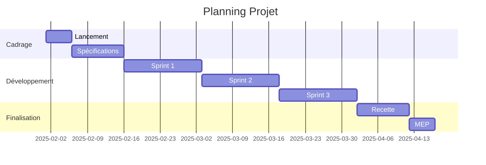
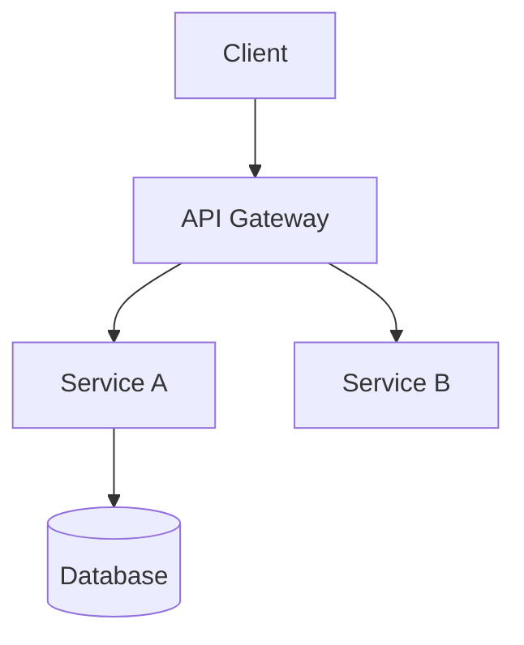
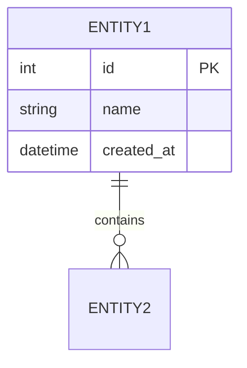
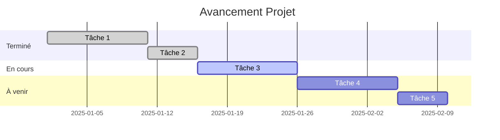
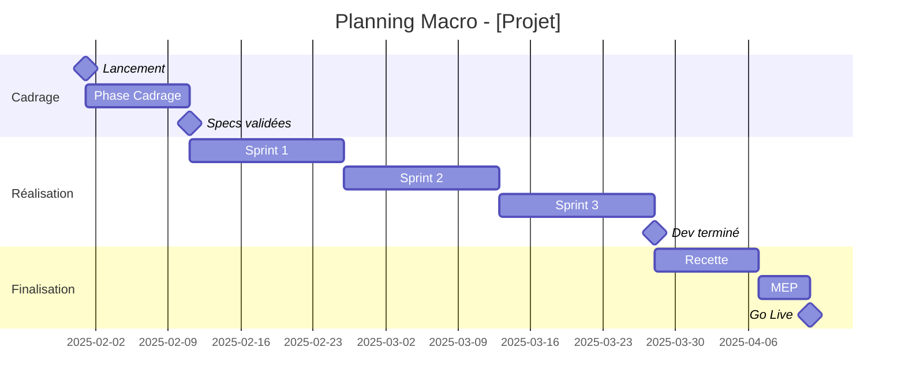
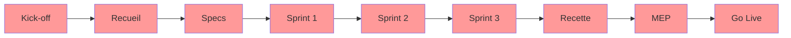
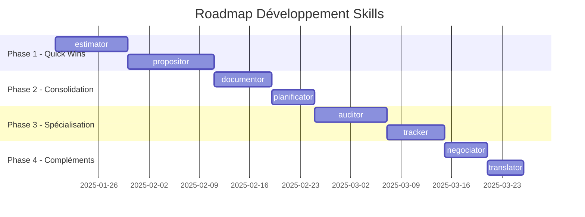

# Cahier des Charges — Écosystème Skills Complémentaires

> **Version** : 1.0  
> **Date** : 2025-01-12  
> **Auteur** : Édouard  
> **Statut** : Proposition détaillée  

---

## Table des Matières

1. [Vue d'ensemble de l'écosystème](#1-vue-densemble-de-lécosystème)
2. [Skill 1 : Estimator](#2-skill-1--estimator)
3. [Skill 2 : Propositor](#3-skill-2--propositor)
4. [Skill 3 : Documentor](#4-skill-3--documentor)
5. [Skill 4 : Auditor](#5-skill-4--auditor)
6. [Skill 5 : Tracker](#6-skill-5--tracker)
7. [Skill 6 : Planificator](#7-skill-6--planificator)
8. [Skill 7 : Negociator](#8-skill-7--negociator)
9. [Skill 8 : Translator](#9-skill-8--translator)
10. [Matrice des synergies](#10-matrice-des-synergies)
11. [Roadmap de développement](#11-roadmap-de-développement)
12. [Annexes](#12-annexes)

---

## 1. Vue d'ensemble de l'écosystème

### 1.1 Stack actuel

```
SKILLS EXISTANTS (8)
├── Input vocal/texte brut
│   ├── corrector      → Emails professionnels
│   ├── clarifior      → Texte structuré
│   ├── resumator      → Comptes-rendus réunion
│   └── code-promptor  → Briefs développement
├── Analyse & Critique
│   └── critiquor      → Analyse qualitative + scoring
├── Idéation & Structuration
│   ├── brainstormer   → Rapports de brainstorming
│   └── promptor       → Prompts optimisés
└── Meta-tooling
    └── skill-factory  → Création de skills
```

### 1.2 Skills proposés (8)

```
NOUVEAUX SKILLS PROPOSÉS
├── Cycle commercial
│   ├── estimator      → Chiffrage projets
│   ├── propositor     → Propositions commerciales
│   └── negociator     → Préparation négociations
├── Cycle projet
│   ├── planificator   → Roadmaps et plannings
│   ├── tracker        → Suivi d'avancement
│   └── auditor        → Audit code/architecture
└── Production
    ├── documentor     → Documentation technique
    └── translator     → Traduction contextualisée
```

### 1.3 Vision globale

L'objectif est de créer un écosystème de skills interconnectés couvrant l'intégralité du cycle de vie d'un projet, de l'idée initiale jusqu'à la maintenance :

```
┌─────────────────────────────────────────────────────────────────────────────┐
│                           CYCLE DE VIE PROJET                                │
├─────────────────────────────────────────────────────────────────────────────┤
│                                                                             │
│  IDÉATION          COMMERCIAL         PROJET           PRODUCTION          │
│  ─────────         ──────────         ──────           ──────────          │
│                                                                             │
│  brainstormer  →   estimator    →    planificator  →   documentor         │
│       ↓              ↓                   ↓                 ↓               │
│  promptor      →   propositor   →    tracker       →   translator         │
│       ↓              ↓                   ↓                                 │
│  critiquor     →   negociator   →    auditor                              │
│                                                                             │
└─────────────────────────────────────────────────────────────────────────────┘
```

### 1.4 Principes communs à tous les skills

| Principe | Description |
|----------|-------------|
| **Proactivité** | Les skills proposent, ne se contentent pas de répondre |
| **Interopérabilité** | Chaque skill peut recevoir l'output d'un autre en input |
| **Format unifié** | Outputs en Markdown, exportables DOCX si besoin |
| **Langue adaptative** | Réponse dans la langue de l'utilisateur |
| **Traçabilité** | Chaque livrable est autoportant et daté |

---

## 2. Skill 1 : Estimator

### 2.1 Fiche d'identité

| Attribut | Valeur |
|----------|--------|
| **Nom** | `estimator` |
| **Catégorie** | Cycle commercial |
| **Priorité** | 🔴 Haute |
| **Effort estimé** | 3-4 jours |
| **Dépendances** | Aucune (skill autonome) |

### 2.2 Vision et objectif

**Mission** : Transformer un besoin fonctionnel en chiffrage structuré, argumenté et présentable au client.

**Problème résolu** : L'estimation de projets est chronophage, souvent approximative, et manque de traçabilité. Les fourchettes sont rarement documentées, les risques mal intégrés.

**Valeur ajoutée** :
- Méthodologie reproductible
- Fourchettes documentées (optimiste/réaliste/pessimiste)
- Intégration des risques et buffers
- Format client-ready

### 2.3 Cas d'usage cibles

| Cas d'usage | Description | Fréquence |
|-------------|-------------|-----------|
| Chiffrage nouveau projet | Projet complet de développement web | Hebdomadaire |
| Chiffrage évolution | Nouvelles fonctionnalités sur existant | Hebdomadaire |
| Chiffrage TMA | Forfait de maintenance annuel | Mensuel |
| Chiffrage audit | Estimation d'un audit technique | Mensuel |
| Re-chiffrage | Révision après changement de scope | Ponctuel |

### 2.4 Déclenchement

**Triggers suggérés** :
- "estime", "estimation", "chiffre", "chiffrage"
- "combien coûterait", "budget pour", "évalue le coût"
- "jours/homme", "charge de travail"
- "use estimator"

**Description YAML** :
```yaml
description: >-
  Project estimation and cost calculation tool. Breaks down projects into 
  components, applies complexity metrics, generates cost ranges (optimistic/
  realistic/pessimistic) with risk buffers. Produces client-ready estimation 
  documents. Use when user needs to estimate costs, calculate workload, or 
  prepare project budgets. Not for financial accounting or invoicing.
```

### 2.5 Workflow détaillé

#### Phase 1 : Collecte du contexte

**Questions de cadrage** :
1. Quel est le projet/la fonctionnalité à estimer ?
2. Quel est le contexte technique ? (stack, existant, contraintes)
3. Y a-t-il des documents de référence ? (specs, maquettes, brainstorm)
4. Quel est le profil du client ? (expertise technique, budget connu)
5. Quelle granularité souhaitée ? (macro/détaillée)

**Inputs acceptés** :
- Texte descriptif libre
- Output de `brainstormer` (rapport de synthèse)
- Output de `code-promptor` (brief technique)
- Cahier des charges existant
- Maquettes ou wireframes (description)

#### Phase 2 : Décomposition

**Méthodologie de découpage** :

```
PROJET
├── Lot 1 : [Nom du lot]
│   ├── Fonctionnalité 1.1
│   │   ├── Tâche 1.1.1
│   │   ├── Tâche 1.1.2
│   │   └── Tâche 1.1.3
│   └── Fonctionnalité 1.2
│       └── ...
├── Lot 2 : [Nom du lot]
│   └── ...
└── Lot transverse
    ├── Gestion de projet
    ├── Recette / Tests
    └── Déploiement / MEP
```

**Niveaux de granularité** :
| Niveau | Usage | Précision |
|--------|-------|-----------|
| Macro | Proposition initiale, go/no-go | ±30% |
| Standard | Proposition commerciale | ±20% |
| Détaillée | Engagement forfaitaire | ±10% |

#### Phase 3 : Évaluation

**Métriques d'estimation** :

| Métrique | Description | Échelle |
|----------|-------------|---------|
| Complexité technique | Difficulté d'implémentation | 1-5 (Simple → Très complexe) |
| Incertitude | Degré d'inconnu | 1-5 (Clair → Très flou) |
| Dépendances | Couplage avec autres éléments | 1-3 (Isolé → Très couplé) |
| Réutilisabilité | Existence de code/composants | 1-3 (From scratch → Existant) |

**Formule de calcul** :

```
Charge_Base = Somme(Tâches × Complexité)

Coefficient_Incertitude = 1 + (Incertitude × 0.1)

Charge_Ajustée = Charge_Base × Coefficient_Incertitude

Fourchettes :
- Optimiste = Charge_Ajustée × 0.8
- Réaliste  = Charge_Ajustée × 1.0
- Pessimiste = Charge_Ajustée × 1.3
```

**Buffer de risque** :
| Niveau de risque | Buffer |
|------------------|--------|
| Faible (client connu, specs claires) | +5% |
| Moyen (nouveau client OU specs partielles) | +10% |
| Élevé (nouveau client ET specs floues) | +15-20% |

#### Phase 4 : Valorisation

**Grille de TJM suggérée** (personnalisable) :

| Profil | TJM indicatif | Usage |
|--------|---------------|-------|
| Dev Junior | 350-450€ | Tâches simples, support |
| Dev Confirmé | 450-550€ | Développement standard |
| Dev Senior | 550-700€ | Architecture, complexe |
| Lead / Expert | 700-900€ | Conseil, audit, direction |
| Chef de projet | 500-650€ | Coordination, suivi |

**Calcul du prix** :
```
Prix_HT = Charge_Jours × TJM_Moyen
Prix_Optimiste = Charge_Optimiste × TJM
Prix_Réaliste = Charge_Réaliste × TJM
Prix_Pessimiste = Charge_Pessimiste × TJM
```

#### Phase 5 : Génération du livrable

**Structure du document d'estimation** :

```markdown
# Estimation — [Nom du Projet]

> Généré le [date] — Version [X.Y]
> Niveau de granularité : [Macro/Standard/Détaillée]

---

## 1. Contexte et périmètre

### 1.1 Description du besoin
[Reformulation du besoin]

### 1.2 Périmètre
- **Inclus** : [Liste]
- **Exclus** : [Liste]
- **Hypothèses** : [Liste]

### 1.3 Contraintes identifiées
[Contraintes techniques, délais, budget]

---

## 2. Décomposition fonctionnelle

### Lot 1 : [Nom]
| Fonctionnalité | Complexité | Incertitude | Charge (j) |
|----------------|------------|-------------|------------|
| [Fonc 1.1] | 3/5 | 2/5 | 3-5 |
| [Fonc 1.2] | 2/5 | 1/5 | 1-2 |
| **Sous-total Lot 1** | | | **4-7** |

### Lot 2 : [Nom]
[Même structure...]

### Lot transverse
| Élément | Charge (j) |
|---------|------------|
| Gestion de projet (10%) | X |
| Recette / Tests (15%) | X |
| Déploiement / MEP | X |
| Buffer risque (X%) | X |
| **Sous-total transverse** | **X** |

---

## 3. Synthèse de la charge

| Lot | Optimiste | Réaliste | Pessimiste |
|-----|-----------|----------|------------|
| Lot 1 | X j | X j | X j |
| Lot 2 | X j | X j | X j |
| Transverse | X j | X j | X j |
| **TOTAL** | **X j** | **X j** | **X j** |

---

## 4. Valorisation financière

### 4.1 Hypothèses de valorisation
- TJM moyen appliqué : XXX €
- Profils mobilisés : [Liste]

### 4.2 Estimation budgétaire

| Scénario | Charge | Montant HT |
|----------|--------|------------|
| 🟢 Optimiste | X j | XX XXX € |
| 🟡 Réaliste | X j | XX XXX € |
| 🔴 Pessimiste | X j | XX XXX € |

**Recommandation** : Budget à prévoir = [Réaliste] soit **XX XXX € HT**

---

## 5. Risques et réserves

| Risque | Impact | Probabilité | Mitigation |
|--------|--------|-------------|------------|
| [Risque 1] | +X j | Moyenne | [Action] |
| [Risque 2] | +X j | Faible | [Action] |

---

## 6. Conditions et validité

- **Validité de l'estimation** : 30 jours
- **Base de l'estimation** : [Documents de référence]
- **Révision prévue si** : Changement de périmètre, nouvelles contraintes

---

*Document généré par Estimator — À affiner après échanges client*
```

### 2.6 Synergies

| Skill source | → Estimator | Description |
|--------------|-------------|-------------|
| `brainstormer` | ✅ | Rapport de brainstorm → Base d'estimation |
| `code-promptor` | ✅ | Brief technique → Estimation fonctionnalité |
| `auditor` | ✅ | Rapport d'audit → Estimation remédiation |

| Estimator → | Skill cible | Description |
|-------------|-------------|-------------|
| ✅ | `propositor` | Estimation → Section chiffrage de la propale |
| ✅ | `planificator` | Charges → Base du planning |
| ✅ | `tracker` | Estimation initiale → Référence de suivi |

### 2.7 Commandes et flags

| Commande/Flag | Description |
|---------------|-------------|
| `--macro` | Estimation rapide, ±30% |
| `--detailed` | Estimation détaillée, ±10% |
| `--tjm [montant]` | Forcer un TJM spécifique |
| `--no-risk` | Désactiver le buffer de risque |
| `--client [type]` | Adapter le format (public/privé/GMS) |

### 2.8 Critères d'acceptance

- [ ] Décomposition en lots/fonctionnalités/tâches
- [ ] Métriques de complexité et incertitude appliquées
- [ ] Trois fourchettes calculées (optimiste/réaliste/pessimiste)
- [ ] Buffer de risque intégré et justifié
- [ ] Valorisation financière avec hypothèses explicites
- [ ] Document exportable et présentable au client
- [ ] Intégration des outputs de brainstormer/code-promptor

---

## 3. Skill 2 : Propositor

### 3.1 Fiche d'identité

| Attribut | Valeur |
|----------|--------|
| **Nom** | `propositor` |
| **Catégorie** | Cycle commercial |
| **Priorité** | 🔴 Haute |
| **Effort estimé** | 4-5 jours |
| **Dépendances** | Optimisé avec `estimator` |

### 3.2 Vision et objectif

**Mission** : Générer des propositions commerciales professionnelles, structurées et adaptées au type de client.

**Problème résolu** : Les propositions commerciales sont chronophages à rédiger, souvent incohérentes dans leur structure, et nécessitent une adaptation manuelle selon le client.

**Valeur ajoutée** :
- Templates adaptés par type de client et de projet
- Structure professionnelle et cohérente
- Intégration automatique des estimations
- Personnalisation du ton et du niveau de détail

### 3.3 Cas d'usage cibles

| Cas d'usage | Description | Fréquence |
|-------------|-------------|-----------|
| Propale développement | Nouveau projet de développement | Hebdomadaire |
| Propale refonte | Migration/refonte d'existant | Mensuel |
| Propale TMA | Contrat de maintenance | Mensuel |
| Propale audit | Mission d'audit technique | Mensuel |
| Propale conseil | Mission de conseil/AMO | Ponctuel |
| Réponse AO | Appel d'offres public | Ponctuel |

### 3.4 Déclenchement

**Triggers suggérés** :
- "proposition commerciale", "propale", "proposal"
- "rédige une offre", "prépare un devis"
- "réponds à l'appel d'offres"
- "use propositor"

**Description YAML** :
```yaml
description: >-
  Commercial proposal generator for development projects, maintenance contracts,
  and consulting missions. Creates professional, structured proposals adapted to
  client type (public/private/retail). Integrates estimates, timelines, and 
  terms. Use when preparing quotes, responding to RFPs, or formalizing offers.
  Not for simple invoicing or contract legal review.
```

### 3.5 Workflow détaillé

#### Phase 1 : Qualification

**Questions de cadrage** :
1. Quel est le client ? (nom, secteur, taille)
2. Quel type de client ? (public/privé/GMS/industriel)
3. Quel type de projet ? (développement/refonte/TMA/audit/conseil)
4. Contexte de la demande ? (spontané, consultation, AO)
5. Existe-t-il un cahier des charges ou une expression de besoin ?
6. Y a-t-il une estimation déjà réalisée ?
7. Délai de réponse attendu ?

**Inputs acceptés** :
- Brief textuel
- Output de `brainstormer`
- Output de `estimator`
- Cahier des charges client
- CCTP (appels d'offres publics)

#### Phase 2 : Structuration

**Templates par type de projet** :

##### Template A : Développement/Refonte
```
1. Page de garde
2. Synthèse exécutive
3. Compréhension du besoin
4. Solution proposée
5. Méthodologie et organisation
6. Planning prévisionnel
7. Équipe projet
8. Proposition financière
9. Conditions générales
10. Annexes
```

##### Template B : TMA/Maintenance
```
1. Page de garde
2. Synthèse de l'offre
3. Périmètre de la prestation
4. Niveaux de service (SLA)
5. Organisation et gouvernance
6. Processus d'intervention
7. Proposition financière (forfait/régie)
8. Conditions contractuelles
9. Annexes
```

##### Template C : Audit
```
1. Page de garde
2. Contexte et objectifs
3. Périmètre de l'audit
4. Méthodologie d'audit
5. Livrables attendus
6. Planning d'intervention
7. Proposition financière
8. Conditions
9. Références similaires
```

##### Template D : Réponse AO Public
```
1. Lettre de candidature (DC1)
2. Déclaration du candidat (DC2)
3. Mémoire technique
   3.1 Compréhension du besoin
   3.2 Solution technique
   3.3 Méthodologie
   3.4 Moyens humains
   3.5 Planning
   3.6 Références
4. Bordereau des prix (BPU)
5. Acte d'engagement
6. Annexes obligatoires
```

#### Phase 3 : Rédaction

**Adaptation du ton selon le client** :

| Type client | Ton | Vocabulaire | Niveau détail |
|-------------|-----|-------------|---------------|
| Startup | Direct, moderne | Tech assumé | Synthétique |
| PME | Professionnel, accessible | Vulgarisé | Équilibré |
| Grand compte | Corporate, formel | Business | Détaillé |
| Public | Administratif, précis | Réglementaire | Très détaillé |
| GMS | Pragmatique, ROI | Métier retail | Focus résultats |

**Éléments de personnalisation** :
- Logo et identité visuelle (placeholder)
- Références clients similaires
- Témoignages si disponibles
- Certifications et agréments

#### Phase 4 : Intégration des données

**Depuis `estimator`** :
- Tableau de chiffrage
- Fourchettes budgétaires
- Hypothèses d'estimation
- Risques identifiés

**Depuis `brainstormer`** :
- Contexte et reformulation du besoin
- Décisions et orientations validées
- Plan d'action macro

**Depuis `planificator`** :
- Diagramme de Gantt
- Jalons clés
- Dépendances

#### Phase 5 : Génération du livrable

**Structure du document** :

```markdown
# Proposition Commerciale

## [Nom du Projet]
### [Nom du Client]

---

**Référence** : PROP-[AAAA]-[NNN]  
**Date** : [Date]  
**Validité** : 30 jours  
**Version** : 1.0  

---

## Sommaire

1. [Synthèse exécutive](#1-synthèse-exécutive)
2. [Compréhension du besoin](#2-compréhension-du-besoin)
3. [Solution proposée](#3-solution-proposée)
4. [Méthodologie](#4-méthodologie)
5. [Planning](#5-planning)
6. [Équipe projet](#6-équipe-projet)
7. [Proposition financière](#7-proposition-financière)
8. [Conditions](#8-conditions)
9. [Annexes](#9-annexes)

---

## 1. Synthèse exécutive

[Résumé en 10-15 lignes : contexte, solution, bénéfices clés, budget, délai]

**Points clés de notre proposition** :
- ✅ [Bénéfice 1]
- ✅ [Bénéfice 2]
- ✅ [Bénéfice 3]

---

## 2. Compréhension du besoin

### 2.1 Contexte
[Description du contexte client et de la problématique]

### 2.2 Enjeux identifiés
[Liste des enjeux business et techniques]

### 2.3 Objectifs du projet
[Objectifs SMART si possible]

### 2.4 Périmètre
**Inclus dans cette proposition** :
- [Élément 1]
- [Élément 2]

**Hors périmètre** :
- [Élément 1]
- [Élément 2]

---

## 3. Solution proposée

### 3.1 Vue d'ensemble
[Description de la solution à haut niveau]

### 3.2 Architecture fonctionnelle
[Description des modules/composants]

### 3.3 Choix technologiques
| Composant | Technologie | Justification |
|-----------|-------------|---------------|
| Backend | Symfony 7 | [Raison] |
| Frontend | React 18 | [Raison] |
| Base de données | PostgreSQL | [Raison] |

### 3.4 Points forts de la solution
[Différenciateurs, innovations, valeur ajoutée]

---

## 4. Méthodologie

### 4.1 Approche projet
[Agile, cycle en V, hybride...]

### 4.2 Phases du projet
| Phase | Description | Livrables |
|-------|-------------|-----------|
| Cadrage | [Description] | [Livrables] |
| Conception | [Description] | [Livrables] |
| Développement | [Description] | [Livrables] |
| Recette | [Description] | [Livrables] |
| Déploiement | [Description] | [Livrables] |

### 4.3 Gouvernance
[Instances, fréquence, participants]

### 4.4 Gestion des risques
[Approche de gestion des risques]

---

## 5. Planning

### 5.1 Planning macro


### 5.2 Jalons clés
| Jalon | Date prévisionnelle | Livrable |
|-------|---------------------|----------|
| Kick-off | [Date] | Réunion de lancement |
| Fin conception | [Date] | Spécifications validées |
| Fin développement | [Date] | Application complète |
| Mise en production | [Date] | Application live |

---

## 6. Équipe projet

### 6.1 Organisation
[Schéma d'organisation]

### 6.2 Profils mobilisés
| Rôle | Nom/Profil | Responsabilités | Disponibilité |
|------|------------|-----------------|---------------|
| Chef de projet | [Nom] | Coordination, reporting | X j/sem |
| Dev Senior | [Profil] | Architecture, dev | X j/sem |
| Dev | [Profil] | Développement | X j/sem |

### 6.3 Références
[Projets similaires réalisés]

---

## 7. Proposition financière

### 7.1 Synthèse budgétaire

| Lot | Description | Montant HT |
|-----|-------------|------------|
| Lot 1 | [Description] | XX XXX € |
| Lot 2 | [Description] | XX XXX € |
| Lot 3 | [Description] | XX XXX € |
| **TOTAL** | | **XX XXX € HT** |

### 7.2 Détail par lot
[Tableau détaillé si nécessaire]

### 7.3 Options
| Option | Description | Montant HT |
|--------|-------------|------------|
| Option A | [Description] | X XXX € |
| Option B | [Description] | X XXX € |

### 7.4 Conditions de facturation
[Échéancier de paiement]

---

## 8. Conditions

### 8.1 Validité
Cette proposition est valable 30 jours à compter de sa date d'émission.

### 8.2 Conditions de réalisation
[Prérequis, engagements client]

### 8.3 Propriété intellectuelle
[Clauses PI]

### 8.4 Confidentialité
[Clause de confidentialité]

### 8.5 Conditions générales
[Référence aux CGV]

---

## 9. Annexes

### Annexe A : Détail de l'estimation
[Tableau complet d'estimation]

### Annexe B : CV des intervenants
[Si pertinent]

### Annexe C : Références détaillées
[Fiches références]

---

## Acceptation

**Pour accord, merci de retourner ce document signé.**

| | Client | Prestataire |
|--|--------|-------------|
| **Nom** | | [Votre nom] |
| **Fonction** | | [Votre fonction] |
| **Date** | | |
| **Signature** | | |

---

*Proposition générée par Propositor — [Votre société]*
```

### 3.6 Synergies

| Skill source | → Propositor | Description |
|--------------|--------------|-------------|
| `brainstormer` | ✅ | Rapport → Section "Compréhension du besoin" |
| `estimator` | ✅ | Chiffrage → Section financière complète |
| `planificator` | ✅ | Planning → Section planning avec Gantt |
| `critiquor` | ✅ | Critique → Amélioration avant envoi |

| Propositor → | Skill cible | Description |
|--------------|-------------|-------------|
| ✅ | `negociator` | Propale → Base de négociation |
| ✅ | `tracker` | Propale signée → Initialisation suivi |

### 3.7 Commandes et flags

| Commande/Flag | Description |
|---------------|-------------|
| `--template [type]` | Forcer un template (dev/tma/audit/ao) |
| `--client [type]` | Type de client (public/prive/gms/startup) |
| `--formal` | Ton très formel (grands comptes, public) |
| `--lean` | Version allégée (startups) |
| `--include-estimate` | Intégrer une estimation existante |

### 3.8 Critères d'acceptance

- [ ] Template adapté au type de projet
- [ ] Ton ajusté au type de client
- [ ] Intégration des données d'estimation
- [ ] Planning visuel (Gantt Mermaid)
- [ ] Structure complète et professionnelle
- [ ] Export DOCX fonctionnel
- [ ] Personnalisation (logo, références) possible

---

## 4. Skill 3 : Documentor

### 4.1 Fiche d'identité

| Attribut | Valeur |
|----------|--------|
| **Nom** | `documentor` |
| **Catégorie** | Production |
| **Priorité** | 🟡 Moyenne-Haute |
| **Effort estimé** | 3-4 jours |
| **Dépendances** | Aucune |

### 4.2 Vision et objectif

**Mission** : Générer de la documentation technique professionnelle à partir de briefs, specs ou code.

**Problème résolu** : La documentation est souvent négligée, incomplète ou obsolète. Elle prend du temps à rédiger et à maintenir.

**Valeur ajoutée** :
- Documentation structurée selon les standards
- Cohérence de format et de ton
- Templates par type de documentation
- Facilité de mise à jour

### 4.3 Cas d'usage cibles

| Cas d'usage | Description | Fréquence |
|-------------|-------------|-----------|
| Specs techniques | Spécifications fonctionnelles et techniques | Par projet |
| Doc API | Documentation d'endpoints REST/GraphQL | Par projet |
| README | Documentation de repository | Par projet |
| Guide installation | Procédures de déploiement | Par projet |
| Doc utilisateur | Manuel d'utilisation | Par projet |
| Architecture Decision Record | Documentation de décisions techniques | Ponctuel |

### 4.4 Déclenchement

**Triggers suggérés** :
- "documente", "documentation", "rédige les specs"
- "README", "documentation API", "guide d'installation"
- "spécifications techniques", "manuel utilisateur"
- "use documentor"

**Description YAML** :
```yaml
description: >-
  Technical documentation generator for software projects. Creates specifications,
  API documentation, READMEs, installation guides, and user manuals. Supports
  multiple formats and standards (OpenAPI, JSDoc style). Use when documenting
  code, APIs, architectures, or creating technical guides. Not for commercial
  or marketing content.
```

### 4.5 Workflow détaillé

#### Phase 1 : Identification du besoin

**Questions de cadrage** :
1. Quel type de documentation ? (specs/API/README/guide/manuel)
2. Quelle est la cible ? (développeurs/ops/utilisateurs finaux)
3. Quel niveau de détail ? (overview/standard/exhaustif)
4. Existe-t-il une documentation existante à compléter ?
5. Quelles sont les conventions à respecter ?

#### Phase 2 : Collecte des informations

**Sources acceptées** :
- Brief textuel ou oral (transcription)
- Output de `brainstormer` ou `code-promptor`
- Code source (pour analyse)
- Specs existantes à enrichir
- Swagger/OpenAPI existant
- Maquettes ou wireframes

#### Phase 3 : Génération selon le template

##### Template : Spécifications techniques

```markdown
# Spécifications Techniques — [Nom du Projet/Module]

> Version : X.Y | Date : [Date] | Auteur : [Auteur]

---

## 1. Introduction

### 1.1 Objectif du document
[But de ce document]

### 1.2 Portée
[Ce qui est couvert et ce qui ne l'est pas]

### 1.3 Documents de référence
[Liste des documents liés]

### 1.4 Glossaire
| Terme | Définition |
|-------|------------|
| [Terme] | [Définition] |

---

## 2. Vue d'ensemble

### 2.1 Contexte
[Contexte fonctionnel et technique]

### 2.2 Architecture globale
[Schéma d'architecture]



### 2.3 Technologies utilisées
| Composant | Technologie | Version |
|-----------|-------------|---------|
| [Composant] | [Tech] | [Version] |

---

## 3. Spécifications fonctionnelles

### 3.1 [Fonctionnalité 1]

#### 3.1.1 Description
[Description détaillée]

#### 3.1.2 Règles de gestion
| ID | Règle | Priorité |
|----|-------|----------|
| RG-001 | [Règle] | Must |

#### 3.1.3 Cas d'utilisation
[Diagramme ou description]

#### 3.1.4 Maquettes/Wireframes
[Références aux maquettes]

---

## 4. Spécifications techniques

### 4.1 Modèle de données



### 4.2 API

#### Endpoint : [METHOD] /path
| Paramètre | Type | Obligatoire | Description |
|-----------|------|-------------|-------------|
| [param] | [type] | Oui/Non | [Description] |

**Exemple de requête** :
```json
{
  "field": "value"
}
```

**Exemple de réponse** :
```json
{
  "id": 1,
  "field": "value"
}
```

### 4.3 Sécurité
[Exigences de sécurité]

### 4.4 Performance
[Exigences de performance]

---

## 5. Environnements

| Environnement | URL | Usage |
|---------------|-----|-------|
| Développement | [URL] | Dev local |
| Staging | [URL] | Recette |
| Production | [URL] | Live |

---

## 6. Annexes

### 6.1 Diagrammes complémentaires
### 6.2 Références techniques

---

*Document généré par Documentor*
```

##### Template : Documentation API (style OpenAPI)

```markdown
# API Documentation — [Nom de l'API]

> Version : X.Y.Z | Base URL : `https://api.example.com/v1`

---

## Authentication

[Description du mécanisme d'authentification]

```bash
curl -H "Authorization: Bearer {token}" https://api.example.com/v1/resource
```

---

## Endpoints

### Resources

#### List Resources
```
GET /resources
```

**Parameters**
| Name | In | Type | Required | Description |
|------|-----|------|----------|-------------|
| page | query | integer | No | Page number (default: 1) |
| limit | query | integer | No | Items per page (default: 20) |

**Response 200**
```json
{
  "data": [
    {
      "id": 1,
      "name": "Resource 1",
      "created_at": "2025-01-12T10:00:00Z"
    }
  ],
  "meta": {
    "total": 100,
    "page": 1,
    "limit": 20
  }
}
```

**Errors**
| Code | Description |
|------|-------------|
| 401 | Unauthorized |
| 403 | Forbidden |

---

#### Get Resource
```
GET /resources/{id}
```

[Même structure...]

---

## Models

### Resource
| Field | Type | Description |
|-------|------|-------------|
| id | integer | Unique identifier |
| name | string | Resource name |
| created_at | datetime | Creation timestamp |

---

## Error Handling

All errors follow this format:
```json
{
  "error": {
    "code": "ERROR_CODE",
    "message": "Human readable message",
    "details": {}
  }
}
```

---

*Generated by Documentor*
```

##### Template : README

```markdown
# [Nom du Projet]

[Description courte du projet en 1-2 phrases]


---

## 📋 Table of Contents

- [Features](#features)
- [Prerequisites](#prerequisites)
- [Installation](#installation)
- [Configuration](#configuration)
- [Usage](#usage)
- [API Reference](#api-reference)
- [Testing](#testing)
- [Deployment](#deployment)
- [Contributing](#contributing)
- [License](#license)

---

## ✨ Features

- [Feature 1]
- [Feature 2]
- [Feature 3]

---

## 📦 Prerequisites

- PHP >= 8.2
- Composer >= 2.0
- Node.js >= 18
- PostgreSQL >= 14

---

## 🚀 Installation

```bash
# Clone the repository
git clone https://github.com/user/project.git
cd project

# Install dependencies
composer install
npm install

# Setup environment
cp .env.example .env
php bin/console doctrine:database:create
php bin/console doctrine:migrations:migrate

# Build assets
npm run build
```

---

## ⚙️ Configuration

### Environment Variables

| Variable | Description | Default |
|----------|-------------|---------|
| `DATABASE_URL` | Database connection string | - |
| `APP_SECRET` | Application secret key | - |
| `MAILER_DSN` | Mail server DSN | - |

---

## 📖 Usage

```bash
# Start development server
symfony serve

# Run in production
php bin/console cache:clear --env=prod
```

---

## 🧪 Testing

```bash
# Run all tests
php bin/phpunit

# Run specific test suite
php bin/phpunit --testsuite=unit
```

---

## 🚢 Deployment

[Instructions de déploiement]

---

## 🤝 Contributing

1. Fork the repository
2. Create a feature branch (`git checkout -b feature/amazing`)
3. Commit changes (`git commit -m 'Add amazing feature'`)
4. Push to branch (`git push origin feature/amazing`)
5. Open a Pull Request

---

## 📄 License

This project is licensed under the MIT License.

---

*Generated by Documentor*
```

### 4.6 Synergies

| Skill source | → Documentor | Description |
|--------------|--------------|-------------|
| `brainstormer` | ✅ | Rapport feature → Specs techniques |
| `code-promptor` | ✅ | Brief → Documentation technique |
| `auditor` | ✅ | Rapport audit → Doc d'architecture existante |

| Documentor → | Skill cible | Description |
|--------------|-------------|-------------|
| ✅ | `translator` | Doc FR → Doc EN |
| ✅ | `critiquor` | Doc → Revue et amélioration |

### 4.7 Commandes et flags

| Commande/Flag | Description |
|---------------|-------------|
| `--type [type]` | Type de doc (specs/api/readme/guide/manual) |
| `--audience [cible]` | Cible (dev/ops/user/all) |
| `--format [format]` | Format (markdown/html/docx) |
| `--openapi` | Générer au format OpenAPI/Swagger |
| `--mermaid` | Inclure diagrammes Mermaid |

### 4.8 Critères d'acceptance

- [ ] Templates pour chaque type de documentation
- [ ] Adaptation au niveau de l'audience
- [ ] Intégration de diagrammes Mermaid
- [ ] Génération de documentation API structurée
- [ ] README professionnel avec badges
- [ ] Export multi-format (MD, HTML, DOCX)

---

## 5. Skill 4 : Auditor

### 5.1 Fiche d'identité

| Attribut | Valeur |
|----------|--------|
| **Nom** | `auditor` |
| **Catégorie** | Cycle projet |
| **Priorité** | 🟡 Moyenne |
| **Effort estimé** | 4-5 jours |
| **Dépendances** | Aucune |

### 5.2 Vision et objectif

**Mission** : Analyser du code, une architecture ou un système existant pour identifier les problèmes, évaluer la dette technique et proposer des recommandations.

**Problème résolu** : Les audits techniques sont souvent superficiels, manquent de structure ou de priorisation des problèmes identifiés.

**Valeur ajoutée** :
- Méthodologie d'audit reproductible
- Scoring objectif de la dette technique
- Recommandations priorisées
- Estimation de l'effort de remédiation

### 5.3 Cas d'usage cibles

| Cas d'usage | Description | Fréquence |
|-------------|-------------|-----------|
| Audit code | Revue qualité d'un codebase | Ponctuel |
| Audit architecture | Évaluation d'architecture technique | Ponctuel |
| Audit sécurité | Revue des vulnérabilités | Ponctuel |
| Audit performance | Analyse des performances | Ponctuel |
| Due diligence | Audit avant acquisition/reprise | Ponctuel |

### 5.4 Déclenchement

**Triggers suggérés** :
- "audite", "audit", "analyse le code"
- "dette technique", "code review", "revue de code"
- "évalue l'architecture", "due diligence technique"
- "use auditor"

**Description YAML** :
```yaml
description: >-
  Technical audit tool for code, architecture, and systems. Analyzes codebases
  for quality issues, technical debt, security vulnerabilities, and performance
  problems. Produces structured audit reports with prioritized recommendations
  and remediation estimates. Use for code reviews, architecture assessments,
  or technical due diligence. Not for functional testing or business audits.
```

### 5.5 Workflow détaillé

#### Phase 1 : Cadrage de l'audit

**Questions de cadrage** :
1. Quel est le périmètre de l'audit ? (tout le projet, module spécifique)
2. Quel type d'audit ? (code/archi/sécu/perf/global)
3. Quelle est la stack technique ?
4. Y a-t-il des préoccupations spécifiques ?
5. Quel est le contexte ? (reprise, évolution, problèmes connus)
6. Documentation existante à fournir ?

**Inputs acceptés** :
- Code source (fichiers, repository)
- Documentation technique existante
- Métriques de monitoring (si audit perf)
- Rapports de scans existants (SonarQube, etc.)

#### Phase 2 : Analyse selon les axes

**Axes d'audit standard** :

| Axe | Poids | Critères |
|-----|-------|----------|
| **Qualité du code** | 25% | Lisibilité, conventions, complexité, duplication |
| **Architecture** | 25% | Patterns, découplage, scalabilité, maintenabilité |
| **Sécurité** | 20% | OWASP Top 10, authentification, données sensibles |
| **Performance** | 15% | Requêtes, cache, assets, temps de réponse |
| **Tests** | 10% | Couverture, qualité des tests, CI/CD |
| **Documentation** | 5% | Existence, qualité, mise à jour |

**Grille de scoring** :

| Score | Niveau | Description |
|-------|--------|-------------|
| 0-2 | 🔴 Critique | Problèmes bloquants, risques majeurs |
| 3-4 | 🟠 Préoccupant | Problèmes significatifs, dette élevée |
| 5-6 | 🟡 Acceptable | Problèmes mineurs, dette maîtrisée |
| 7-8 | 🟢 Bon | Bonnes pratiques respectées |
| 9-10 | 🔵 Excellent | Exemplaire, référence |

#### Phase 3 : Identification des problèmes

**Classification des findings** :

| Sévérité | Impact | Action |
|----------|--------|--------|
| 🔴 Critique | Sécurité, perte de données, indisponibilité | Immédiat |
| 🟠 Majeur | Fonctionnalité impactée, dette importante | Court terme |
| 🟡 Mineur | Qualité dégradée, maintenabilité réduite | Moyen terme |
| 🔵 Observation | Amélioration possible, best practice | Opportuniste |

#### Phase 4 : Recommandations et estimations

**Pour chaque problème** :
- Description du problème
- Impact (technique et business)
- Recommandation de remédiation
- Effort estimé (en jours)
- Priorité de traitement
- Quick win ou investissement

#### Phase 5 : Génération du rapport

**Structure du rapport d'audit** :

```markdown
# Rapport d'Audit Technique

## [Nom du Projet/Système]

> Date : [Date] | Auditeur : [Nom] | Version : 1.0

---

## Synthèse Exécutive

### Score Global : X/10

```
Qualité code   [████████░░] 8/10
Architecture   [██████░░░░] 6/10
Sécurité       [█████░░░░░] 5/10
Performance    [███████░░░] 7/10
Tests          [████░░░░░░] 4/10
Documentation  [███░░░░░░░] 3/10
```

### Verdict
[Résumé en 3-5 lignes de l'état général]

### Chiffres clés
| Métrique | Valeur |
|----------|--------|
| Findings critiques | X |
| Findings majeurs | X |
| Dette technique estimée | X jours |
| Recommandation | [Go / Go with fixes / No-go] |

---

## 1. Périmètre et Méthodologie

### 1.1 Périmètre audité
[Description précise]

### 1.2 Éléments analysés
- [Élément 1]
- [Élément 2]

### 1.3 Méthodologie
[Description de l'approche]

### 1.4 Limitations
[Ce qui n'a pas pu être analysé]

---

## 2. Analyse Détaillée

### 2.1 Qualité du Code (Score : X/10)

#### Points positifs
- ✅ [Point positif 1]
- ✅ [Point positif 2]

#### Problèmes identifiés

| ID | Sévérité | Problème | Impact | Fichier/Zone |
|----|----------|----------|--------|--------------|
| QC-001 | 🔴 | [Description] | [Impact] | [Localisation] |
| QC-002 | 🟠 | [Description] | [Impact] | [Localisation] |

#### Recommandations
[Recommandations spécifiques à cet axe]

---

### 2.2 Architecture (Score : X/10)
[Même structure...]

### 2.3 Sécurité (Score : X/10)
[Même structure...]

### 2.4 Performance (Score : X/10)
[Même structure...]

### 2.5 Tests (Score : X/10)
[Même structure...]

### 2.6 Documentation (Score : X/10)
[Même structure...]

---

## 3. Synthèse des Findings

### 3.1 Vue d'ensemble

| Sévérité | Nombre | % |
|----------|--------|---|
| 🔴 Critique | X | X% |
| 🟠 Majeur | X | X% |
| 🟡 Mineur | X | X% |
| 🔵 Observation | X | X% |
| **Total** | **X** | 100% |

### 3.2 Top 5 des problèmes prioritaires

| Rang | ID | Problème | Sévérité | Effort |
|------|-----|----------|----------|--------|
| 1 | SEC-001 | [Problème] | 🔴 | X j |
| 2 | QC-003 | [Problème] | 🔴 | X j |
| 3 | ARCH-002 | [Problème] | 🟠 | X j |
| 4 | PERF-001 | [Problème] | 🟠 | X j |
| 5 | QC-005 | [Problème] | 🟠 | X j |

---

## 4. Plan de Remédiation

### 4.1 Actions immédiates (< 1 semaine)
| Action | Finding | Effort | Responsable |
|--------|---------|--------|-------------|
| [Action] | [ID] | X j | [Qui] |

### 4.2 Court terme (1-4 semaines)
[Même structure...]

### 4.3 Moyen terme (1-3 mois)
[Même structure...]

### 4.4 Estimation globale

| Phase | Effort | Coût estimé |
|-------|--------|-------------|
| Immédiat | X j | XX XXX € |
| Court terme | X j | XX XXX € |
| Moyen terme | X j | XX XXX € |
| **Total** | **X j** | **XX XXX €** |

---

## 5. Annexes

### 5.1 Liste complète des findings
[Tableau exhaustif]

### 5.2 Métriques brutes
[Données de SonarQube, etc.]

### 5.3 Glossaire
[Termes techniques]

---

*Rapport généré par Auditor*
```

### 5.6 Synergies

| Skill source | → Auditor | Description |
|--------------|-----------|-------------|
| `brainstormer` (audit) | ✅ | Cadrage d'audit → Audit détaillé |

| Auditor → | Skill cible | Description |
|-----------|-------------|-------------|
| ✅ | `estimator` | Findings → Estimation remédiation |
| ✅ | `propositor` | Rapport → Proposition de TMA/refactoring |
| ✅ | `planificator` | Recommandations → Planning de remédiation |
| ✅ | `documentor` | État des lieux → Documentation technique |

### 5.7 Commandes et flags

| Commande/Flag | Description |
|---------------|-------------|
| `--scope [périmètre]` | Limiter le périmètre (module, fichiers) |
| `--focus [axe]` | Focus sur un axe (code/archi/secu/perf) |
| `--quick` | Audit rapide, overview seulement |
| `--deep` | Audit approfondi, analyse exhaustive |
| `--with-estimate` | Inclure estimations de remédiation |

### 5.8 Critères d'acceptance

- [ ] Scoring objectif sur 6 axes
- [ ] Classification des findings par sévérité
- [ ] Recommandations priorisées
- [ ] Estimation de l'effort de remédiation
- [ ] Plan de remédiation phasé
- [ ] Rapport exportable et présentable
- [ ] Intégration des métriques externes (SonarQube)

---

## 6. Skill 5 : Tracker

### 6.1 Fiche d'identité

| Attribut | Valeur |
|----------|--------|
| **Nom** | `tracker` |
| **Catégorie** | Cycle projet |
| **Priorité** | 🟡 Moyenne |
| **Effort estimé** | 3-4 jours |
| **Dépendances** | Optimisé avec `estimator`, `planificator` |

### 6.2 Vision et objectif

**Mission** : Générer des rapports d'avancement projet structurés et des analyses de suivi pour communiquer avec les parties prenantes.

**Problème résolu** : Le reporting projet est souvent improvisé, incohérent d'une période à l'autre, et chronophage à produire.

**Valeur ajoutée** :
- Templates de reporting standardisés
- Comparaison prévu vs réalisé
- Identification automatique des dérives
- Historisation des décisions et changements

### 6.3 Cas d'usage cibles

| Cas d'usage | Description | Fréquence |
|-------------|-------------|-----------|
| Rapport hebdo | Point d'avancement hebdomadaire | Hebdomadaire |
| Rapport mensuel | Synthèse mensuelle pour direction | Mensuel |
| CR COPIL | Compte-rendu de comité de pilotage | Bi-mensuel |
| Alerte dérive | Signalement d'écart significatif | Ponctuel |
| Bilan projet | Synthèse de fin de projet | Par projet |

### 6.4 Déclenchement

**Triggers suggérés** :
- "rapport d'avancement", "point projet", "status report"
- "suivi projet", "où en est le projet"
- "COPIL", "comité de pilotage"
- "bilan projet", "rétrospective"
- "use tracker"

**Description YAML** :
```yaml
description: >-
  Project tracking and status reporting tool. Generates progress reports,
  milestone tracking, variance analysis, and steering committee minutes.
  Compares planned vs actual, identifies drifts, and maintains decision logs.
  Use for weekly updates, monthly reports, COPIL minutes, or project closures.
  Not for task management or time tracking.
```

### 6.5 Workflow détaillé

#### Phase 1 : Collecte de l'état actuel

**Questions de cadrage** :
1. Quel projet ? (nom, contexte)
2. Quelle période de reporting ? (semaine, mois)
3. Quels sont les jalons prévus vs atteints ?
4. Quels sont les sujets en cours ?
5. Y a-t-il des risques ou blocages ?
6. Y a-t-il des décisions à prendre ou prises ?
7. Planning de référence disponible ?

**Inputs acceptés** :
- Notes textuelles ou vocales
- Output de `resumator` (CR de réunion)
- Planning de référence (`planificator`)
- Estimation initiale (`estimator`)
- Rapport précédent

#### Phase 2 : Analyse des écarts

**Métriques de suivi** :

| Métrique | Calcul | Seuils d'alerte |
|----------|--------|-----------------|
| Avancement réel | Tâches terminées / Total | - |
| Écart planning | Date réelle - Date prévue | >5j = 🟠, >10j = 🔴 |
| Écart budget | Consommé / Budget | >80% = 🟠, >100% = 🔴 |
| Vélocité | Story points / Sprint | Tendance baissière = 🟠 |

**Indicateurs visuels** :

| Statut | Signification |
|--------|---------------|
| 🟢 | Conforme, pas d'écart significatif |
| 🟡 | Vigilance, écart mineur ou risque identifié |
| 🟠 | Alerte, écart significatif, action requise |
| 🔴 | Critique, blocage ou dérive majeure |

#### Phase 3 : Génération du rapport

**Structure du rapport d'avancement** :

```markdown
# Rapport d'Avancement

## [Nom du Projet]
### Période : [Dates]

---

## 🎯 Synthèse

| Indicateur | Statut | Commentaire |
|------------|--------|-------------|
| Planning | 🟢/🟡/🟠/🔴 | [Commentaire] |
| Budget | 🟢/🟡/🟠/🔴 | [Commentaire] |
| Qualité | 🟢/🟡/🟠/🔴 | [Commentaire] |
| Risques | 🟢/🟡/🟠/🔴 | [Commentaire] |

**Statut global** : 🟢/🟡/🟠/🔴

**Message clé** : [Résumé en 1-2 phrases]

---

## 📊 Avancement

### Jalons

| Jalon | Prévu | Réel/Prévu | Écart | Statut |
|-------|-------|------------|-------|--------|
| [Jalon 1] | [Date] | [Date] | +X j | 🟢 |
| [Jalon 2] | [Date] | En cours | - | 🟡 |
| [Jalon 3] | [Date] | - | - | ⚪ |

### Cette période

**Réalisé** :
- ✅ [Réalisation 1]
- ✅ [Réalisation 2]
- ✅ [Réalisation 3]

**En cours** :
- 🔄 [Tâche 1] — [Avancement]%
- 🔄 [Tâche 2] — [Avancement]%

**Prévu non réalisé** :
- ⏸️ [Tâche] — Raison : [Explication]

### Prochaine période

**Objectifs** :
- [ ] [Objectif 1]
- [ ] [Objectif 2]
- [ ] [Objectif 3]

---

## 💰 Budget

| Poste | Budget | Consommé | Reste | % |
|-------|--------|----------|-------|---|
| Développement | XX XXX € | XX XXX € | XX XXX € | XX% |
| Gestion projet | X XXX € | X XXX € | X XXX € | XX% |
| **Total** | **XX XXX €** | **XX XXX €** | **XX XXX €** | **XX%** |

**Projection à fin de projet** : [Conforme / Dépassement de X%]

---

## ⚠️ Risques et Blocages

### Risques actifs

| ID | Risque | Proba | Impact | Mitigation | Propriétaire |
|----|--------|-------|--------|------------|--------------|
| R-001 | [Risque] | 🟠 | 🔴 | [Action] | [Qui] |

### Blocages en cours

| Blocage | Depuis | Impact | Action | Propriétaire |
|---------|--------|--------|--------|--------------|
| [Blocage] | [Date] | [Impact] | [Action] | [Qui] |

---

## 📝 Décisions et Actions

### Décisions prises cette période

| Décision | Date | Par | Impact |
|----------|------|-----|--------|
| [Décision] | [Date] | [Qui] | [Impact] |

### Actions en cours

| Action | Responsable | Échéance | Statut |
|--------|-------------|----------|--------|
| [Action] | [Qui] | [Date] | 🟢/🟡/🔴 |

### Décisions à prendre

| Sujet | Options | Échéance | Décideur |
|-------|---------|----------|----------|
| [Sujet] | [Options] | [Date] | [Qui] |

---

## 📅 Planning



---

## 📎 Annexes

### Métriques détaillées
[Données brutes]

### Historique des changements de scope
[Liste des changements]

---

*Rapport généré par Tracker — [Date]*
```

### 6.6 Synergies

| Skill source | → Tracker | Description |
|--------------|-----------|-------------|
| `estimator` | ✅ | Estimation initiale → Référence budget |
| `planificator` | ✅ | Planning → Référence jalons |
| `resumator` | ✅ | CR réunion → Input pour avancement |
| `propositor` | ✅ | Propale signée → Initialisation projet |

| Tracker → | Skill cible | Description |
|-----------|-------------|-------------|
| ✅ | `brainstormer` | Points bloquants → Brainstorm résolution |
| ✅ | `negociator` | Dérives → Préparation négociation avenant |

### 6.7 Commandes et flags

| Commande/Flag | Description |
|---------------|-------------|
| `--period [type]` | Type de rapport (weekly/monthly/copil/final) |
| `--compare [ref]` | Comparer avec rapport précédent |
| `--focus [zone]` | Focus sur une zone (budget/planning/risks) |
| `--alert-only` | Générer uniquement si alertes |

### 6.8 Critères d'acceptance

- [ ] Templates par type de rapport (hebdo/mensuel/COPIL/bilan)
- [ ] Calcul automatique des écarts prévu vs réalisé
- [ ] Indicateurs visuels de statut
- [ ] Suivi des risques et blocages
- [ ] Historisation des décisions
- [ ] Planning visuel Mermaid Gantt
- [ ] Comparaison avec rapports précédents

---

## 7. Skill 6 : Planificator

### 7.1 Fiche d'identité

| Attribut | Valeur |
|----------|--------|
| **Nom** | `planificator` |
| **Catégorie** | Cycle projet |
| **Priorité** | 🟡 Moyenne-Haute |
| **Effort estimé** | 2-3 jours |
| **Dépendances** | Optimisé avec `estimator` |

### 7.2 Vision et objectif

**Mission** : Générer des plannings projet visuels et réalistes à partir d'estimations et de contraintes.

**Problème résolu** : La création de plannings est souvent approximative, les dépendances mal gérées, et les chemins critiques non identifiés.

**Valeur ajoutée** :
- Plannings visuels en Mermaid Gantt
- Identification des dépendances et chemin critique
- Phasages alternatifs
- Intégration des contraintes (ressources, délais)

### 7.3 Cas d'usage cibles

| Cas d'usage | Description | Fréquence |
|-------------|-------------|-----------|
| Planning projet | Planning complet d'un projet | Par projet |
| Roadmap produit | Vision à moyen/long terme | Trimestriel |
| Planning sprint | Planning d'une itération | Bi-hebdomadaire |
| Macro-planning | Vue haute pour proposition | Par propale |
| Replanification | Mise à jour suite à changement | Ponctuel |

### 7.4 Déclenchement

**Triggers suggérés** :
- "planning", "planifie", "roadmap"
- "Gantt", "diagramme de Gantt"
- "phasage", "jalons", "milestones"
- "use planificator"

**Description YAML** :
```yaml
description: >-
  Project planning and roadmap generator. Creates visual Gantt charts in Mermaid,
  identifies dependencies and critical paths, proposes phasing alternatives.
  Integrates resource constraints and deadlines. Use for project planning,
  product roadmaps, sprint planning, or proposal timelines. Not for task
  management or resource allocation.
```

### 7.5 Workflow détaillé

#### Phase 1 : Collecte des inputs

**Questions de cadrage** :
1. Quelles sont les tâches/lots à planifier ?
2. Quelles sont les estimations de charge ?
3. Quelles sont les dépendances entre tâches ?
4. Y a-t-il des contraintes de dates ? (deadline, jalons imposés)
5. Quelles ressources sont disponibles ?
6. Y a-t-il des périodes de non-disponibilité ? (congés, autres projets)

**Inputs acceptés** :
- Output de `estimator` (lots et charges)
- Liste de tâches textuelle
- Output de `brainstormer` (plan d'action)
- Planning existant à mettre à jour

#### Phase 2 : Structuration

**Éléments du planning** :

| Élément | Description |
|---------|-------------|
| **Phase** | Regroupement logique de tâches |
| **Tâche** | Activité élémentaire |
| **Jalon** | Point de contrôle sans durée |
| **Dépendance** | Lien entre tâches (FS, SS, FF, SF) |
| **Ressource** | Personne ou équipe assignée |

**Types de dépendances** :

| Type | Signification | Exemple |
|------|---------------|---------|
| FS | Finish-to-Start | B commence quand A finit |
| SS | Start-to-Start | B commence quand A commence |
| FF | Finish-to-Finish | B finit quand A finit |
| SF | Start-to-Finish | B finit quand A commence |

#### Phase 3 : Génération du planning

**Structure du livrable** :

```markdown
# Planning Projet — [Nom]

> Généré le [Date] | Version [X.Y]

---

## 1. Hypothèses de planification

| Paramètre | Valeur |
|-----------|--------|
| Date de début | [Date] |
| Ressources | [Nb ETP] |
| Jours ouvrés/semaine | 5 |
| Buffer intégré | [X%] |

### Contraintes prises en compte
- [Contrainte 1]
- [Contrainte 2]

### Périodes exclues
- [Période 1] : [Raison]

---

## 2. Vue Macro



---

## 3. Vue Détaillée

### Phase 1 : Cadrage

| Tâche | Durée | Début | Fin | Dépendances | Ressource |
|-------|-------|-------|-----|-------------|-----------|
| Kick-off | 1j | [Date] | [Date] | - | Tous |
| Recueil besoins | 3j | [Date] | [Date] | Kick-off | CP, Client |
| Rédaction specs | 5j | [Date] | [Date] | Recueil | CP |
| Validation specs | 2j | [Date] | [Date] | Rédaction | Client |

**Jalon** : Specs validées — [Date]

### Phase 2 : Réalisation
[Même structure...]

### Phase 3 : Finalisation
[Même structure...]

---

## 4. Chemin Critique



**Durée du chemin critique** : [X] jours ouvrés

**Tâches critiques** (aucune marge) :
- [Tâche 1]
- [Tâche 2]
- [Tâche 3]

---

## 5. Jalons clés

| Jalon | Date | Critère de validation |
|-------|------|----------------------|
| Kick-off | [Date] | Réunion tenue |
| Specs validées | [Date] | PV de validation signé |
| Dev terminé | [Date] | Tous les US "Done" |
| Recette OK | [Date] | PV de recette signé |
| Go Live | [Date] | Application en production |

---

## 6. Alternatives de phasage

### Option A : Planning nominal
- Durée totale : [X] semaines
- Risque : Moyen
- [Planning ci-dessus]

### Option B : Planning accéléré
- Durée totale : [X-Y] semaines
- Risque : Élevé
- Actions : Parallélisation, renfort ressources
- Impact budget : +[X]%

### Option C : Planning prudent
- Durée totale : [X+Y] semaines
- Risque : Faible
- Actions : Marges supplémentaires, phases de validation étendues
- Impact budget : +[X]%

---

## 7. Risques planning

| Risque | Impact | Mitigation |
|--------|--------|------------|
| Retard validation client | +[X] semaines | Points de validation intermédiaires |
| Indisponibilité ressource | +[X] semaines | Identification backup |
| Complexité sous-estimée | +[X] semaines | Buffer de [X]% intégré |

---

*Planning généré par Planificator*
```

### 7.6 Synergies

| Skill source | → Planificator | Description |
|--------------|----------------|-------------|
| `estimator` | ✅ | Charges → Durées des tâches |
| `brainstormer` | ✅ | Plan d'action → Structure du planning |

| Planificator → | Skill cible | Description |
|----------------|-------------|-------------|
| ✅ | `propositor` | Planning → Section planning de la propale |
| ✅ | `tracker` | Planning → Référence de suivi |

### 7.7 Commandes et flags

| Commande/Flag | Description |
|---------------|-------------|
| `--view [type]` | Type de vue (macro/detailed/milestones) |
| `--start [date]` | Date de début du projet |
| `--deadline [date]` | Date de fin imposée |
| `--resources [nb]` | Nombre de ressources disponibles |
| `--alternatives` | Proposer des phasages alternatifs |

### 7.8 Critères d'acceptance

- [ ] Diagramme de Gantt en Mermaid
- [ ] Gestion des dépendances entre tâches
- [ ] Identification du chemin critique
- [ ] Proposition de phasages alternatifs
- [ ] Intégration des contraintes (dates, ressources)
- [ ] Liste des jalons avec critères de validation
- [ ] Identification des risques planning

---

## 8. Skill 7 : Negociator

### 8.1 Fiche d'identité

| Attribut | Valeur |
|----------|--------|
| **Nom** | `negociator` |
| **Catégorie** | Cycle commercial |
| **Priorité** | 🟢 Basse-Moyenne |
| **Effort estimé** | 2-3 jours |
| **Dépendances** | Aucune |

### 8.2 Vision et objectif

**Mission** : Préparer des négociations structurées en analysant les positions, identifiant les leviers et anticipant les scénarios.

**Problème résolu** : Les négociations sont souvent improvisées, sans préparation structurée des arguments et des concessions possibles.

**Valeur ajoutée** :
- Analyse structurée de la situation (BATNA, ZOPA)
- Préparation des arguments et contre-arguments
- Identification des leviers et concessions
- Simulation de scénarios

### 8.3 Cas d'usage cibles

| Cas d'usage | Description | Fréquence |
|-------------|-------------|-----------|
| Négo commerciale | Négociation de contrat client | Mensuel |
| Négo achat | Négociation avec fournisseur | Ponctuel |
| Négo avenant | Renégociation suite à changement | Ponctuel |
| Négo partenariat | Accord de partenariat | Ponctuel |
| Négo salariale | Augmentation, embauche | Ponctuel |

### 8.4 Déclenchement

**Triggers suggérés** :
- "prépare une négociation", "négocier", "négociation"
- "argumentaire", "contre-arguments"
- "BATNA", "concessions possibles"
- "use negociator"

**Description YAML** :
```yaml
description: >-
  Negotiation preparation tool. Analyzes negotiation situations using BATNA/ZOPA
  frameworks, prepares arguments and counter-arguments, identifies leverage points
  and possible concessions. Simulates negotiation scenarios. Use when preparing
  for commercial negotiations, contract discussions, or partnership talks.
  Not for conflict mediation or legal negotiations requiring lawyers.
```

### 8.5 Workflow détaillé

#### Phase 1 : Analyse de la situation

**Questions de cadrage** :
1. Quel est l'objet de la négociation ?
2. Qui sont les parties en présence ?
3. Quel est votre objectif idéal ?
4. Quel est votre minimum acceptable ?
5. Quels sont vos atouts et faiblesses ?
6. Que savez-vous de l'autre partie ?
7. Y a-t-il un historique relationnel ?
8. Quelle est l'urgence de conclure ?

#### Phase 2 : Cadre analytique

**Framework BATNA/ZOPA** :

| Concept | Description |
|---------|-------------|
| **BATNA** | Best Alternative To Negotiated Agreement — Meilleure option si pas d'accord |
| **ZOPA** | Zone Of Possible Agreement — Zone d'accord potentiel |
| **Reservation Point** | Point limite en-dessous duquel on refuse |
| **Target Point** | Objectif idéal visé |

```
                    VOTRE POSITION              LEUR POSITION
                    
Idéal               ←─── Target Point          Target Point ───→
                              │                      │
                              │        ZOPA          │
                              │    ┌─────────┐       │
Acceptable          ←── Reservation │         │ Reservation ──→
                              Point │         │ Point
                                   └─────────┘
                                   
Inacceptable        ←─── BATNA                     BATNA ───→
```

#### Phase 3 : Préparation des arguments

**Structure des arguments** :

| Type | Description | Exemple |
|------|-------------|---------|
| **Argument de valeur** | Ce que vous apportez | "Notre expertise unique en X..." |
| **Argument de marché** | Comparaison avec alternatives | "Les prix du marché sont de..." |
| **Argument relationnel** | Historique, confiance | "Notre collaboration depuis X ans..." |
| **Argument d'urgence** | Timing, opportunité | "Cette offre est valable jusqu'à..." |

**Anticipation des objections** :

| Objection probable | Réponse préparée | Concession possible |
|--------------------|------------------|---------------------|
| "C'est trop cher" | [Réponse] | [Concession] |
| "Le délai est trop long" | [Réponse] | [Concession] |
| "Concurrent X propose moins" | [Réponse] | [Concession] |

#### Phase 4 : Génération de la fiche de préparation

```markdown
# Fiche de Préparation Négociation

## [Objet de la négociation]
### Avec : [Partie adverse]

> Date prévue : [Date] | Préparé le : [Date]

---

## 1. Contexte

### 1.1 Objet
[Description de ce qui est négocié]

### 1.2 Enjeux
**Pour nous** : [Enjeux]
**Pour eux** : [Enjeux supposés]

### 1.3 Historique relationnel
[Relations passées, contrats précédents]

---

## 2. Analyse des positions

### 2.1 Notre position

| Élément | Valeur |
|---------|--------|
| **Target Point** (idéal) | [Objectif idéal] |
| **Reservation Point** (limite) | [Minimum acceptable] |
| **BATNA** (alternative) | [Que fait-on si pas d'accord] |

### 2.2 Leur position (estimation)

| Élément | Estimation |
|---------|------------|
| **Target Point** | [Leur idéal supposé] |
| **Reservation Point** | [Leur limite supposée] |
| **BATNA** | [Leur alternative supposée] |

### 2.3 Zone d'accord potentiel (ZOPA)

```
Notre limite : [X]  ←──── ZOPA ────→  Leur limite : [Y]
                         [Zone]
```

**Estimation ZOPA** : [Existe / N'existe pas / Incertain]

---

## 3. Nos atouts et faiblesses

### Forces (à exploiter)
- 💪 [Force 1]
- 💪 [Force 2]
- 💪 [Force 3]

### Faiblesses (à protéger)
- ⚠️ [Faiblesse 1] — Parade : [Comment minimiser]
- ⚠️ [Faiblesse 2] — Parade : [Comment minimiser]

---

## 4. Arguments préparés

### Arguments principaux

| # | Argument | Type | Impact attendu |
|---|----------|------|----------------|
| 1 | [Argument] | Valeur | Fort |
| 2 | [Argument] | Marché | Moyen |
| 3 | [Argument] | Relationnel | Fort |

### Développement des arguments

**Argument 1 : [Titre]**
- Point clé : [Développement]
- Preuve/Exemple : [Support]
- Formulation : "[Phrase type]"

[Répéter pour chaque argument...]

---

## 5. Objections et réponses

| Objection probable | Notre réponse | Si insuffisant |
|--------------------|---------------|----------------|
| "[Objection 1]" | [Réponse] | [Concession possible] |
| "[Objection 2]" | [Réponse] | [Concession possible] |
| "[Objection 3]" | [Réponse] | [Concession possible] |

---

## 6. Concessions préparées

### Concessions possibles (par ordre de préférence)

| # | Concession | Coût pour nous | Valeur pour eux | Contrepartie demandée |
|---|------------|----------------|-----------------|----------------------|
| 1 | [Concession mineure] | Faible | Moyenne | [Contrepartie] |
| 2 | [Concession moyenne] | Moyen | Élevée | [Contrepartie] |
| 3 | [Concession majeure] | Élevé | Très élevée | [Contrepartie] |

### Concessions à ne PAS faire
- ❌ [Ligne rouge 1] — Raison : [Pourquoi]
- ❌ [Ligne rouge 2] — Raison : [Pourquoi]

---

## 7. Scénarios

### Scénario A : Accord rapide (optimiste)
- Ils acceptent [condition]
- Résultat : [Résultat]
- Probabilité : [X]%

### Scénario B : Négociation équilibrée (réaliste)
- Échange de concessions sur [points]
- Résultat : [Résultat]
- Probabilité : [X]%

### Scénario C : Blocage (pessimiste)
- Désaccord sur [point]
- Action : [Activer BATNA ou reporter]
- Probabilité : [X]%

---

## 8. Tactiques recommandées

### À faire
- ✅ [Tactique 1]
- ✅ [Tactique 2]
- ✅ [Tactique 3]

### À éviter
- ❌ [Piège 1]
- ❌ [Piège 2]

### Séquence suggérée
1. [Ouverture] — Établir le cadre
2. [Exploration] — Comprendre leurs besoins
3. [Proposition] — Présenter notre offre
4. [Négociation] — Échanger sur les points de friction
5. [Conclusion] — Formaliser l'accord

---

## 9. Check-list avant négociation

- [ ] Objectifs clairs (target et reservation point)
- [ ] BATNA identifié et activable
- [ ] Arguments maîtrisés
- [ ] Réponses aux objections prêtes
- [ ] Concessions ordonnées
- [ ] Lignes rouges définies
- [ ] Documents nécessaires préparés
- [ ] Mandat de négociation confirmé

---

*Fiche générée par Negociator*
```

### 8.6 Synergies

| Skill source | → Negociator | Description |
|--------------|--------------|-------------|
| `propositor` | ✅ | Propale → Base de la négociation |
| `estimator` | ✅ | Chiffrage → Marges de négociation |
| `brainstormer` | ✅ | Exploration options → Préparation négo |

| Negociator → | Skill cible | Description |
|--------------|-------------|-------------|
| ✅ | `tracker` | Post-négo → Mise à jour conditions projet |

### 8.7 Commandes et flags

| Commande/Flag | Description |
|---------------|-------------|
| `--context [type]` | Type de négo (commercial/achat/avenant/partenariat) |
| `--position [stance]` | Position (forte/équilibrée/faible) |
| `--quick` | Version rapide, points clés seulement |
| `--simulation` | Inclure simulation de dialogue |

### 8.8 Critères d'acceptance

- [ ] Analyse BATNA/ZOPA structurée
- [ ] Arguments préparés et ordonnés
- [ ] Objections anticipées avec réponses
- [ ] Concessions hiérarchisées avec contreparties
- [ ] Scénarios multiples
- [ ] Tactiques recommandées
- [ ] Check-list de préparation

---

## 9. Skill 8 : Translator

### 9.1 Fiche d'identité

| Attribut | Valeur |
|----------|--------|
| **Nom** | `translator` |
| **Catégorie** | Production |
| **Priorité** | 🟢 Basse |
| **Effort estimé** | 2 jours |
| **Dépendances** | Aucune |

### 9.2 Vision et objectif

**Mission** : Traduire des documents techniques en préservant le jargon métier approprié et en adaptant le registre au contexte.

**Problème résolu** : Les traductions automatiques perdent souvent la nuance technique et le ton approprié au contexte professionnel.

**Valeur ajoutée** :
- Préservation du jargon technique approprié
- Adaptation du registre selon le contexte
- Génération de glossaires bilingues
- Gestion des termes intraduisibles

### 9.3 Cas d'usage cibles

| Cas d'usage | Description | Fréquence |
|-------------|-------------|-----------|
| Doc technique | Traduction de spécifications | Par projet |
| Propale international | Version anglaise de propositions | Ponctuel |
| Communication | Emails, notes pour partenaires étrangers | Hebdomadaire |
| README/Doc | Documentation open source | Par projet |
| Contenu marketing | Présentations, site web | Ponctuel |

### 9.4 Déclenchement

**Triggers suggérés** :
- "traduis", "traduction", "translate"
- "version anglaise", "version française"
- "en anglais", "en français", "in English"
- "use translator"

**Description YAML** :
```yaml
description: >-
  Technical translation tool with context awareness. Translates documents while
  preserving technical jargon, adapting register to context, and generating
  bilingual glossaries. Handles untranslatable terms with notes. Supports FR↔EN
  primarily. Use for technical documentation, proposals, or professional
  communications. Not for certified/legal translations or literary content.
```

### 9.5 Workflow détaillé

#### Phase 1 : Analyse du document

**Questions de cadrage** :
1. Quelle est la langue source et cible ?
2. Quel est le type de document ? (technique/commercial/communication)
3. Quelle est l'audience cible ? (développeurs/décideurs/utilisateurs)
4. Y a-t-il des termes à ne PAS traduire ?
5. Y a-t-il un glossaire existant à respecter ?
6. Quel registre ? (formel/standard/décontracté)

#### Phase 2 : Traduction contextualisée

**Règles de traduction** :

| Catégorie | Règle |
|-----------|-------|
| Termes techniques standards | Traduire (ex: database → base de données) |
| Noms de technologies | Conserver (ex: React, Symfony, PostgreSQL) |
| Acronymes courants | Conserver avec expansion si première occurrence |
| Termes métier spécifiques | Selon glossaire ou demande |
| Noms propres | Conserver |
| Marques | Conserver |

**Adaptation du registre** :

| Registre source | Adaptation cible |
|-----------------|------------------|
| Formel FR | Formal EN (professional tone) |
| Standard FR | Standard EN (neutral tone) |
| Familier FR | Casual EN (conversational) |
| Technique FR | Technical EN (precise jargon) |

#### Phase 3 : Génération des livrables

**Structure du livrable** :

```markdown
# Translation — [Document Title]

> Source: [Langue] | Target: [Langue] | Date: [Date]

---

## Document traduit

[CONTENU TRADUIT COMPLET]

---

## Notes de traduction

### Choix de traduction

| Terme original | Traduction | Justification |
|----------------|------------|---------------|
| [Terme] | [Traduction] | [Pourquoi ce choix] |

### Termes conservés (non traduits)

| Terme | Raison |
|-------|--------|
| [Terme] | Nom de technologie |
| [Terme] | Pas d'équivalent satisfaisant |

### Adaptations contextuelles

| Original | Traduction | Adaptation |
|----------|------------|------------|
| "[Phrase]" | "[Traduction]" | Registre adapté |

---

## Glossaire bilingue

| Français | English | Contexte |
|----------|---------|----------|
| [Terme] | [Term] | [Usage] |
| [Terme] | [Term] | [Usage] |

---

*Translated by Translator*
```

### 9.6 Synergies

| Skill source | → Translator | Description |
|--------------|--------------|-------------|
| `documentor` | ✅ | Doc FR → Doc EN |
| `propositor` | ✅ | Propale FR → Propale EN |
| Tous les skills | ✅ | Tout output → Version traduite |

| Translator → | Skill cible | Description |
|--------------|-------------|-------------|
| ✅ | `critiquor` | Traduction → Revue qualité |

### 9.7 Commandes et flags

| Commande/Flag | Description |
|---------------|-------------|
| `--to [lang]` | Langue cible (en/fr/es/de) |
| `--register [type]` | Registre (formal/standard/casual/technical) |
| `--glossary` | Générer un glossaire bilingue |
| `--preserve [terms]` | Termes à ne pas traduire |
| `--notes` | Inclure les notes de traduction détaillées |

### 9.8 Critères d'acceptance

- [ ] Traduction FR↔EN de qualité professionnelle
- [ ] Préservation du jargon technique approprié
- [ ] Adaptation du registre selon le contexte
- [ ] Génération de glossaire bilingue
- [ ] Notes de traduction pour choix non évidents
- [ ] Gestion des termes intraduisibles

---

## 10. Matrice des synergies

### 10.1 Vue d'ensemble des flux

```
                    ┌─────────────────────────────────────────────────┐
                    │                 FLUX PRINCIPAL                   │
                    └─────────────────────────────────────────────────┘
                    
  IDÉE              ESTIMATION          COMMERCIAL          PROJET
    │                   │                   │                  │
    ▼                   ▼                   ▼                  ▼
┌──────────┐      ┌──────────┐       ┌──────────┐       ┌──────────┐
│brainstorm│ ───→ │estimator │ ────→ │propositor│ ────→ │planificat│
└──────────┘      └──────────┘       └──────────┘       └──────────┘
    │                   │                   │                  │
    │                   │                   │                  │
    │                   ▼                   ▼                  ▼
    │             ┌──────────┐       ┌──────────┐       ┌──────────┐
    │             │ auditor  │       │negociator│       │ tracker  │
    │             └──────────┘       └──────────┘       └──────────┘
    │                   │                                     │
    │                   │                                     │
    ▼                   ▼                                     ▼
┌──────────┐      ┌──────────┐                          ┌──────────┐
│documentor│ ←─── │          │ ←──────────────────────  │          │
└──────────┘      └──────────┘                          └──────────┘
    │
    ▼
┌──────────┐
│translator│
└──────────┘
```

### 10.2 Matrice de compatibilité

| Source ↓ / Cible → | estimator | propositor | documentor | auditor | tracker | planificator | negociator | translator |
|--------------------|-----------|------------|------------|---------|---------|--------------|------------|------------|
| **brainstormer** | ✅ Fort | ✅ Fort | ✅ Fort | ✅ Moyen | ⚪ Faible | ✅ Fort | ✅ Moyen | ⚪ Faible |
| **estimator** | - | ✅ Fort | ⚪ Faible | ⚪ Faible | ✅ Fort | ✅ Fort | ✅ Moyen | ⚪ Faible |
| **propositor** | ⚪ Faible | - | ⚪ Faible | ⚪ Faible | ✅ Moyen | ⚪ Faible | ✅ Fort | ✅ Fort |
| **documentor** | ⚪ Faible | ⚪ Faible | - | ⚪ Faible | ⚪ Faible | ⚪ Faible | ⚪ Faible | ✅ Fort |
| **auditor** | ✅ Fort | ✅ Fort | ✅ Moyen | - | ⚪ Faible | ✅ Moyen | ⚪ Faible | ⚪ Faible |
| **tracker** | ⚪ Faible | ⚪ Faible | ⚪ Faible | ⚪ Faible | - | ✅ Moyen | ✅ Moyen | ⚪ Faible |
| **planificator** | ⚪ Faible | ✅ Fort | ⚪ Faible | ⚪ Faible | ✅ Fort | - | ⚪ Faible | ⚪ Faible |
| **negociator** | ⚪ Faible | ⚪ Faible | ⚪ Faible | ⚪ Faible | ✅ Moyen | ⚪ Faible | - | ⚪ Faible |
| **translator** | ⚪ Faible | ⚪ Faible | ⚪ Faible | ⚪ Faible | ⚪ Faible | ⚪ Faible | ⚪ Faible | - |

### 10.3 Chaînes de valeur types

#### Chaîne "Nouveau projet client"
```
brainstormer → estimator → propositor → [négociation] → planificator → tracker
      │                                                       │
      └──────────────────── documentor ──────────────────────┘
```

#### Chaîne "Reprise/TMA"
```
auditor → estimator → propositor → [négociation] → planificator → tracker
             │
             └──────── documentor (documentation existant)
```

#### Chaîne "Projet international"
```
brainstormer → estimator → propositor → translator (EN) → [client étranger]
                               │
                               └── documentor → translator (EN)
```

---

## 11. Roadmap de développement

### 11.1 Planning suggéré



### 11.2 Effort total estimé

| Phase | Skills | Effort | Durée |
|-------|--------|--------|-------|
| Phase 1 | estimator, propositor | 8-9 jours | 3-4 semaines |
| Phase 2 | documentor, planificator | 5-7 jours | 2-3 semaines |
| Phase 3 | auditor, tracker | 7-9 jours | 3-4 semaines |
| Phase 4 | negociator, translator | 4-5 jours | 2 semaines |
| **Total** | **8 skills** | **24-30 jours** | **10-13 semaines** |

### 11.3 Priorisation recommandée

| Priorité | Skill | Justification |
|----------|-------|---------------|
| 🥇 1 | **estimator** | Fondation pour tout le cycle commercial |
| 🥇 2 | **propositor** | ROI immédiat, gain de temps massif |
| 🥈 3 | **planificator** | Complète le cycle commercial |
| 🥈 4 | **documentor** | Améliore la qualité des livrables |
| 🥉 5 | **tracker** | Utile pour projets en cours |
| 🥉 6 | **auditor** | Missions spécifiques |
| 4️⃣ 7 | **negociator** | Nice-to-have |
| 4️⃣ 8 | **translator** | Ponctuel |

---

## 12. Annexes

### Annexe A : Glossaire

| Terme | Définition |
|-------|------------|
| **BATNA** | Best Alternative To Negotiated Agreement |
| **CDC** | Cahier des charges |
| **COPIL** | Comité de pilotage |
| **ETP** | Équivalent temps plein |
| **GMS** | Grandes et Moyennes Surfaces |
| **TJM** | Taux Journalier Moyen |
| **TMA** | Tierce Maintenance Applicative |
| **ZOPA** | Zone Of Possible Agreement |

### Annexe B : Conventions de nommage

| Élément | Convention | Exemple |
|---------|------------|---------|
| Nom de skill | minuscules, singulier | `estimator` |
| Fichier principal | SKILL.md | `SKILL.md` |
| Références | kebab-case | `output-formats.md` |
| Flags | préfixé --, kebab-case | `--no-risk` |
| Commandes | minuscules | `continue`, `finish` |

### Annexe C : Standards techniques communs

| Standard | Description |
|----------|-------------|
| Format output | Markdown |
| Diagrammes | Mermaid |
| Export | MD, DOCX (via pandoc) |
| Langue skill | Anglais |
| Langue output | Langue de l'input |

---

## Validation du document

| Rôle | Nom | Date | Signature |
|------|-----|------|-----------|
| Auteur | | | |
| Relecteur | | | |
| Valideur | | | |

---

*Fin du cahier des charges — Écosystème Skills Complémentaires v1.0*
