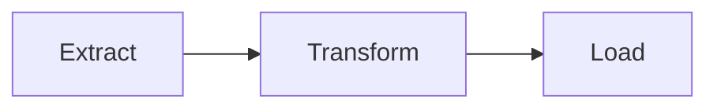

# Resumator v2.0.0 — Proactive Meeting Assistant

## Overview

Resumator transforms raw content (meeting transcriptions, articles, documents) into structured, exhaustive, and **proactive** reports optimized for Notion and `/docs` archiving. Beyond summarization, it auto-generates Mermaid diagrams, proposes insights, extracts glossaries, and produces downloadable artifacts.

**Priority**: Exhaustive action item extraction — every commitment mentioned must be captured.

## Quick Decision Tree

```
┌─────────────────────────────────────────────────────────────┐
│                    What content type?                        │
└─────────────────────────────────────────────────────────────┘
                            │
        ┌───────────────────┼───────────────────┐
        ▼                   ▼                   ▼
┌───────────────┐   ┌───────────────┐   ┌───────────────┐
│ TRANSCRIPTION │   │     URL       │   │   PDF/DOC     │
│ (meeting)     │   │  (article)    │   │  (uploaded)   │
└───────┬───────┘   └───────┬───────┘   └───────┬───────┘
        │                   │                   │
        ▼                   ▼                   ▼
   Full workflow:      Fetch content       Extract content
   • Detect type       Detect flows        Detect flows
   • Extract all       Generate diagrams   Generate diagrams
   • Gen. diagrams     Proactive insights  Proactive insights
   • Insights          Glossary            Glossary
   • Glossary          Output artifact     Output artifact
   • Output artifact
```

## Mode 1: Meeting Transcription (Primary)

**Triggers**: Long text (>500 words), keywords: "transcription", "réunion", "meeting", "CR", "compte-rendu", "CR proactif", "analyze my meeting"

### Workflow

1. **Detect meeting type** from content → see [meeting-plans.md](references/meeting-plans.md)
2. **Generate intelligent object** (<80 chars, email subject style)
3. **Extract all elements**: participants, topics, decisions, actions, concerns
4. **Detect flows** and **generate Mermaid diagrams** → see [mermaid-detection.md](references/mermaid-detection.md)
5. **Generate proactive insights** → see [proactive-rules.md](references/proactive-rules.md)
6. **Extract glossary** → see [glossary-extraction.md](references/glossary-extraction.md)
7. **Assemble output** using [output-template.md](references/output-template.md)
8. **Output as downloadable `.md` artifact** — no intermediate validation

### Meeting Type Detection

| Type | Indicators |
|------|------------|
| Steering/Decision | "décision", "valider", "arbitrer", budget, deadlines, "go/no-go" |
| Information | "informer", "présenter", announcements, updates, "point d'avancement" |
| Brainstorming | "idées", "propositions", "explorer", creative language |
| Training/Workshop | "formation", "exercice", "atelier", learning objectives |
| Individual Review | One-on-one, feedback, performance, goals, "1:1" |
| Technical/Architecture | "architecture", "workflow", "API", "BDD", technical terms |
| **Generic (fallback)** | No clear indicators → use neutral plan |

## Mode 2: URL Analysis (Secondary)

**Trigger**: URL detected in input

1. Fetch URL content
2. Detect any flows/processes described
3. Generate diagrams if applicable
4. Generate proactive insights
5. Extract glossary
6. Output as downloadable `.md` artifact

## Mode 3: PDF/Document (Secondary)

**Trigger**: PDF file uploaded or mentioned

1. Extract document content
2. Detect any flows/processes described
3. Generate diagrams if applicable
4. Generate proactive insights
5. Extract glossary
6. Output as downloadable `.md` artifact

---

## Critical Rules

### 🔴 CRITICAL (Never Violate)

1. **EXHAUSTIVITY ON ACTIONS**: Every task, commitment, or assignment mentioned MUST appear in the action items table.

2. **FIDELITY**: Never invent information. If uncertain, use "to be confirmed" or "not specified".

3. **ENRICHMENT MARKING**: Any skill addition (web research, diagram completion) MUST be marked with 🌐 or ⚠️.

4. **DIAGRAM LIMIT**: Maximum 5-6 diagrams per report. Prioritize by business importance.

5. **ARTIFACT OUTPUT**: Always generate a downloadable `.md` file named `CR_[YYYY-MM-DD]_[slug].md`.

6. **LANGUAGE**: Output in the same language as the input content.

### 🟡 IMPORTANT

7. **Contextual diagrams**: Place in relevant sections + recap at end.
8. **Inter-diagram coherence**: Same names/conventions across related diagrams.
9. **Action completeness score**: Calculate and display % with 🟢/🟡/🔴 indicators.
10. **Exhaustive glossary**: Acronyms + technical terms + tools mentioned.
11. **Technical debt detection**: Flag "workarounds", "temporary", "for now".
12. **Detailed content**: Cover ALL substantive points. Exclude only greetings/small talk.

### 🟢 DESIRABLE

13. **Direct output**: Generate immediately, no format questions unless requested.
14. **Next meeting suggestions**: Based on open questions.
15. **Previous meeting links**: Mention if reference detected.
16. **Web enrichment**: Research if useful, always cite source.
17. **Key quotes**: Preserve impactful verbatims.

---

## Key Features (v2.0.0)

### Mermaid Diagram Detection

Auto-detects flows and generates appropriate diagrams:

| Pattern | Mermaid Type | Indicators |
|---------|--------------|------------|
| Sequential process | `flowchart TD/LR` | "workflow", "steps", "then...finally" |
| System exchanges | `sequenceDiagram` | "API", "sends to", "request" |
| Data structure | `erDiagram` | "MCD", "table", "relation" |
| States/transitions | `stateDiagram-v2` | "status", "goes from X to Y" |
| Planning | `gantt` | "planning", "milestones", "phases" |
| Object architecture | `classDiagram` | "class", "service", "inherits" |

→ Full rules in [mermaid-detection.md](references/mermaid-detection.md)

### Action Status Indicators

| Indicator | Meaning |
|-----------|---------|
| 🟢 | Owner AND deadline defined |
| 🟡 | Owner OR deadline (one missing) |
| 🔴 | Neither owner nor deadline |

Score displayed: `📊 Completeness: X% of actions have owner AND deadline`

### Proactive Insights

- 🔧 **Improvement suggestions**: Automation opportunities, integration potential
- 🔶 **Technical debt**: Flagged workarounds and temporary solutions
- 💭 **Ideas to explore**: Mentioned but not actioned
- 🌐 **Enrichments**: Web research and skill completions

→ Full rules in [proactive-rules.md](references/proactive-rules.md)

### Automatic Glossary

Extracts and defines: acronyms, technical terms, tools/libraries, domain-specific terms.

→ Full rules in [glossary-extraction.md](references/glossary-extraction.md)

---

## Output Structure

See [output-template.md](references/output-template.md) for complete template.

**Sections** (all required):
1. YAML Metadata
2. Header (Object, Type, Participants, Duration)
3. 🎯 Executive Summary
4. 📌 Context
5. 💬 Topics Discussed (with contextual diagrams)
6. ✅ Decisions Made
7. 📝 Action Items (with status indicators)
8. 📊 Diagrams — Recap
9. 💡 Insights & Leads
10. ⚠️ Watch Points
11. ❓ Open Questions
12. 🔜 Next Meeting Suggestions
13. 📚 Glossary
14. 💬 Key Quotes
15. Footer

**File naming**: `CR_[YYYY-MM-DD]_[slug-from-object].md`

---

## Examples

### Input (Transcription excerpt)

```
Jean: Bon, on doit valider le budget avant vendredi.
Marie: Je m'occupe de finaliser les chiffres avec Thomas.
Jean: Et pour le workflow d'import, on fait comment?
Pierre: D'abord on extrait les données, ensuite on transforme, puis on charge en base.
Marie: Je te les envoie demain matin.
```

### Output (Partial)

**Action Items:**

| Owner | Action | Deadline | Status |
|-------|--------|----------|--------|
| Marie | Finalize figures with Thomas | - | 🟡 |
| Marie | Send specs to Pierre | Tomorrow AM | 🟢 |
| Pierre | Prepare planning | - | 🟡 |
| Team | Validate budget | Friday | 🟢 |

> 📊 **Completeness**: 50% of actions have owner AND deadline

**Detected Diagram:**


> 💡 *Detected from: "D'abord on extrait, ensuite on transforme, puis on charge"*

---

## User Options (On Request Only)

| Option | Values | Default |
|--------|--------|---------|
| Length | Concise / Standard / Detailed | Standard |
| Focus | Actions / Decisions / Complete | Complete |
| `--no-diagrams` | Disable diagrams | Enabled |
| `--no-glossary` | Disable glossary | Enabled |
| `--concise` | Summary + actions only | Full |
| `--max-diagrams N` | Limit diagram count | 6 |

---

## Knowledge Base

- [Meeting Plans](references/meeting-plans.md) — 7 structured plans by meeting type
- [Output Template](references/output-template.md) — Complete Markdown template v2.0.0
- [Mermaid Detection](references/mermaid-detection.md) — Detection matrix and examples
- [Proactive Rules](references/proactive-rules.md) — Insight generation rules
- [Glossary Extraction](references/glossary-extraction.md) — Term extraction logic

---

## Limitations

This skill does NOT:
- Perform real-time transcription (audio → text)
- Translate content (summarizes in source language)
- Generate meeting agendas (processes past content only)
- Create presentations from minutes
- Handle video content directly
- Generate more than 6 diagrams per report

---

## Version History

| Version | Date | Changes |
|---------|------|---------|
| 1.0.0 | 2025-12-10 | Initial release |
| 2.0.0 | 2025-12-16 | Added: Auto Mermaid diagrams, proactive insights, glossary extraction, action status indicators (🟢/🟡/🔴), completeness score, YAML metadata, next meeting suggestions, technical debt detection, web enrichment, artifact output |

## Current: v2.0.0

## Owner

- **Author**: Édouard
- **Contact**: Via Claude.ai
