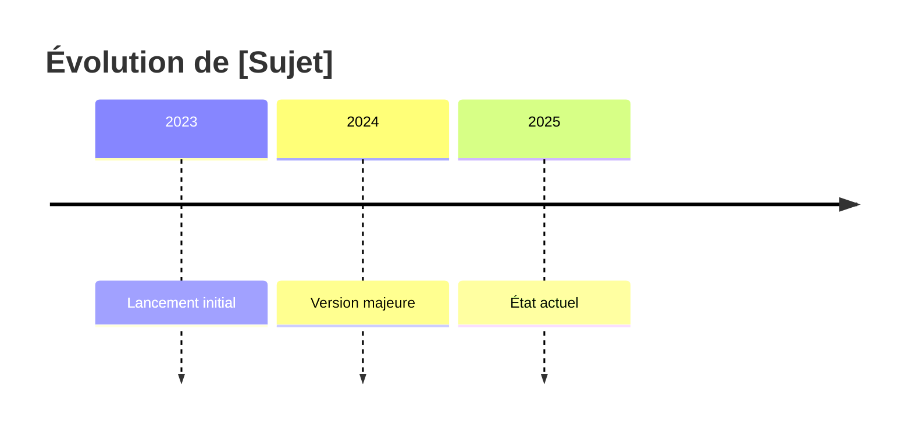

# Template : 🔬 Étude

## Usage

Recherche thématique approfondie sur un sujet, avec multi-sources et enrichissement web.

---

## Structure du rapport

```markdown
# 🔬 Étude : [Sujet]

> **Niveau** : [1-5] | **Date** : [YYYY-MM-DD] | **Sources** : [N fournies + M web]
> **Confiance globale** : ⭐⭐⭐⭐ (X/5)

---

## 🎯 Synthèse Exécutive

[5-10 lignes maximum — TOUJOURS présent même niveau 5]

**Points clés** :
- [Point 1]
- [Point 2]
- [Point 3]

**Verdict/Recommandation** : [1-2 phrases]

---

## 📌 Contexte et Périmètre

### Pourquoi cette étude ?
[Objectif, besoin initial]

### Questions auxquelles elle répond
- [Question 1]
- [Question 2]

### Délimitation
- **Inclus** : [ce qui est couvert]
- **Exclu** : [ce qui n'est pas traité]

---

## 🔍 Méthodologie

### Sources fournies
| # | Type | Source | Fiabilité |
|---|------|--------|-----------|
| [1] | [type] | [nom] | ⭐⭐⭐⭐ |

### Recherches web effectuées
| Axe | Requêtes | Sources retenues |
|-----|----------|------------------|
| [Axe 1] | "[requête]" | [N] |

### Limites méthodologiques
- [Biais potentiel ou source non accessible]

---

## 📚 Corps de l'étude

### 1. [Axe principal — auto-détecté du sujet]

#### 1.1 État des lieux
[Description de la situation actuelle]

#### 1.2 Analyse détaillée
[Développement approfondi avec citations [N]]

#### 1.3 Points clés à retenir
- [Synthèse de l'axe]

### 2. [Axe secondaire]

#### 2.1 [Sous-section]
[...]

### N. [Axes supplémentaires selon le sujet]

[Diagrammes Mermaid si flux/architecture détectés]

---

## ⚖️ Analyse Comparative

[Si plusieurs solutions/options identifiées]

| Critère | Option A | Option B | Option C |
|---------|----------|----------|----------|
| [Critère 1] | ✅ | ⚠️ | ❌ |
| [Critère 2] | ... | ... | ... |

### Forces et faiblesses

**Option A**
- ✅ [Force]
- ❌ [Faiblesse]

**Option B**
- ✅ [Force]
- ❌ [Faiblesse]

---

## 🔄 Chronologie / Évolution

[Si pertinent — timeline du sujet]



---

## 🗣️ Opinions et Controverses

[Points de vue divergents identifiés dans les sources]

### Position A
[Description + source]

### Position B  
[Description + source]

### Analyse
[Synthèse des positions, sans trancher arbitrairement]

---

## 💡 Insights et Recommandations

### Insights clés
1. **[Insight 1]** : [Découverte non évidente]
2. **[Insight 2]** : [Connexion entre éléments]

### Recommandations actionnables

| Priorité | Recommandation | Justification |
|----------|----------------|---------------|
| 🔴 Haute | [Action] | [Pourquoi] |
| 🟡 Moyenne | [Action] | [Pourquoi] |
| 🟢 Basse | [Action] | [Pourquoi] |

---

## ⚠️ Risques et Points d'Attention

- **[Risque 1]** : [Description + impact potentiel]
- **[Risque 2]** : [Description]

---

## ❓ Questions Ouvertes

- [Question non résolue par l'étude]
- [Sujet nécessitant investigation supplémentaire]

---

## 🔮 Perspectives et Tendances

### Évolutions prévisibles
- [Tendance 1]

### Signaux faibles détectés
- [Signal identifié dans les sources]

### Scénarios possibles
1. **Optimiste** : [...]
2. **Pessimiste** : [...]

---

## 🔗 Sujets Connexes à Explorer

- [Lien vers autre domaine pertinent]
- [Suggestion de recherche complémentaire]

---

## 📖 Bibliographie Complète

### Sources primaires (fournies)
| # | Type | Source | Sections utilisées |
|---|------|--------|-------------------|
| [1] | [type] | [nom] | [sections] |

### Sources web (recherchées)
| # | URL | Titre | Date | Fiabilité |
|---|-----|-------|------|-----------|
| [🌐1] | [url] | [titre] | [date] | ⭐⭐⭐⭐ |

### Sources non retenues (et pourquoi)
- [url] — [Raison : obsolète, non fiable, hors sujet]

---

## 📊 Annexes

### A. Glossaire complet
| Terme | Définition |
|-------|------------|
| [terme] | [définition] |

### B. Données brutes
[Tableaux détaillés si pertinent]

### C. Diagrammes techniques
[Diagrammes supplémentaires]

---

## 🏷️ Métadonnées

| Champ | Valeur |
|-------|--------|
| Sujet | [Sujet] |
| Date | [YYYY-MM-DD] |
| Niveau | [1-5] |
| Sources fournies | [N] |
| Recherches web | [M requêtes] |
| Sources web retenues | [X] |
| Temps de génération | ~[N] minutes |
| Confiance globale | ⭐⭐⭐⭐ |

---

*Généré par Resumator v3.0 — [Date]*
```

---

## Adaptations par niveau

| Section | Niv 1-2 | Niv 3 | Niv 4 | Niv 5 |
|---------|---------|-------|-------|-------|
| Synthèse | = tout | ✅ | ✅ | ✅ |
| Contexte/Périmètre | ❌ | ✅ court | ✅ | ✅ détaillé |
| Méthodologie | ❌ | Sources listées | ✅ | ✅ + métriques |
| Corps étude | Résumé | Complet | Enrichi | Exhaustif |
| Analyse comparative | ❌ | Si évident | ✅ | ✅ détaillée |
| Chronologie | ❌ | ❌ | Si pertinent | ✅ |
| Controverses | ❌ | ❌ | Si présentes | ✅ |
| Recommandations | 1-2 | 3-5 | Priorisées | Complètes |
| Risques | ❌ | ✅ | ✅ | ✅ + impacts |
| Questions ouvertes | ❌ | ❌ | ✅ | ✅ |
| Perspectives | ❌ | ❌ | ✅ | ✅ + scénarios |
| Sujets connexes | ❌ | ❌ | ✅ | ✅ |
| Bibliographie | ❌ | Sources | Complète | + non retenues |
| Annexes | ❌ | ❌ | Optionnel | ✅ |
| Métadonnées | ❌ | ❌ | ❌ | ✅ |

---

## Recherche web

Pour le type Étude, la recherche web est :
- **Niveau 1-2** : Non
- **Niveau 3** : Oui, ciblée (2-3 axes)
- **Niveau 4** : Oui, approfondie (5 axes)
- **Niveau 5** : Oui, exhaustive (5-7 axes, saturation)

Voir [workflow-recherche.md](../workflow-recherche.md) pour le processus complet.
