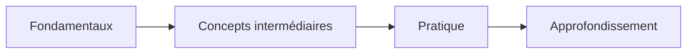

# Template : 📖 Formation

## Usage

Extraction pédagogique d'un contenu pour apprentissage structuré.

---

## Structure du rapport

```markdown
# 📖 Formation : [Sujet]

> **Niveau requis** : [Débutant/Intermédiaire/Avancé]
> **Durée estimée** : [X heures]
> **Prérequis** : [Liste]

---

## 🎯 Objectifs Pédagogiques

À la fin de cette formation, vous serez capable de :

1. [ ] [Objectif 1 — verbe d'action]
2. [ ] [Objectif 2]
3. [ ] [Objectif 3]

---

## 📚 Concepts Clés

### Concept 1 : [Nom]

**Définition** : [Explication claire]

**Exemple** : [Illustration concrète]

**À retenir** : [Point essentiel]

### Concept 2 : [Nom]

[...]

---

## 🗺️ Progression Suggérée



### Étape 1 : Fondamentaux
- [Notion 1]
- [Notion 2]

### Étape 2 : Concepts intermédiaires
- [Notion 3]
- [Notion 4]

### Étape 3 : Pratique
- [Exercice suggéré]

### Étape 4 : Approfondissement
- [Sujets avancés]

---

## 💡 Points Clés à Mémoriser

| # | Point | Importance |
|---|-------|------------|
| 1 | [Point clé] | 🔴 Critique |
| 2 | [Point clé] | 🟡 Important |
| 3 | [Point clé] | 🟢 Utile |

---

## ⚠️ Erreurs Courantes

| Erreur | Pourquoi c'est faux | Correction |
|--------|---------------------|------------|
| [Erreur 1] | [Explication] | [Bonne pratique] |

---

## 🏋️ Exercices Suggérés

### Exercice 1 : [Titre]
**Objectif** : [Ce que ça travaille]
**Consigne** : [Instructions]
**Niveau** : ⭐/⭐⭐/⭐⭐⭐

### Exercice 2 : [Titre]
[...]

---

## 📎 Ressources Complémentaires

### Pour aller plus loin
- [Ressource 1] — [Description]
- [Ressource 2] — [Description]

### Documentation officielle
- [Lien doc]

### Tutoriels recommandés
- [Tutoriel 1]

---

## 📚 Glossaire

| Terme | Définition |
|-------|------------|
| [Terme] | [Définition simple] |

---

## ✅ Auto-évaluation

Cochez ce que vous maîtrisez :

- [ ] Je comprends [concept 1]
- [ ] Je sais [compétence 1]
- [ ] Je peux [action 1]

---

*Formation extraite par Resumator v3.0 — [Date]*
```

---

## Spécificités formation

### Extraction pédagogique
- Reformuler pour la clarté (pas de jargon inutile)
- Structurer du simple au complexe
- Identifier les prérequis implicites

### Exercices
- Proposer des exercices progressifs
- Lier aux concepts enseignés
- Indiquer le niveau de difficulté

### Ressources
- Privilégier documentation officielle
- Tutoriels de qualité vérifiée
- Communautés d'entraide

---

## Adaptations par niveau

| Section | Niv 1-2 | Niv 3 | Niv 4-5 |
|---------|---------|-------|---------|
| Objectifs | 3 max | 5 | Complets |
| Concepts | Essentiels | Tous | + contexte |
| Progression | ❌ | ✅ | + timeline |
| Erreurs courantes | ❌ | Top 3 | Exhaustif |
| Exercices | ❌ | 2-3 | Parcours complet |
| Ressources | ❌ | Essentielles | Exhaustives |
| Auto-évaluation | ❌ | ❌ | ✅ |
