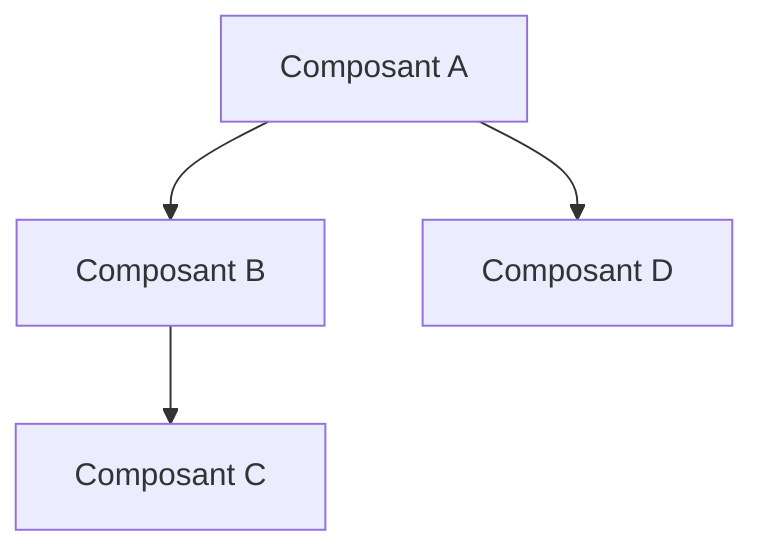
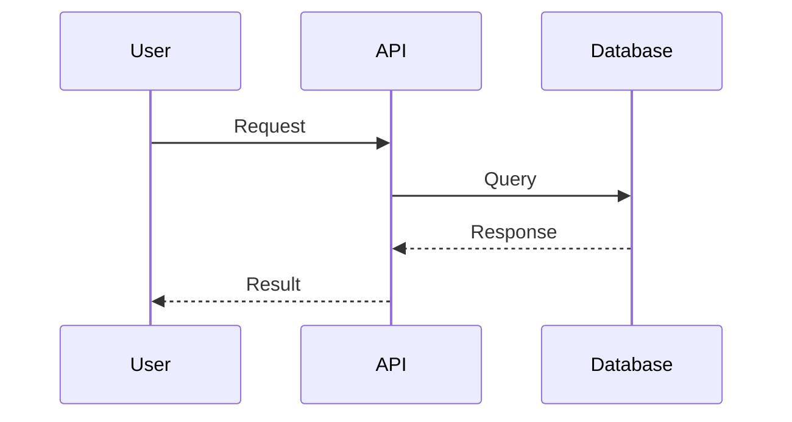
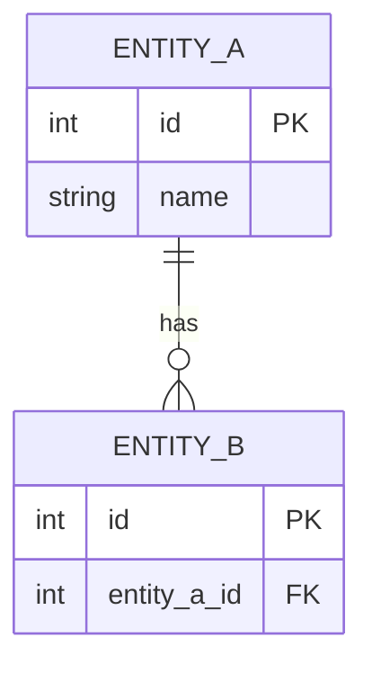

# Template : 🔧 Technique

## Usage

Documentation technique d'une API, architecture, outil ou système.

---

## Structure du rapport

```markdown
# 🔧 Documentation Technique : [Sujet]

> **Version** : [X.Y.Z] | **Dernière màj** : [YYYY-MM-DD]
> **Statut** : [Stable/Beta/Deprecated]

---

## 🎯 Vue d'Ensemble

**Qu'est-ce que c'est ?**
[Description en 2-3 phrases]

**À quoi ça sert ?**
[Cas d'usage principaux]

**Prérequis**
- [Prérequis 1]
- [Prérequis 2]

---

## 🚀 Quick Start

### Installation

```bash
[Commande d'installation]
```

### Premier exemple

```[langage]
[Code minimal fonctionnel]
```

### Vérification

```bash
[Commande de test]
```

---

## 🏗️ Architecture



### Composants principaux

| Composant | Rôle | Technologies |
|-----------|------|--------------|
| [Composant A] | [Description] | [Tech] |
| [Composant B] | [Description] | [Tech] |

### Flux de données



---

## 📖 API Reference

### Endpoints / Méthodes

#### `[méthode/endpoint]`

**Description** : [Ce que ça fait]

**Paramètres** :
| Nom | Type | Requis | Description |
|-----|------|--------|-------------|
| `param1` | string | ✅ | [Description] |
| `param2` | number | ❌ | [Description] |

**Retour** :
```json
{
  "field": "value"
}
```

**Exemple** :
```[langage]
[Code d'exemple]
```

#### `[autre méthode]`

[Même structure...]

---

## ⚙️ Configuration

### Fichier de configuration

```[format]
[Exemple de config]
```

### Variables d'environnement

| Variable | Description | Défaut |
|----------|-------------|--------|
| `VAR_1` | [Description] | `value` |
| `VAR_2` | [Description] | — |

---

## 📊 Modèle de Données



### Entités

#### [Entity A]
| Champ | Type | Description |
|-------|------|-------------|
| `id` | int | Identifiant unique |
| `name` | string | Nom |

---

## 🔐 Authentification / Sécurité

### Méthode d'authentification
[Description de la méthode]

### Exemple
```[langage]
[Code d'authentification]
```

### Bonnes pratiques
- [Pratique 1]
- [Pratique 2]

---

## ⚠️ Limitations et Quotas

| Limite | Valeur | Contournement |
|--------|--------|---------------|
| [Limite 1] | [Valeur] | [Solution] |
| [Limite 2] | [Valeur] | [Solution] |

---

## 🐛 Troubleshooting

### Erreur : [Message d'erreur]
**Cause** : [Explication]
**Solution** : [Étapes]

### Erreur : [Autre message]
[Même structure...]

---

## 💡 Bonnes Pratiques

### À faire ✅
- [Pratique recommandée]

### À éviter ❌
- [Anti-pattern]

---

## 🔗 Intégrations

| Service | Méthode | Documentation |
|---------|---------|---------------|
| [Service 1] | [SDK/API/Webhook] | [Lien] |

---

## 📚 Ressources

- **Documentation officielle** : [Lien]
- **GitHub** : [Lien]
- **Communauté** : [Lien]

---

## 📝 Changelog

| Version | Date | Changements |
|---------|------|-------------|
| X.Y.Z | [Date] | [Description] |

---

*Documentation générée par Resumator v3.0 — [Date]*
```

---

## Spécificités technique

### Code
- Toujours tester/vérifier les exemples
- Indiquer le langage pour la coloration
- Exemples minimaux mais fonctionnels

### Diagrammes
- Architecture : flowchart ou C4
- API : sequenceDiagram
- Données : erDiagram
- États : stateDiagram

### Précision
- Versions exactes
- Paramètres exhaustifs
- Valeurs par défaut

---

## Adaptations par niveau

| Section | Niv 1-2 | Niv 3 | Niv 4-5 |
|---------|---------|-------|---------|
| Vue d'ensemble | = tout | ✅ | ✅ |
| Quick Start | ✅ | ✅ | ✅ + variantes |
| Architecture | ❌ | Schéma simple | Complet |
| API Reference | Essentiels | Tous endpoints | + exemples détaillés |
| Configuration | ❌ | Essentielle | Exhaustive |
| Modèle données | ❌ | Si pertinent | ✅ + relations |
| Troubleshooting | ❌ | Top 3 | Exhaustif |
| Changelog | ❌ | ❌ | ✅ |
