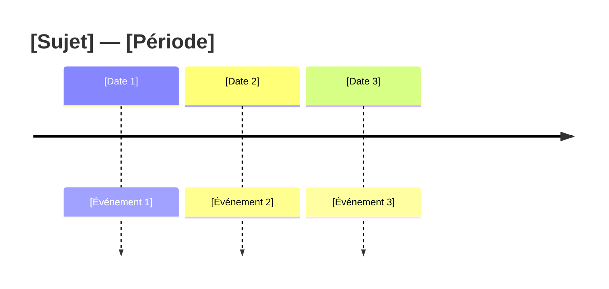

# Template : 📰 Veille

## Usage

Synthèse d'actualités et tendances sur un sujet, avec focus sur la temporalité et les signaux faibles.

---

## Structure du rapport

```markdown
# 📰 Veille : [Sujet]

> **Période** : [Date début] — [Date fin] | **Sources** : [N]
> **Dernière mise à jour** : [YYYY-MM-DD]

---

## 🎯 Headlines

[3-5 actualités majeures de la période]

1. **[Titre actu 1]** — [Source] ([Date])
2. **[Titre actu 2]** — [Source] ([Date])
3. ...

---

## 📈 Tendances Identifiées

### Tendance majeure : [Nom]
[Description de la tendance avec sources]

### Autres tendances
- **[Tendance 2]** : [Description courte]
- **[Tendance 3]** : [Description courte]

---

## 🔄 Timeline des Événements



| Date | Événement | Source | Impact |
|------|-----------|--------|--------|
| [Date] | [Événement] | [N] | 🔴/🟡/🟢 |

---

## 👥 Acteurs Clés

| Acteur | Rôle | Actualité récente |
|--------|------|-------------------|
| [Entreprise/Personne] | [Position] | [Action récente] |

---

## 📊 Chiffres Clés

| Métrique | Valeur | Évolution | Source |
|----------|--------|-----------|--------|
| [Métrique] | [Valeur] | ↗️/↘️/➡️ | [N] |

---

## 🔮 Signaux Faibles

[Éléments émergents, pas encore mainstream]

- **[Signal 1]** : [Description + pourquoi c'est à surveiller]
- **[Signal 2]** : [Description]

---

## ⚠️ Points d'Attention

- [Risque ou changement à surveiller]
- [Élément disruptif potentiel]

---

## 🔜 À Surveiller

- [ ] [Événement à venir]
- [ ] [Annonce attendue]
- [ ] [Décision en attente]

---

## 📖 Sources

### Par date
| Date | Source | Sujet |
|------|--------|-------|
| [Date] | [Source] | [Titre] |

### Par fiabilité
| Source | Fiabilité | Articles |
|--------|-----------|----------|
| [Source] | ⭐⭐⭐⭐⭐ | [N] |

---

*Veille générée par Resumator v3.0 — [Date]*
```

---

## Spécificités veille

### Focus temporel
- Toujours inclure les dates
- Trier par chronologie (récent en premier)
- Identifier les événements déclencheurs

### Signaux faibles
Chercher :
- Mentions isolées qui pourraient devenir tendances
- Mouvements de petits acteurs
- Changements réglementaires annoncés
- Technologies émergentes

### Sources privilégiées
- Médias tech (TechCrunch, Ars Technica, The Verge)
- Blogs officiels des acteurs
- Communiqués de presse
- Twitter/X des experts du domaine

---

## Adaptations par niveau

| Section | Niv 1-2 | Niv 3 | Niv 4-5 |
|---------|---------|-------|---------|
| Headlines | = tout | ✅ | ✅ |
| Tendances | 1 majeure | 3-5 | Exhaustif |
| Timeline | ❌ | Tableau | + Mermaid |
| Acteurs | ❌ | Top 5 | Complet |
| Chiffres | ❌ | Clés | Tous |
| Signaux faibles | ❌ | ❌ | ✅ |
| À surveiller | ❌ | ✅ | ✅ détaillé |
