# EPCI — Complete Workflow

## Overview

Structured workflow in 3 phases with validation at each step.
Generates a Feature Document as traceability thread.

```mermaid
flowchart LR
    subgraph P1["Phase 1"]
        FD["Read §1"] --> Plan["Plan"] --> PV["@plan-validator"]
    end
    subgraph P2["Phase 2"]
        TDD["TDD"] --> CR["@code-reviewer"]
    end
    subgraph P3["Phase 3"]
        Doc["@doc-generator"] --> Commit["Commit"]
    end

    PV --> BP1["BP1"]
    BP1 -->|Continue| TDD
    CR --> BP2["BP2"]
    BP2 -->|Continue| Doc

    style BP1 fill:#ffd700
    style BP2 fill:#ffd700
```



## Arguments

### Workflow Control

| Argument | Description |
|----------|-------------|
| `--large` | Alias for `--think-hard --wave` (backward compatible) |
| `--turbo` | Speed-optimized mode: @planner/@implementer (Sonnet), parallel reviews, 1 breakpoint |
| `--continue` | Continue from last phase (resume after interruption) |
| `--no-hooks` | Disable all hook execution |

### --turbo Mode (MANDATORY Instructions)

**⚠️ MANDATORY: When `--turbo` flag is active, you MUST follow these rules:**

#### Phase 1 — Turbo Planning

1. **Use @planner agent** (Sonnet model) for rapid task breakdown:
   ```
   Invoke @planner via Task tool with model: sonnet
   Input: Feature Document §1 + identified files
   Output: Atomic tasks (2-15 min each) with dependencies
   ```

2. **Skip detailed risk analysis** — Focus on execution, not documentation

3. **Single breakpoint only** — Combine BP1 approval with implementation start

#### Phase 2 — Turbo Implementation

1. **Use @implementer agent** (Sonnet model) for code execution:
   ```
   Invoke @implementer via Task tool with model: sonnet
   Input: Single task from plan
   Output: Implemented code with tests
   ```

2. **Parallel reviews** — Run all review agents simultaneously:
   ```
   ⚠️ MANDATORY: Launch ALL applicable reviews in a SINGLE message with multiple Task calls:

   Task 1: @code-reviewer (opus) — Review code quality
   Task 2: @security-auditor (opus) — If security files detected
   Task 3: @qa-reviewer (sonnet) — If complex tests

   DO NOT run these sequentially. Use parallel Task tool calls.
   ```

3. **Single breakpoint** — Skip BP2, proceed directly to Phase 3 after reviews pass

4. **Auto-fix minor issues** — Apply Minor/Style fixes automatically, report in summary

#### Turbo DAG Structure

```
@planner (sonnet)
      │
      ▼
@implementer (sonnet) ──────────────────────────┐
      │                                          │
      ▼                                          ▼
┌─────────────────────────────────────────────────────┐
│ PARALLEL REVIEWS (single Task message)              │
│ @code-reviewer (opus)                               │
│ @security-auditor (opus) — if applicable            │
│ @qa-reviewer (sonnet) — if applicable               │
└─────────────────────────────────────────────────────┘
      │
      ▼
@doc-generator (sonnet)
```

**Turbo vs Standard Comparison:**

| Aspect | Standard | Turbo |
|--------|----------|-------|
| Breakpoints | 3 (BP1, BP2, pre-commit) | 1 (pre-commit only) |
| Planning | Manual | @planner (Sonnet) |
| Implementation | Manual | @implementer (Sonnet) |
| Reviews | Sequential | Parallel (single message) |
| Minor fixes | User approval | Auto-applied |
| Est. time savings | - | 30-50% |

### Key Flags for /epci

| Flag | Effect | Auto-Trigger |
|------|--------|--------------|
| `--turbo` | Speed mode (@planner, @implementer, parallel reviews, 1 BP) | Suggested if `.project-memory/` exists |
| `--large` | Alias for `--think-hard --wave` | Never |
| `--safe` | Max validations, all conditional agents mandatory | Sensitive files |
| `--wave` | DAG-based parallel agent execution | complexity > 0.7 |
| `--no-hooks` | Disable all hook execution | Never |

**Full flag documentation:** `src/settings/flags.md`
- Thinking flags (`--think`, `--think-hard`, `--ultrathink`)
- Output flags (`--uc`, `--verbose`)
- MCP flags (`--c7`, `--seq`, `--magic`, `--play`, `--no-mcp`) → see `src/skills/mcp/SKILL.md`

## Feature Document

The Feature Document is created by `/brief` at: `docs/features/<feature-slug>.md`

```markdown
# Feature Document — [Title]

## §1 — Functional Brief
[Created by /brief with thorough exploration]

## §2 — Implementation Plan
[Generated in Phase 1]

## §3 — Implementation & Finalization
[Updated in Phases 2-3]
```

**Prerequisite:** Feature Document with §1 completed must exist before running `/epci`.

---

## Hooks Integration

User-defined hooks can be executed at specific points in the workflow.
See `hooks/README.md` for configuration and examples.

**Hook Points:**

| Hook Type | Trigger Point | Use Case |
|-----------|--------------|----------|
| `pre-brief` | Before /brief exploration | Load external config, validate environment |
| `post-brief` | After complexity evaluation | Notify feature start, create tickets |
| `pre-phase-1` | Before Phase 1 starts | Load context, check prerequisites |
| `post-phase-1` | After plan validation | Notify team, update tickets |
| `pre-phase-2` | Before coding starts | Run linters, setup environment |
| `post-phase-2` | After code review | Additional tests, coverage checks |
| `post-phase-3` | After completion | Deploy, notify, collect metrics |
| `on-breakpoint` | At each breakpoint | Logging, metrics collection |
| `pre-agent` | Before each agent runs | Custom agent setup, logging |
| `post-agent` | After each agent completes | Process agent results, notifications |

> **Note (v3.2):** `pre-phase-3` removed (redundant with `post-phase-2`).

**Execution:** Hooks must be explicitly invoked using the hook runner.

**⚠️ MANDATORY: Always invoke hooks at the designated points using:**

```bash
python3 src/hooks/runner.py <hook-type> --context '{
  "phase": "<phase>",
  "feature_slug": "<slug>",
  "complexity": "<TINY|SMALL|STANDARD|LARGE>",
  "files_modified": ["file1.py", "file2.py"],
  ...
}'
```

On error with `fail_on_error: false` (default), workflow continues with warning.

---

## Multi-Agent Orchestration (F07)

When `--wave` flag is enabled, agents are executed using the DAG-based orchestrator
for parallel execution of independent agents.

**Orchestration Modes:**

| Mode | Description | Flag |
|------|-------------|------|
| Sequential | One agent at a time | `--sequential` |
| DAG | Respect dependencies, parallelize when possible | default with `--wave` |
| Parallel | All agents simultaneously (use with caution) | `--parallel` |

**DAG Structure:**
```
@plan-validator
       │
       ├──────────────┬──────────────┐
       ▼              ▼              ▼
@code-reviewer  @security-auditor  @qa-reviewer
       │              │              │
       └──────────────┼──────────────┘
                      ▼
               @doc-generator
```

**Performance:** Parallel execution of independent agents (code-reviewer, security-auditor,
qa-reviewer) reduces validation time by 30-50% for LARGE features.

**Configuration:** Default DAG is defined in `config/dag-default.yaml`. Project-specific
overrides can be placed in `.project-memory/orchestration.yaml`.

---

## Pre-Workflow: Memory Context

**Memory is loaded once by `/brief`** and passed via Feature Document §1 (Memory Summary section).

**Reading memory context:**
1. Check Feature Document §1 for "Memory Summary" section
2. If present: Use conventions, patterns, and velocity from §1
3. If absent (direct /epci call): Fall back to loading `.project-memory/` directly

**Fallback behavior:** If `/epci` is called without prior `/brief`, the `project-memory` skill will load context. This is not recommended — always start with `/brief`.

---

## Feature Document Prerequisite Check (MANDATORY)

**⚠️ CRITICAL: This check MUST pass before Phase 1 can begin.**

### Step 1: Verify Feature Document Exists

```
IF NOT exists(docs/features/<slug>.md):
  ╔══════════════════════════════════════════════════════════════╗
  ║ ❌ ERROR: Feature Document Not Found                         ║
  ╠══════════════════════════════════════════════════════════════╣
  ║ Expected: docs/features/<slug>.md                            ║
  ║                                                              ║
  ║ → Run `/brief "<feature description>"` first                 ║
  ╚══════════════════════════════════════════════════════════════╝
  ABORT workflow
```

### Step 2: Verify §1 Brief Fonctionnel Exists

```
IF NOT contains_section("## §1 — Brief Fonctionnel"):
  ╔══════════════════════════════════════════════════════════════╗
  ║ ❌ ERROR: §1 Brief Fonctionnel Missing                       ║
  ╠══════════════════════════════════════════════════════════════╣
  ║ Feature Document exists but §1 is incomplete.                ║
  ║                                                              ║
  ║ → Run `/brief` to complete functional brief                  ║
  ╚══════════════════════════════════════════════════════════════╝
  ABORT workflow
```

### Step 3: Verify Required Fields in §1

Required fields:
- Context technique (stack, dependencies)
- Objectif (what to achieve)
- At least 1 acceptance criterion

```
IF missing_required_fields:
  ╔══════════════════════════════════════════════════════════════╗
  ║ ⚠️ WARNING: Incomplete §1 Brief                              ║
  ╠══════════════════════════════════════════════════════════════╣
  ║ Missing fields:                                              ║
  ║ • [list of missing fields]                                   ║
  ╠══════════════════════════════════════════════════════════════╣
  ║ OPTIONS:                                                     ║
  ║ 1. "continue" → Proceed anyway (not recommended)             ║
  ║ 2. "brief" → Run /brief to complete §1                       ║
  ╚══════════════════════════════════════════════════════════════╝
  WAIT for user choice
```

### Validation Passed

```
IF all_checks_pass:
  ✅ Feature Document validated: docs/features/<slug>.md
  ✅ §1 Brief Fonctionnel: Complete
  → Proceeding to Phase 1: Planification
```

---

## Phase 1: Planification (MANDATORY)

**⚠️ ALL steps in this phase are MANDATORY. Do NOT skip any step.**

### Configuration

| Element | Value |
|---------|-------|
| **Thinking** | Based on flags: `think` (default), `think hard` (--think-hard), `ultrathink` (--ultrathink) |
| **Skills** | project-memory, epci-core, architecture-patterns, flags-system, [stack] |
| **Subagents** | @plan-validator |

**Flag effects on Phase 1:**
- `--think-hard` or `--large`: Use `think hard` mode
- `--ultrathink`: Use `ultrathink` mode (extended analysis)
- `--safe`: Additional validation checks in plan
- `--no-hooks`: Skip pre-phase-1 and post-phase-1 hooks

**Note**: @Plan is no longer invoked — exploration has been done by `/brief`.

### Process

**🪝 Execute `pre-phase-1` hooks** (if configured)

1. **Read Feature Document**
   - Read `docs/features/<slug>.md` (created by `/brief`)
   - Verify §1 is complete (if incomplete → error, suggest `/brief` first)
   - Extract from §1: identified files, stack, constraints, acceptance criteria

2. **Direct planning**
   - Use the files already identified in §1
   - Break down into atomic tasks (2-15 min each)
   - Order by dependencies
   - Plan a test for each task

3. **Validation** (via @plan-validator)
   - Submit plan to validator
   - If NEEDS_REVISION → correct and resubmit
   - If APPROVED → proceed to breakpoint

### Output §2 (USE EDIT TOOL — MANDATORY)

**⚠️ MANDATORY:** Use the **Edit tool** to update the Feature Document with §2 content.

```markdown
## §2 — Implementation Plan

### Impacted Files
| File | Action | Risk |
|------|--------|------|
| src/Service/X.php | Modify | Medium |
| src/Entity/Y.php | Create | Low |
| tests/Unit/XTest.php | Create | Low |

### Tasks
1. [ ] **Create entity Y** (5 min)
   - File: `src/Entity/Y.php`
   - Test: `tests/Unit/Entity/YTest.php`

2. [ ] **Modify service X** (10 min)
   - File: `src/Service/X.php`
   - Test: `tests/Unit/Service/XTest.php`

### Risks
| Risk | Probability | Mitigation |
|------|-------------|------------|
| Breaking change | Medium | Regression tests |

### Validation
- **@plan-validator**: APPROVED
```

**🪝 Execute `post-phase-1` hooks:**
```bash
python3 src/hooks/runner.py post-phase-1 --context '{"phase": "phase-1", "feature_slug": "<slug>", "complexity": "<complexity>"}'
```

### ⏸️ BREAKPOINT BP1 (MANDATORY — WAIT FOR USER)

**⚠️ MANDATORY:** Display this breakpoint and WAIT for user confirmation before proceeding.

**🪝 Execute `on-breakpoint` hooks** (if configured)

**Template:** Use `breakpoint-metrics/templates/bp1-template.md`

**Variables to populate:**
| Variable | Source |
|----------|--------|
| `FLAGS` | Active flags with sources (auto/explicit/alias) |
| `CATEGORY`, `SCORE` | Complexity score from breakpoint-metrics formula |
| `FILE_COUNT` | From §2 Implementation Plan |
| `TIME_ESTIMATE` | Heuristic: TINY=15min, SMALL=1h, STANDARD=3h, LARGE=8h+ |
| `RISK_LEVEL` | From identified risks in plan |
| `PLAN_VALIDATOR_VERDICT` | From @plan-validator output |
| `TASK_PREVIEW` | First 3 tasks from §2 |
| `SLUG` | Feature slug |

**User options:** "Continuer" / "Modifier le plan" / "Voir détails" / "Annuler"

**Awaiting confirmation:** User must type "Continuer" to proceed

---

## Phase 2: Implementation (MANDATORY)

**⚠️ ALL steps in this phase are MANDATORY. Do NOT skip any step.**

### Configuration

| Element | Value |
|---------|-------|
| **Thinking** | Based on flags: `think` (default), `think hard` (--think-hard) |
| **Skills** | testing-strategy, code-conventions, flags-system, [stack] |
| **Subagents** | @code-reviewer (mandatory), @security-auditor*, @qa-reviewer* |

**Flag effects on Phase 2:**
- `--safe`: All conditional subagents become mandatory
- `--uc`: Compressed output in progress reports
- `--no-hooks`: Skip pre-phase-2 and post-phase-2 hooks

### Conditional Subagents

**@security-auditor** if detection of:
- Files: `**/auth/**`, `**/security/**`, `**/api/**`, `**/password/**`
- Keywords: `password`, `secret`, `api_key`, `jwt`, `oauth`

**@qa-reviewer** if:
- More than 5 test files created/modified
- Integration or E2E tests involved
- Complex mocking detected

### Process

**🪝 Execute `pre-phase-2` hooks** (if configured)

For each task in the plan:

```
1. RED — Write the failing test
2. Execute → confirm failure
3. GREEN — Implement minimal code
4. Execute → confirm passing
5. REFACTOR — Improve if necessary
6. Check off the task ✓
```

After all tasks:
1. Run complete test suite
2. Invoke @code-reviewer
3. Invoke @security-auditor (if applicable)
4. Invoke @qa-reviewer (if applicable)
5. Fix Critical/Important issues
6. **Generate proactive suggestions (F06)**

### Proactive Suggestions (F06)

After code review, the `proactive-suggestions` skill generates suggestions:

**Sources:**
- Subagent findings (@code-reviewer, @security-auditor, @qa-reviewer)
- PatternDetector analysis on changed files

**Priority Order:** P1 (Security) > P2 (Performance/Quality) > P3 (Style)

**Display:** Up to 5 suggestions shown in BP2 breakpoint with actions:
- `[Accepter tout]` - Apply auto-fixable suggestions
- `[Voir détails]` - Show full details
- `[Ignorer]` - Skip for this session

User feedback is recorded for learning (F08) to improve future suggestions.

### Output §3 Part 1 (USE EDIT TOOL — MANDATORY)

**⚠️ MANDATORY:** Use the **Edit tool** to update the Feature Document with §3 implementation content.

> **Note (v3.2):** §3 now contains both Implementation and Finalization. Phase 2 writes the implementation part, Phase 3 appends the finalization part.

```markdown
## §3 — Implementation & Finalization

### Progress
- [x] Task 1 — Create entity Y
- [x] Task 2 — Modify service X
- [x] Task 3 — Add validation

### Tests
```bash
$ php bin/phpunit
OK (47 tests, 156 assertions)
```

### Reviews
- **@code-reviewer**: APPROVED (0 Critical, 2 Minor)
- **@security-auditor**: APPROVED
- **@qa-reviewer**: N/A

### Deviations
| Task | Deviation | Justification |
|------|-----------|---------------|
| #3 | +1 file | Helper extraction |
```

**🪝 Execute `post-phase-2` hooks:**
```bash
python3 src/hooks/runner.py post-phase-2 --context '{"phase": "phase-2", "feature_slug": "<slug>", "files_modified": [...], "test_results": {...}}'
```

### ⏸️ BREAKPOINT BP2 (MANDATORY — WAIT FOR USER)

**⚠️ MANDATORY:** Display this breakpoint and WAIT for user confirmation before proceeding.

**🪝 Execute `on-breakpoint` hooks** (if configured)

**Template:** Use `breakpoint-metrics/templates/bp2-template.md`

**Variables to populate:**
| Variable | Source |
|----------|--------|
| `FLAGS` | Active flags with sources |
| `TASKS_COMPLETED`, `TASKS_TOTAL` | From §3 Progress checklist |
| `TEST_COUNT`, `TEST_STATUS` | From test execution results |
| `COVERAGE` | From coverage report (if available) |
| `CODE_REVIEWER_VERDICT` | From @code-reviewer output |
| `SECURITY_AUDITOR_VERDICT` | From @security-auditor (if invoked) |
| `QA_REVIEWER_VERDICT` | From @qa-reviewer (if invoked) |
| `SLUG` | Feature slug |

**Conditional agents display:**
- @security-auditor: Show only if auth/security files detected
- @qa-reviewer: Show only if 5+ test files
- In `--safe` mode: All agents mandatory

**User options:** "Continuer" / "Corriger issues" / "Voir rapports" / "Annuler"

**Awaiting confirmation:** User must type "Continuer" to proceed

---

## Phase 3: Finalization (MANDATORY)

**⚠️ ALL steps in this phase are MANDATORY. Do NOT skip any step.**

### Configuration

| Element | Value |
|---------|-------|
| **Thinking** | `think` |
| **Skills** | git-workflow |
| **Subagents** | @doc-generator |

### Process

1. **Structured commit**
   ```
   feat(scope): short description

   - Detail 1
   - Detail 2

   Refs: docs/features/<slug>.md
   ```

2. **Documentation** (via @doc-generator)
   - Generate/update README if new component
   - Document API changes if applicable
   - Update CHANGELOG

3. **PR preparation**
   - Create branch if not done
   - Prepare PR template
   - List reviewers

4. **Learning update** (F08 - automatic)
   - Save feature history to `.project-memory/history/features/{slug}.json`
   - Trigger calibration with estimated vs actual times
   - Update velocity metrics
   - Record any corrections for pattern detection

### Output §3 Part 2 (USE EDIT TOOL — MANDATORY)

**⚠️ MANDATORY:** Use the **Edit tool** to **append** finalization content to §3.

> **Note (v3.2):** Append this content after the Reviews/Deviations section in §3.

```markdown
### Documentation
- **@doc-generator**: 2 files updated
  - README.md (Configuration section)
  - CHANGELOG.md (v1.2.0)

### PR Ready
- Branch: `feature/user-email-validation`
- Tests: ✅ All passing
- Lint: ✅ Clean
- Docs: ✅ Up to date
```

### Generate Commit Context (MANDATORY)

**⚠️ MANDATORY:** Generate the commit context file for `/commit` command.

**Write `.epci-commit-context.json`** to project root:

```json
{
  "source": "epci",
  "type": "<type from commit message>",
  "scope": "<scope from feature>",
  "description": "<description from plan>",
  "files": ["<list of modified files>"],
  "featureDoc": "docs/features/<slug>.md",
  "breaking": false,
  "ticket": null
}
```

**Display commit suggestion:**

```
┌─────────────────────────────────────────────────────────────────────┐
│ 📝 CONTEXTE COMMIT PRÉPARÉ                                          │
├─────────────────────────────────────────────────────────────────────┤
│                                                                     │
│ Message proposé:                                                   │
│ {TYPE}({SCOPE}): {DESCRIPTION}                                     │
│                                                                     │
│ Fichiers: {FILE_COUNT}                                             │
│ Feature Document: docs/features/{slug}.md                          │
│                                                                     │
│ → Lancez /commit pour finaliser                                    │
│ → Ou /commit --auto-commit pour commit direct                      │
└─────────────────────────────────────────────────────────────────────┘
```

**Note:** The `/commit` command handles:
- Pre-commit breakpoint with user confirmation
- Git commit execution
- Pre/post-commit hooks
- Context file cleanup after success

### 🪝 Memory Update (MANDATORY)

**⚠️ CRITICAL: You MUST execute this hook before displaying completion message.**

```bash
python3 src/hooks/runner.py post-phase-3 --context '{
  "phase": "phase-3",
  "feature_slug": "<slug>",
  "complexity": "<complexity>",
  "files_modified": ["<list of files>"],
  "estimated_time": "<estimated>",
  "actual_time": "<actual>",
  "commit_hash": "<hash or null>",
  "commit_status": "<committed|pending|cancelled>",
  "test_results": {"status": "passed", "count": <n>}
}'
```

**Why this is mandatory:**
- Saves feature to `.project-memory/history/features/`
- Updates velocity metrics for calibration
- Increments `features_completed` counter
- Required for `/memory` command accuracy

**Note:** Skip only if `--no-hooks` flag is active.

### ✅ COMPLETION

```
---
✅ **FEATURE COMPLETE**

Feature Document finalized: docs/features/<slug>.md
- Phase 1: Plan validated
- Phase 2: Code implemented and reviewed
- Phase 3: Documentation and commit validation

Commit status: {COMMITTED | PENDING}
**Next step:** {Create PR | Manual commit then PR}

💡 Si .claude/ n'existe pas: Lancez /rules pour générer les conventions
---
```

**Rules Suggestion:** If `.claude/` directory doesn't exist, suggest `/rules` command
to generate project conventions automatically.

---

## --large Mode

The `--large` flag is an alias for `--think-hard --wave`. When used:

| Aspect | Standard | Large (`--think-hard --wave`) |
|--------|----------|-------------------------------|
| Thinking P1 | `think` | `think hard` |
| Thinking P2 | `think` | `think hard` |
| @security-auditor | Conditional | Conditional (use `--safe` for mandatory) |
| @qa-reviewer | Conditional | Conditional (use `--safe` for mandatory) |
| Wave orchestration | Off | Enabled |

**Note:** To get the previous v2.7 `--large` behavior with all subagents mandatory, use:
```
/epci --large --safe
```

This expands to `--think-hard --wave --safe`.

---

## Quick Reference

### Workflow Summary

```
/brief → Feature Document §1
  ↓
/epci (Phase 1) → §2 Implementation Plan → BP1
  ↓
/epci (Phase 2) → TDD + Reviews → §3 Part 1 → BP2
  ↓
/epci (Phase 3) → Commit + Docs → §3 Part 2 → Complete
```

### Key Agents

| Agent | Phase | Model | Role |
|-------|-------|-------|------|
| @plan-validator | P1 | opus | Gate-keeper validation |
| @code-reviewer | P2 | opus | Quality review (mandatory) |
| @security-auditor | P2 | opus | Security audit (conditional) |
| @qa-reviewer | P2 | sonnet | Test review (conditional) |
| @doc-generator | P3 | sonnet | Documentation generation |

### Breakpoints

| BP | Phase | Required Action |
|----|-------|-----------------|
| BP1 | After Phase 1 | Approve implementation plan |
| BP2 | After Phase 2 | Approve code before finalization |

### Common Flag Combinations

| Use Case | Flags |
|----------|-------|
| Fast standard feature | `--turbo` |
| Fast with quality gate | `--turbo --safe` |
| Large refactoring | `--large` or `--think-hard --wave` |
| Security-sensitive | `--safe --think-hard` |
| CI/CD pipeline | `--no-hooks --uc` |

### See Also

- Full flags: `src/settings/flags.md`
- Breakpoint metrics: `src/skills/core/breakpoint-metrics/SKILL.md`
- MCP servers: `src/skills/mcp/SKILL.md`

---

## Flag Compatibility Matrix

| Combination | Result |
|-------------|--------|
| `--think` + `--think-hard` | `--think-hard` wins |
| `--uc` + `--verbose` | Explicit wins |
| `--large` + `--ultrathink` | `--ultrathink` wins |
| `--wave` + `--safe` | Both active |
| `--no-hooks` + any | Both active |
