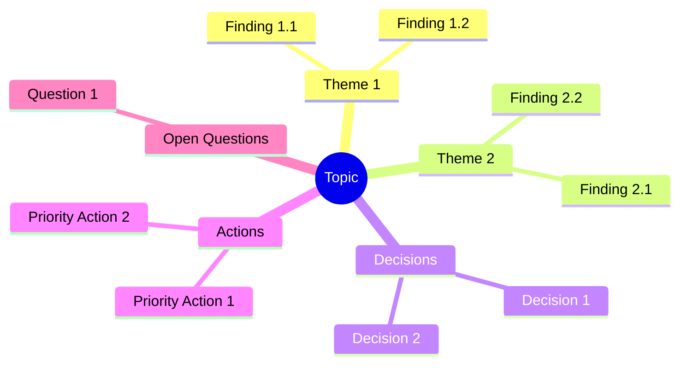

# Brief Format - PRD v3.0

> Output template for brainstorm synthesis reports.

## Overview

The brief is the main deliverable of a brainstorm session. It serves as input for `/spec` which transforms it into a technical specification.

**Filename**: `brief-{slug}-{date}.md`
**Location**: `docs/briefs/{slug}/`
**Audience**: Anyone who needs to understand conclusions without attending the session.
**Principle**: Fully self-contained - a reader with no context should understand everything.
**Estimated length**: 800-2000 words depending on complexity.

## Template

```markdown
# [Brainstorming Title]

> Generated on [date] - [N] iterations - Template: [name] - Final EMS: [score]/100

---

## 1. Context and Initial Objective

[Clear reformulation of the starting point - 2-4 sentences]

**Initial question/problem**:
[What we set out to explore - 1-2 sentences]

**Scope**:
- In scope: [what was covered]
- Out of scope: [what was explicitly excluded]

**Success criteria defined**:
1. [Criterion 1]
2. [Criterion 2]

---

## 2. Executive Summary

[5-10 lines capturing the essential conclusions. A decision-maker should be able to read only this section and understand the key outcomes.]

**Key insight**: [Single most important takeaway - 1 sentence, bolded]

**Main decisions**:
- [Decision 1]
- [Decision 2]
- [Decision 3]

---

## 3. Analysis and Key Findings

### 3.1 [Major Theme 1]

[Structured development of findings - 1-3 paragraphs]

**Key points**:
- [Point 1]
- [Point 2]

**Implications**:
[What this means for the decision/project - 1-2 sentences]

### 3.2 [Major Theme 2]

[Same structure...]

### 3.3 [Major Theme N]

[Same structure...]

---

## 4. Decisions and Orientations

| Decision | Rationale | Impact | Confidence |
|----------|-----------|--------|------------|
| [Decision 1] | [Why this choice] | [Consequences] | High/Medium/Low |
| [Decision 2] | [Why this choice] | [Consequences] | High/Medium/Low |

### Decisions Deferred
- [Decision X] - Deferred because: [reason]. To revisit: [when/condition]

---

## 5. Action Plan

| # | Action | Priority | Effort | Timeline | Owner | Dependencies |
|---|--------|----------|--------|----------|-------|--------------|
| 1 | [Action] | High | Low | [Date] | [Who] | [If any] |
| 2 | [Action] | Medium | Medium | [Date] | [Who] | [If any] |
| 3 | [Action] | Low | High | [Date] | [Who] | [If any] |

### Quick Wins (High Impact, Low Effort)
1. [Action] - [Why it's a quick win]
2. [Action] - [Why it's a quick win]

### Strategic Investments (High Impact, High Effort)
1. [Action] - [Why it's worth the investment]

---

## 6. Risks and Considerations

| Risk | Probability | Impact | Mitigation |
|------|-------------|--------|------------|
| [Risk 1] | High/Med/Low | High/Med/Low | [Mitigation strategy] |
| [Risk 2] | High/Med/Low | High/Med/Low | [Mitigation strategy] |

### Assumptions Made
- [Assumption 1] - If wrong: [consequence]
- [Assumption 2] - If wrong: [consequence]

---

## 7. Unexplored Avenues

[What remains open for future exploration]

| Topic | Why Not Explored | Potential Value | Suggested Next Step |
|-------|------------------|-----------------|---------------------|
| [Topic 1] | [Reason] | High/Med/Low | [Action] |
| [Topic 2] | [Reason] | High/Med/Low | [Action] |

---

## 8. Synthesis Mindmap



---

## 9. Success Criteria Verification

| Criterion | Status | Evidence |
|-----------|--------|----------|
| [Criterion 1] | Achieved / Partial / Not achieved | [Explanation] |
| [Criterion 2] | Achieved / Partial / Not achieved | [Explanation] |

**Overall assessment**: [Summary of whether brainstorm achieved its goals - 1-2 sentences]

---

## 10. Final EMS Score

```
EMS Final: [SCORE]/100 [STATUS]

EMS Score
100 |                                        [graph]
 90 | . . . . . . . . . . . . . . . . . . . . . . . .
 80 |
 70 |
 60 | . . . . . . . . . . . . . . . . . . . . . . . .
 50 |
 40 |
 30 | . . . . . . . . . . . . . . . . . . . . . . . .
 20 |
  0 +----+-----+-----+-----+-----+-----+
    Init  It.1  It.2  It.3  ...  End

Final axes:
   Clarity      [BAR] [SCORE]/100
   Depth        [BAR] [SCORE]/100
   Coverage     [BAR] [SCORE]/100
   Decisions    [BAR] [SCORE]/100
   Actionab.    [BAR] [SCORE]/100
```

---

## 11. Sources and References

### Documents Analyzed
- [Document 1]: [What was extracted/learned]

### Web Research
- [URL 1]: [Key information obtained]

### Past Conversations Referenced
- [Topic/Date]: [Relevant connection]

---

## 12. Next Steps

**Recommended workflow**:

| Step | Skill | Action |
|------|-------|--------|
| 1 | `/spec` | Transform this brief into technical specification |
| 2 | `/implement` or `/quick` | Implement based on complexity routing |

**Complexity routing**: [TINY/SMALL/STANDARD/LARGE]
**Suggested skill**: [/quick or /implement]

---

*Document generated by Brainstorm v6.0 - Self-contained and independently usable*
```

## Section Guidelines

### Section 1: Context
- Keep it brief (2-4 sentences)
- Include original user formulation
- Define clear scope boundaries

### Section 2: Executive Summary
- Write last (after all other sections)
- Should stand alone as a complete summary
- One sentence key insight is mandatory

### Section 3: Analysis
- Group findings by theme
- Each theme: findings + implications
- 3-7 themes typically

### Section 4: Decisions
- Include rationale for each decision
- Mark confidence level honestly
- List deferred decisions separately

### Section 5: Action Plan
- Actionable, specific items
- Include owner and timeline when known
- Separate quick wins from strategic investments

### Section 6: Risks
- Be honest about assumptions
- Include mitigation strategies
- Don't over-alarm but don't ignore

### Section 7: Unexplored
- Acknowledge what wasn't covered
- Helps future exploration
- Shows intellectual honesty

### Section 8: Mindmap
- Use Mermaid for compatibility
- Visual synthesis of key elements
- Keep it readable (not exhaustive)

### Section 9: Success Criteria
- Reference criteria from Phase 1
- Honest assessment of achievement
- Evidence-based status

### Section 10: EMS
- Include visual progression
- Final radar with all 5 axes
- ASCII art for portability

### Section 11: Sources
- Credit all external sources
- Include what was learned from each
- Helps traceability

### Section 12: Next Steps
- Clear routing to next skill
- Based on complexity-calculator output
- Actionable recommendation

## Language Adaptation

The brief adapts to user's input language. French section headers:

| English | French |
|---------|--------|
| Context and Initial Objective | Contexte et Objectif Initial |
| Executive Summary | Synthese Executive |
| Analysis and Key Findings | Analyse et Conclusions Cles |
| Decisions and Orientations | Decisions et Orientations |
| Action Plan | Plan d'Action |
| Risks and Considerations | Risques et Points d'Attention |
| Unexplored Avenues | Pistes Non Explorees |
| Success Criteria Verification | Verification des Criteres de Succes |
| Final EMS Score | Score EMS Final |
| Sources and References | Sources et References |
| Next Steps | Prochaines Etapes |

---

*Brief Format v3.0 - EPCI Brainstorm v6.0*
