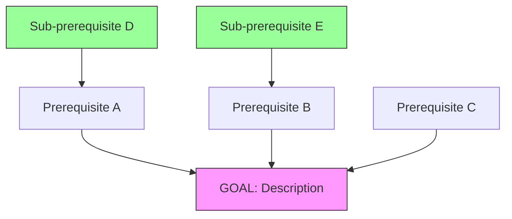
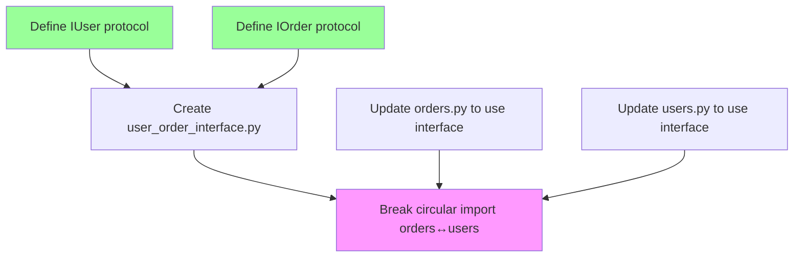

# Mikado Method

> Systematic approach for large-scale refactoring with complex dependencies.

## Overview

The Mikado Method is a technique for making large-scale changes to codebases safely. It visualizes dependencies between changes and ensures you tackle them in the correct order.

**Named after**: The game Mikado (pick-up sticks), where you must remove sticks without disturbing others.

---

## When to Use

- **Complex refactoring** with unclear dependencies
- **Architecture changes** affecting many components
- **Legacy system** modifications
- **Breaking circular dependencies**
- Any change where "just doing it" leads to cascading failures

---

## The Process

### Step 1: Define the Goal

State clearly what you want to achieve:

```
GOAL: Split UserService into AuthService and ProfileService
```

### Step 2: Try to Achieve the Goal Directly

Make the change as if there were no obstacles:

```python
# Just try to split the class
class AuthService:
    def authenticate(self): ...

class ProfileService:
    def get_profile(self): ...
```

### Step 3: Note the Errors

Compilation/test errors reveal dependencies:

```
ERROR: MiddlewareAuth depends on UserService.authenticate()
ERROR: ProfileView depends on UserService.get_profile()
ERROR: AuthService needs UserRepository (circular import)
```

### Step 4: Create Prerequisites

For each error, create a sub-goal:

```
├── Update MiddlewareAuth to use AuthService
├── Update ProfileView to use ProfileService
└── Extract UserRepository to break circular import
```

### Step 5: Revert Changes

**Critical**: Undo all changes from step 2. You're only gathering information.

### Step 6: Repeat Recursively

For each prerequisite, repeat steps 2-5:

```
Trying: Extract UserRepository
└── ERROR: UserRepository needs DatabaseConnection interface
    └── Prerequisite: Create DatabaseConnection interface
```

### Step 7: Build the Graph

Eventually you'll have leaf nodes with no prerequisites:

```
                    ┌─────────────────────────────────────┐
                    │            GOAL                      │
                    │ Split UserService into Auth+Profile  │
                    └──────────────┬──────────────────────┘
                                   │
            ┌──────────────────────┼──────────────────────┐
            │                      │                      │
            ▼                      ▼                      ▼
   ┌────────────────┐   ┌────────────────┐   ┌────────────────┐
   │ Update         │   │ Update         │   │ Extract        │
   │ MiddlewareAuth │   │ ProfileView    │   │ UserRepository │
   └───────┬────────┘   └───────┬────────┘   └───────┬────────┘
           │                    │                    │
           │                    │                    ▼
           │                    │         ┌────────────────────┐
           │                    │         │ Create Database    │
           │                    │         │ Connection iface   │
           │                    │         └────────────────────┘
           │                    │                    │
           ▼                    ▼                    │
   ┌────────────────────────────────────────────────┘
   │ (These depend on UserRepository being extracted)
   └─────────────────────────────────────────────────
```

### Step 8: Execute Leaf to Root

Start with nodes that have no prerequisites:

```
1. Create DatabaseConnection interface [✓]
2. Extract UserRepository [✓]
3. Update MiddlewareAuth [✓]
4. Update ProfileView [✓]
5. Split UserService (GOAL) [✓]
```

---

## Mermaid Graph Template



Green nodes = leaf nodes (execute first)
Pink node = goal (execute last)

---

## Tracking Progress

### JSON State

```json
{
  "mikado_graph": {
    "goal": {
      "id": "GOAL",
      "description": "Split UserService into Auth and Profile",
      "status": "pending",
      "prerequisites": ["A", "B", "C"]
    },
    "nodes": [
      {
        "id": "A",
        "description": "Update MiddlewareAuth",
        "status": "completed",
        "prerequisites": ["D"]
      },
      {
        "id": "D",
        "description": "Create DatabaseConnection interface",
        "status": "completed",
        "prerequisites": []
      }
    ]
  }
}
```

### Status Values

| Status | Meaning |
|--------|---------|
| `pending` | Not yet attempted |
| `in_progress` | Currently working on |
| `completed` | Successfully done, tests pass |
| `blocked` | Waiting for prerequisites |
| `failed` | Attempted but failed, needs investigation |

---

## Best Practices

### Do

- **Always revert** after gathering information
- **One change at a time** when executing
- **Test after each change**
- **Document the graph** for complex refactorings
- **Save state** for multi-session refactorings

### Don't

- Don't try to execute the goal before prerequisites
- Don't make multiple changes before testing
- Don't forget to update the graph as you learn more
- Don't underestimate the time for large graphs

---

## Example: Breaking Circular Dependencies

**Goal**: Break circular import between `orders.py` and `users.py`

```
orders.py imports User from users.py
users.py imports Order from orders.py (circular!)
```

**Mikado Graph**:



**Execution Order**:
1. Define IUser protocol (leaf)
2. Define IOrder protocol (leaf)
3. Create user_order_interface.py
4. Update orders.py to import from interface
5. Update users.py to import from interface
6. Verify circular import broken (GOAL)

---

## Integration with /refactor

When scope is `architecture`:

1. **step-02-planning.md** generates Mikado graph
2. **step-03-breakpoint.md** shows graph for approval
3. **step-04-execute.md** executes leaf-to-root
4. State tracks node completion across sessions

```
## Mikado Progress

Nodes: 5 total
├── Completed: 3 (60%)
├── In Progress: 1
└── Pending: 1

Current: Executing node B (Update MiddlewareAuth)
```

---

## References

- Ellnestam & Brolund: "The Mikado Method" (2014)
- Original blog: https://mikadomethod.info/
