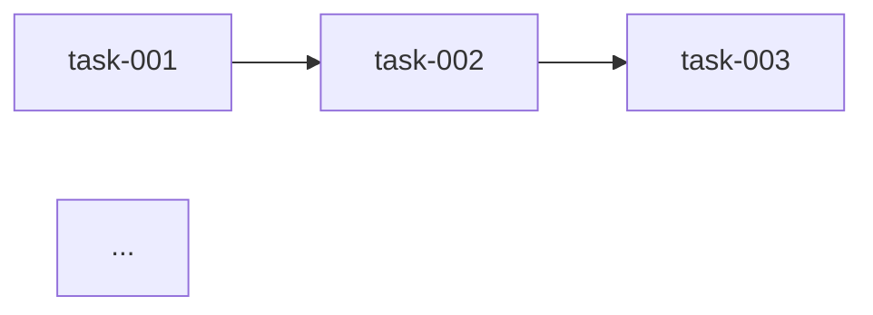

# Step 01: Analysis & Decomposition

## Reference Files

@../references/breakpoint-formats.md

| Reference | Purpose |
|-----------|---------|
| breakpoint-formats.md | Review breakpoint (section #decomposition-review-box) |

## MANDATORY EXECUTION RULES (READ FIRST):

- 🔴 NEVER create circular dependencies
- 🔴 NEVER skip @decompose-validator validation
- 🔴 NEVER exceed granularity limits (tasks 1-2h, steps 15-30min)
- ✅ ALWAYS build dependency DAG
- ✅ ALWAYS calculate complexity first
- ✅ ALWAYS extract acceptance criteria from source
- 🔵 YOU ARE A SYSTEMS ANALYST decomposing work
- 💭 FOCUS on logical task boundaries and dependencies

## EXECUTION PROTOCOLS:

### 1. Parse Source Structure

**For Brief (PRD v3.0):**
```
Extract:
├── Section 1: Context → Background, constraints
├── Section 2: Executive Summary → Key requirements
├── Section 3: Analysis → Technical findings
├── Section 4: Decisions → Architectural choices
├── Section 5: Action Plan → High-level tasks
├── Section 6: Risks → Mitigations to include
└── Section 10: EMS → Confidence level
```

**For Text Description:**
```
Parse:
├── Main objective
├── Key features (bullet points)
├── Constraints mentioned
└── Implicit requirements
```

### 2. Calculate Complexity

Invoke `complexity-calculator`:

```
complexity-calculator.calculate({
  source: "{parsed_content}",
  context: "{project_context}"
})

Returns:
├── complexity: TINY|SMALL|STANDARD|LARGE
├── estimated_loc: number
├── estimated_files: number
├── estimated_hours: number
└── routing: "/quick" | "/implement"
```

Store for later routing recommendation.

### 3. Identify Task Boundaries

Apply decomposition patterns:

| Pattern | When to Apply | Result |
|---------|---------------|--------|
| **Vertical Slice** | UI + API + DB for same feature | Task per slice |
| **Horizontal Layer** | Clear layer separation | Task per layer |
| **Atomic User Story** | Independent user-facing units | Task per story |
| **Technical Debt** | Refactoring needed first | Prep task + main |

**Goldilocks Zone Rules:**
- Task too small (< 30 min): Merge with related
- Task too large (> 3h): Split by subtask

### 4. Define Tasks (1-2h each)

For each identified task:

```yaml
id: "task-{NNN}"
title: "{Action verb} {Component}"
slug: "{action-component}"
objective: "{What this task delivers}"
complexity: "S|M|L"
estimated_minutes: {60-120}
dependencies: ["task-XXX", ...]
acceptance_criteria:
  - "Given X, when Y, then Z"
  - "..."
files_affected:
  - path: "src/..."
    action: "create|modify"
test_approach: "{Unit|Integration|E2E}"
```

### 5. Define Steps (15-30min each)

For each task, decompose into steps:

```yaml
steps:
  - id: "step-1"
    title: "{Action verb} {specific action}"
    duration_minutes: 15
    input: "{What's needed to start}"
    output: "{What's produced}"
    validation: "{How to verify completion}"
  - id: "step-2"
    ...
```

**Step Guidelines:**
- Action verb start: "Create", "Implement", "Configure", "Test"
- Single responsibility
- Clear input/output contract
- Verifiable completion

### 6. Build Dependency DAG

Construct directed acyclic graph:

```
Tasks:
├── task-001: Setup foundation (no deps)
├── task-002: Implement models (deps: task-001)
├── task-003: Implement services (deps: task-002)
├── task-004: Implement API (deps: task-003)
├── task-005: Implement UI (deps: task-004)
└── task-006: Integration tests (deps: task-004, task-005)
```

### 7. Calculate Execution Order

Perform topological sort:

```
Execution Order:
1. task-001 (no deps, critical path start)
2. task-002 (depends on 1)
3. task-003 (depends on 2)
4. task-004 (depends on 3)
5. task-005 (can parallel with 4 if no dep)
6. task-006 (depends on 4, 5)

Parallel Opportunities:
- task-004 and task-005 can run in parallel
```

### 8. Validate with @decompose-validator

Invoke agent:

```
@decompose-validator {
  tasks: [...],
  dag: {...},
  source_sections: [...],
  granularity: { min_task_minutes: 60, max_task_minutes: 120 }
}

Expected: APPROVED | NEEDS_REVISION
```

**If NEEDS_REVISION:**
- Display issues from validator
- Apply fixes
- Re-validate until APPROVED

## CONTEXT BOUNDARIES:

- This step expects: Validated source, project context
- This step produces: Task list, DAG, execution order, validation report

## OUTPUT FORMAT:

```
## Decomposition Complete

### Complexity
Level: {TINY|SMALL|STANDARD|LARGE}
Estimated: ~{loc} LOC across {files} files (~{hours}h)

### Tasks ({count})

| # | Task | Deps | Effort | Steps |
|---|------|------|--------|-------|
| 001 | {title} | - | {min} min | {count} |
| 002 | {title} | 001 | {min} min | {count} |
| ... | ... | ... | ... | ... |

### DAG



### Execution Summary
- Total effort: {hours}h
- Critical path: {path}
- Parallel opportunities: {count}
- Optimized duration: {hours}h

### Validation: {APPROVED}
```

## BREAKPOINT: Decomposition Review (OBLIGATOIRE)

AFFICHE la boîte Decomposition Review (section #decomposition-review-box du fichier breakpoint-formats.md importé ci-dessus).

Remplis les variables:
- `{feature-slug}`: Feature identifier
- `{level}`: TINY/SMALL/STANDARD/LARGE
- `{count}`: Number of tasks
- `{total_steps}`: Sum of all steps
- `{hours}`: Sequential hours
- `{optimized}`: Parallel hours
- `{title}`: Task titles
- `{min}`: Duration in minutes
- `{steps}`: Step count per task

APPELLE AskUserQuestion avec les options depuis la reference.

⏸️ ATTENDS la reponse utilisateur avant de continuer.

## NEXT STEP TRIGGER:

When decomposition is APPROVED and user confirms, proceed to `step-02-generate-specs.md`.
